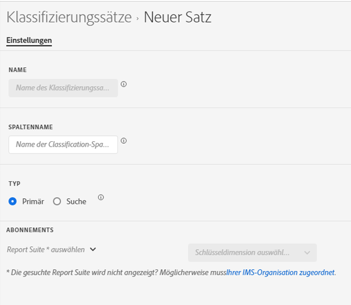

# Erstellen eines Klassifizierungssatzes

Sie können den Classification Set Manager verwenden, um einen Classification-Satz zu erstellen.

**[!UICONTROL Komponenten]** > **[!UICONTROL Klassifizierungssätze]** > **[!UICONTROL Sets]** > **[!UICONTROL Hinzufügen]**

Beim Erstellen eines Classification-Sets sind die folgenden Felder verfügbar.

* **[!UICONTROL Name]**: Ein Textfeld, mit dem der Klassifizierungssatz identifiziert wird. Dieses Feld kann bei seiner Erstellung nicht bearbeitet werden, kann aber später umbenannt werden.
* **[!UICONTROL Spaltenname]**: Der Name der Classification-Dimension, die Sie erstellen möchten. Dieses Feld ist der in Analysis Workspace verwendete Dimensionsname und der Spaltenname beim Exportieren von Classification-Daten.
* **[!UICONTROL Typ]**: Optionsfelder, die den Classification-Typ angeben. Normalerweise werden Primäre Klassifizierungen verwendet. Suchklassifizierungen stellen [Unterklassifizierungen](../c-sub-classifications.md).
* **[!UICONTROL Abonnements]** Die Report Suite und Dimension, für die dieser Classification-Satz gilt. Unterstützung für mehrere Report Suites ist geplant.

Wenn für eine bestimmte Report Suite + -Variable ein Classification-Satz vorhanden ist, wird stattdessen die Classification zum Schema hinzugefügt.
