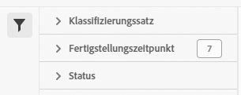

# Auftrags-Manager für Klassifizierungssätze

Mit dem Auftrags-Manager für Klassifizierungssätze können Sie aktuelle und abgeschlossene Klassifizierungsaufträge anzeigen, die aus Klassifizierungssätzen generiert wurden. Sie können diese Benutzeroberfläche auch verwenden, um Klassifizierungsdaten oder Vorlagen für einen bestimmten Auftrag herunterzuladen oder zusätzliche Daten in einen Auftrag hochzuladen.

>[!NOTE]
>
>Diese Funktion steht allen Kunden zur Verfügung, deren Report Suites in die neue Klassifizierungsarchitektur migriert wurden. Weitere Informationen erhalten Sie bei der Kundenunterstützung von Adobe oder Ihrem Account Manager.

**[!UICONTROL Komponenten]** > **[!UICONTROL Klassifizierungssätze]** > **[!UICONTROL Aufträge]**

Beachten Sie, dass Sie über diese Benutzeroberfläche keine Aufträge erstellen können. Stattdessen können Sie Aufträge erstellen, indem Sie Daten in einen Klassifizierungssatz hochladen, eine Datei zum Herunterladen anfordern oder eine Vorlagendatei anfordern.

## Filtern von Klassifizierungssätzen

Auf der linken Seite des Auftrags-Managers für Klassifizierungssätze finden Sie Filtereinstellungen, um den gewünschten Auftrag zu finden. Durch Klicken auf das Filtersymbol wird die Sichtbarkeit der Filtereinstellungen ein-/ausgeblendet. Sie können Klassifizierungssätze nach **[!UICONTROL Klassifizierungssatz]**, **[!UICONTROL Abschlusszeit]** oder **[!UICONTROL Status]** filtern.

Zusätzliche Filteroptionen sind über den Spalten des Auftrags-Managers für Klassifizierungssätze verfügbar:

* **[!UICONTROL Suche nach Titel]**: Suche nach Aufträgen anhand des Dateinamens.
* **[!UICONTROL Mehr laden]**: Der Auftrags-Manager für Klassifizierungssätze zeigt zunächst bis zu 1000 Aufträge an. Klicken Sie auf diese Schaltfläche, um 1000 weitere Aufträge zu laden.
* **Spalten ein-/ausblenden**: Ein-/Ausschalten der Sichtbarkeit für eine beliebige Spalte außer [!UICONTROL Dateiname] und [!UICONTROL Abschlusszeit].

## Spalten im Auftrags-Manager für Klassifizierungssätze

Die folgenden Spalten sind im Auftrags-Manager für Klassifizierungssätze verfügbar:

* **[!UICONTROL Dateiname]**: Der Name der Datei zum Hoch- oder Herunterladen.
* **[!UICONTROL Klassifizierungssatz]**: Der Name des Klassifizierungssatzes, für den die Datei gilt. Sie können auf den Namen des Klassifizierungssatzes klicken, um zu den [Einstellungen](settings.md) des Klassifizierungssatzes zu gelangen.
* **[!UICONTROL Größe]**: Die Größe der Datei.
* **[!UICONTROL Status]**: Der Status des Auftrags, der die Datei verarbeitet.
   * **[!UICONTROL Erstellt]**: Der Auftrag wurde eingereicht.
   * **[!UICONTROL In Warteschlange]**: Die Datei ist bereit zur Verarbeitung und wartet auf ihre Verarbeitung durch einen Klassifizierungs-Server.
   * **[!UICONTROL Validiert]**: Die Datei ist gültig und wartet auf die Verarbeitung.
   * **[!UICONTROL Fehlgeschlagene Validierung]**: Die Datei ist falsch formatiert oder anderweitig ungültig. Die Datei wird nicht verarbeitet.
   * **[!UICONTROL Verarbeitung]**: Die Datei wird aktiv von Adobe verarbeitet.
   * **[!UICONTROL Fehlgeschlagene Verarbeitung]**: Die Verarbeitung der Datei ist fehlgeschlagen.
   * **[!UICONTROL Fertig]**: Die Verarbeitung ist abgeschlossen. Klassifizierungsdaten sind in Berichten sichtbar.
   * **[!UICONTROL Fehlgeschlagen]**: Generischer Fehler, der nicht mit der Validierung oder Verarbeitung in Zusammenhang steht.
* **[!UICONTROL Typ]**: Die Art des Auftrags.
* **[!UICONTROL Datei-Download]**: Gilt nur für Aufträge zum Herunterladen, wie das Herunterladen von Klassifizierungsdaten oder das Herunterladen von Vorlagen. Wenn ein Download bereit ist, enthält diese Spalte einen Link zum Herunterladen.
* **[!UICONTROL Abschlusszeit]**: Datum und Uhrzeit des Abschlusses (oder Fehlschlagens) des Auftrags.
