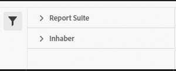

# Classification Set Manager

Mit dem Classification Set Manager können Sie Klassifizierungssätze erstellen, bearbeiten oder löschen.

>[!NOTE]
>
>Diese Funktion ist derzeit nur in begrenztem Umfang verfügbar. Wenn Sie Zugriff auf diese Funktion wünschen, wenden Sie sich an die Kundenunterstützung von Adobe oder Ihre*n Account Manager, der*die Ihre Anfrage zur Bereitstellung an das Classifications-Team weiterleitet.

**[!UICONTROL Komponenten]** > **[!UICONTROL Klassifizierungssätze]** > **[!UICONTROL Sets]**

Klassifizierungssätze bestehen aus **Abonnements** (Report Suites, für die dieser Klassifizierungssatz gilt) und **Klassifizierungsnamen** (die zusätzlichen Dimensionen, die Klassifizierungsdaten enthalten).

## Filtern von Klassifizierungssätzen

Auf der linken Seite des Classification Set Manager finden Sie Filtereinstellungen, um den gewünschten Klassifizierungssatz zu finden. Durch Klicken auf das Filtersymbol wird die Sichtbarkeit der Filtereinstellungen ein-/ausgeblendet. Sie können Klassifizierungssätze **[!UICONTROL Tags]**, **[!UICONTROL Report Suite]** oder **[!UICONTROL Inhaber]** filtern.

## Classification Set Manager-Spalten

Die folgenden Spalten sind im Classification Set Manager verfügbar:

* **[!UICONTROL Klassifizierungssatz]**: Der Name des Klassifizierungssatzes. Klicken Sie auf den Namen eines Klassifizierungssatzes, um [dessen Einstellungen zu bearbeiten](settings.md).
* **[!UICONTROL Abonnements]**: Die Anzahl der Abonnements oder die Anzahl der Report Suites, für die dieser Klassifizierungssatz gilt.
* **[!UICONTROL Inhaber]**: Der/die Verantwortliche des Klassifizierungssatzes.
* **[!UICONTROL Klassifizierungen]**: Die Anzahl der Klassifizierungsdimensionen, die der Klassifizierungssatz enthält.
* **[!UICONTROL Zuletzt geändert]**: Datum und Uhrzeit der letzten Änderung des Klassifizierungssatzes.

## Erstellen oder Bearbeiten von Optionen

Die folgenden Schaltflächen sind im Classification Set Manager verfügbar:

* **[!UICONTROL Hinzufügen]**: [Erstellen](create.md) eines Klassifizierungssatzes.
* **[!UICONTROL Suche nach Titel]**: Suchen nach Klassifizierungssätzen nach Namen.
* **[!UICONTROL Mehr laden]**: Der Classification Set Manager zeigt zunächst bis zu 1000 Klassifizierungssätze an. Klicken Sie auf diese Schaltfläche, um 1000 weitere Klassifizierungssätze zu laden.
* **Spalten ein-/ausblenden**: Ein-/Ausschalten der Sichtbarkeit für eine beliebige Spalte außer der Spalte [!UICONTROL Klassifizierungssatz].

Wählen Sie einen oder mehrere Klassifizierungssätze aus, indem Sie auf das Kontrollkästchen neben dem gewünschten Klassifizierungssatz klicken. Bei Auswahl eines Klassifizierungssatzes werden die folgenden Optionen angezeigt:

* **[!UICONTROL Tag]**: Fügen Sie ein oder mehrere Tags zu den ausgewählten Klassifizierungssätzen hinzu, um Klassifizierungssätze zu organisieren oder zu gruppieren, damit sie später leichter zu finden sind.
* **[!UICONTROL Umbenennen]**: Umbenennen des ausgewählten Klassifizierungssatzes.
