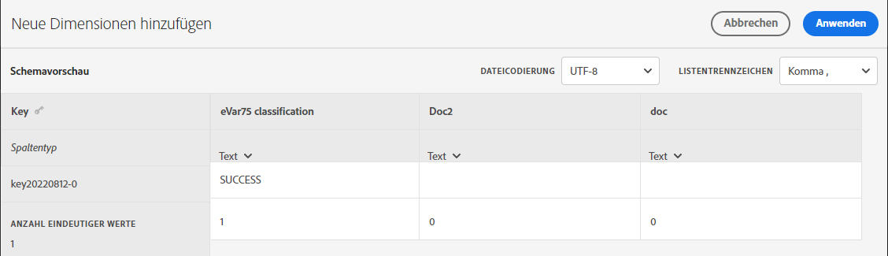
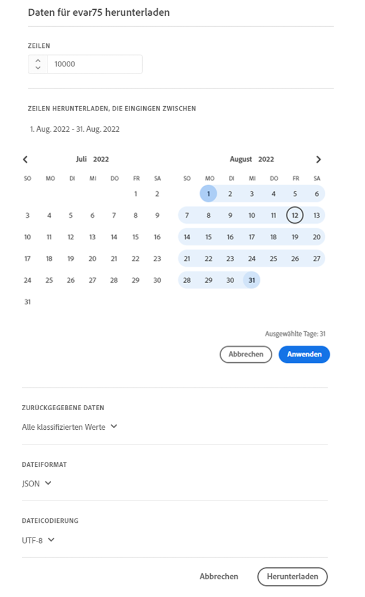
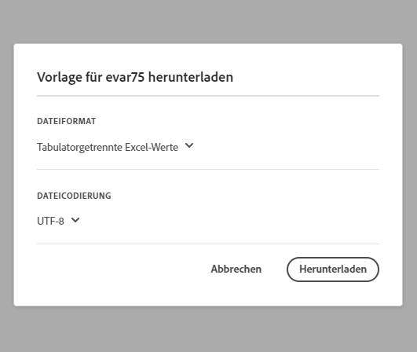

# Einstellungen für Classification Set

Konfigurieren Sie ein Classification Set, laden Sie Daten hoch oder herunter.

>[!NOTE]
>
>Diese Funktion steht allen Kunden zur Verfügung, deren Report Suites in die neue Klassifizierungsarchitektur migriert wurden. Weitere Informationen erhalten Sie bei der Kundenunterstützung von Adobe oder Ihrem Kundenbetreuer.

**[!UICONTROL Komponenten]** > **[!UICONTROL Klassifizierungssätze]** > **[!UICONTROL Sets]** > Klicken Sie auf den Namen des gewünschten Klassifizierungssatzes

Beim Bearbeiten eines Klassifizierungssatzes stehen zwei Registerkarten zur Verfügung. **[!UICONTROL Schema]** und **[!UICONTROL Einstellungen]**.

## Einstellungen 

Die folgenden Felder sind auf der Registerkarte [!UICONTROL Einstellungen] verfügbar und können bearbeitet werden:

* **[!UICONTROL Name]**: Der Name des Klassifizierungssatzes.
* **[!UICONTROL Beschreibung]**: Die Beschreibung für den Klassifizierungssatz.
* **[!UICONTROL Name des Inhabers]**: Der Name des/der Verantwortlichen.
* **[!UICONTROL E-Mail des Inhabers]**: Die E-Mail-Adresse des/der Verantwortlichen.
* **[!UICONTROL Über Probleme informieren]**: Eine kommagetrennte Liste von E-Mail-Adressen, die bei Problemen mit diesem Klassifizierungssatz benachrichtigt werden.
* **[!UICONTROL Tags]**: Fügen Sie ein oder mehrere Tags zu den ausgewählten Klassifizierungssätzen hinzu, um Klassifizierungssätze zu organisieren oder zu gruppieren, damit sie später leichter zu finden sind.

Zusätzliche Felder stehen zu Informationszwecken zur Verfügung und können nicht bearbeitet werden:

* **[!UICONTROL Typ]**: Der Typ der Klassifizierung, entweder [!UICONTROL Primär] oder [!UICONTROL Suche]. Normalerweise werden primäre Klassifizierungen verwendet.
* **[!UICONTROL Abonnements]**: Die Report Suite und Variable, für die der Klassifizierungssatz gilt. Derzeit wird nur eine Report Suite für einen bestimmten Klassifizierungssatz unterstützt. Unterstützung für mehrere Report Suites ist geplant.

## Schema

Zeigen Sie die derzeit konfigurierten Klassifizierungsdimensionen für dieses Abonnement an. Folgende Schaltflächen sind verfügbar:

* **[!UICONTROL Hochladen]**: Manuelles Hochladen von Klassifizierungsdaten für eine oder mehrere Klassifizierungsdimensionen. JSON-, CSV-, TSV- und TAB-Dateien werden unterstützt. Beim Hochladen einer gültigen Datei wird eine Tabellenvorschau der zu klassifizierenden Daten angezeigt.
   * **[!UICONTROL Dateicodierung]**: Wählen Sie mithilfe dieser Dropdown-Liste die richtige Dateicodierung aus. Zu den gültigen Optionen gehören [!UICONTROL UTF-8] und [!UICONTROL Latin1].
   * **[!UICONTROL Listentrennzeichen]**: Wählen Sie das richtige Listentrennzeichen aus. Wenn Sie eine heruntergeladene Datei oder eine Vorlagendatei verwenden, stellen Sie sicher, dass das [!UICONTROL Listentrennzeichen] hier mit dem [!UICONTROL Listentrennzeichen] übereinstimmt, das beim Herunterladen der Datei verwendet wurde.
   * **[!UICONTROL Anwenden]**: Speichern der hochgeladenen Klassifizierungsdaten in den Klassifizierungssatz.

   

* **[!UICONTROL Herunterladen]**: Laden Sie Schlüsselwerte und ihre Classification-Spalten herunter.
   * **[!UICONTROL Zeilen]**: Die maximale Anzahl von Zeilen, die in die herunterzuladene Datei aufgenommen werden sollen.
   * **[!UICONTROL Zeilen herunterladen, die eingingen zwischen]**: Eine Datumsauswahl im Kalender, mit der Sie Schlüsselwerte nach dem Zeitpunkt filtern können, zu dem sie in Berichten angezeigt werden. Wenn in diesem Datumsbereich kein Schlüsselwert erfasst wurde, erscheint er nicht in der heruntergeladenen Datei.
   * **[!UICONTROL Zurückgegebene Daten]**: Ein Dropdown-Menü, mit dem Sie die in der heruntergeladenen Datei enthaltenen Schlüsselwerte anhand der zugehörigen Klassifizierungsdaten filtern können.
      * **[!UICONTROL Alle klassifizierten Werte]**: Umfasst Zeilen, in denen in mindestens einer Spalte Klassifizierungsdaten enthalten sind.
      * **[!UICONTROL Alle nicht klassifizierten Werte]**: Umfasst Zeilen, in denen in mindestens einer Spalte Klassifizierungsdaten fehlen.
   * **[!UICONTROL Dateiformat]**: Dropdown-Liste, in der das Dateiformat der herunterzuladenden Datei bestimmt wird. Die Optionen umfassen [!UICONTROL JSON], [!UICONTROL Kommagetrennte Werte] und [!UICONTROL Tabulatorgetrennte Werte für Excel].
   * **[!UICONTROL Dateicodierung]**: Dropdown-Liste, in der die Dateicodierung bestimmt wird. Die Optionen umfassen [!UICONTROL UTF-8] und [!UICONTROL Latin1]. UTF-8 wird empfohlen.
   * **[!UICONTROL Listentrennzeichen]**: Dropdown-Liste, in der das Listentrennzeichen bestimmt wird, das Klassifizierungsspalten in jeder Zeile trennt.

   

* **[!UICONTROL Vorlage]**: Herunterladen einer Vorlagendatei. Diese Datei ähnelt der Datei, die mit der Schaltfläche [!UICONTROL Herunterladen] erhalten wird, mit der Ausnahme, dass sie keine Klassifizierungsdaten oder Schlüsselwerte enthält.
   * **[!UICONTROL Dateiformat]**: Dropdown-Liste, in der das Dateiformat der Vorlagendatei bestimmt wird. Die Optionen umfassen [!UICONTROL Kommagetrennte Werte] und [!UICONTROL Tabulatorgetrennte Werte für Excel].
   * **[!UICONTROL Dateikodierung]**: Dropdown-Liste, in der die Dateicodierung bestimmt wird. Die Optionen umfassen [!UICONTROL UTF-8] und [!UICONTROL Latin1]. UTF-8 wird empfohlen.
   * **[!UICONTROL Listentrennzeichen]**: Dropdown-Liste, in der das Listentrennzeichen bestimmt wird, das Klassifizierungsspalten in jeder Zeile trennt.
* **[!UICONTROL Auftragsverlauf]**: Ein Verknüpfungs-Link, über den Sie zum [Job Manager](job-manager.md) gelangen, der Aufträge nur für diesen Klassifizierungssatz anzeigt.

   
