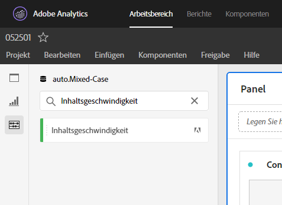

# [!UICONTROL Inhaltsgeschwindigkeit]

[!UICONTROL Content Velocity] ist eine standardmäßige Adobe Analytics-Metrikvorlage. [!UICONTROL Inhaltsgeschwindigkeit] ist definiert als [[!UICONTROL Seiteneinstellungen]] | [!UICONTROL Beitrag]zum Besuch] / [[!UICONTROL Besuche]] und hilft Ihnen dabei, die Wirkung eines bestimmten Inhaltselements (Seite, Site-Abschnitt usw.) zu messen. auf nachgelagerten Inhalten. Es kann Ihnen dabei helfen, zu verstehen, welche Inhalte Benutzer auf der Website oder in der mobilen App sind und nicht speichern.

[!UICONTROL Inhaltsgeschwindigkeit] kann in Analyse Workspace gefunden werden, indem die linke Leiste gefiltert wird, entweder durch Suchen oder mithilfe von Tags (#Adobe-Vorlage).

[!UICONTROL Die Inhaltsgeschwindigkeit] wird häufig bei der Analyse von Inhalten neben anderen wichtigen Metriken wie [!UICONTROL Ansichten], [!UICONTROL Besuche]und [!UICONTROL Absprungrate]verwendet.

