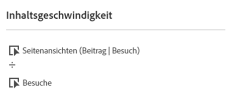
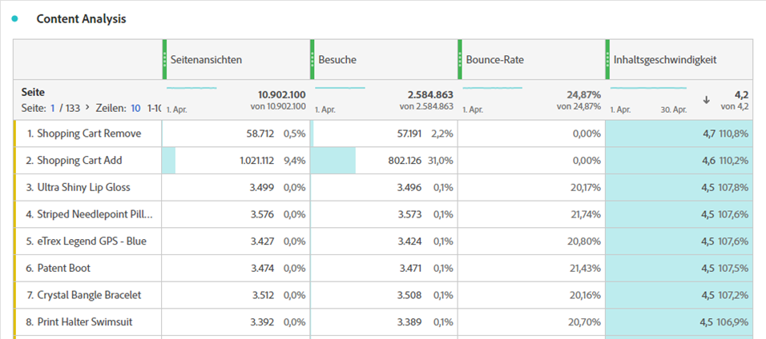

# Content-Geschwindigkeit

„Content-Geschwindigkeit“ ist eine Vorlage für eine berechnete Metrik, mit der Sie messen können, wie effektiv sich eine Dimension auf nachgelagerten Inhalt auswirkt. Sie verwendet die Formel `Page views (Visit participation) divided by Visits`.

[!UICONTROL Content-Geschwindigkeit] wird häufig bei der Analyse von Inhalten neben anderen Schlüsselmetriken wie [!UICONTROL Seitenansichten], [!UICONTROL Besuche] und [!UICONTROL Absprungrate] verwendet.

