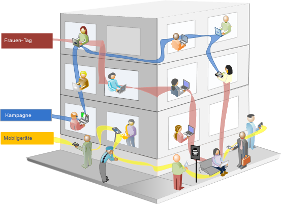
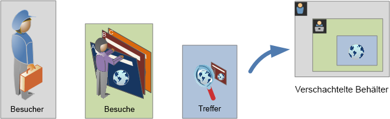
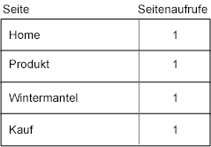
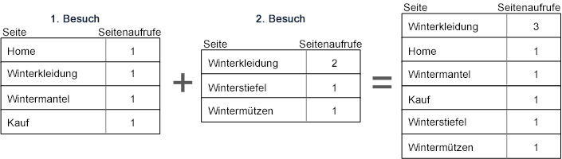
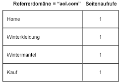
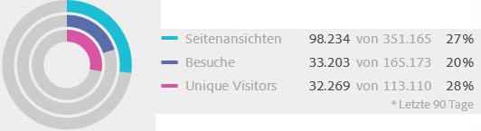

# Info über Segmente und Container

Mit Segmenten können Besucheruntergruppen anhand von Merkmalen oder Website-Interaktionen identifiziert werden. Segmente sind als kodifizierte Zielgruppeneinblicke ausgelegt, die Sie für bestimmte Anforderungen erstellen und dann prüfen, bearbeiten und für andere Team-Mitglieder freigeben oder in anderen Produkten von Adobe und in Analytics verwenden können.

Segmente basieren auf einer [!UICONTROL Besucher-], [!UICONTROL Besuchs-] und [!UICONTROL Trefferebenenhierachie], wobei ein verschachteltes Behältermodell verwendet wird. Mit verschachtelten Behältern können Sie Besucherattribute definieren sowie Aktionen, die auf Regeln zwischen den Behältern und innerhalb der Behältern basieren. Analytics-Segmente können erstellt, genehmigt, freigegeben, gespeichert und über viele Produkte und Funktionen in der [!DNL Adobe Experience Cloud] hinweg ausgeführt werden. Segmente können aus einem Bericht generiert, in einem Dashboard-Bericht erstellt oder für den schnellen Zugriff mit einem Lesezeichen versehen werden.

Sie können Segmente im Segment Builder erstellen und speichern oder aus einem Fallout-Bericht (in  Analysis Workspace) generieren. Sie können auch vorgefertigte Segmente verwenden und erweitern, die auf bestimmten Regeln zwischen verschachtelten Behältern basieren. Diese ermöglichen das Filtern von Ergebnissen und können auf Berichte angewendet werden. Darüber hinaus können Segmente zusammen als [gestapelte Segmente](/help/components/segmentation/segmentation-workflow/seg-workflow.md) verwendet werden.

## Segmente {#section_CC4EBA2A6CCB4F8BBB8437052A880657}

Segmente ermitteln, wer Ihre Besucher sind (Land, Geschlecht, Internetcafé), welche Geräte und Dienste diese verwenden (Browser, Suchmaschine, Mobilgerät), von wo sie zu Ihnen navigiert sind (Suchmaschine, vorherige Exitpage, normale Suche) und vieles mehr.



Segmente können auf folgenden Werten basieren:

* Auf Attributen basierende Besucher: Browsertyp, Gerät, Anzahl Besuche, Land, Geschlecht.
* Auf Interaktionen basierende Besucher: Kampagnen, Keyword, Suchmaschine.
* Auf Exits und Entries basierende Besucher: Besucher von Facebook, einer bestimmten Landingpage, Referrerdomäne.
* Auf benutzerdefinierten Variablen basierende Benutzer: Formularfeld, definierte Kategorien, Kunden-ID.

Beim Erstellen von Zielgruppensegmenten im Segmentaufbau definieren Sie Bedingungen, für die Sie zwischen den Behältern die Operatoren [!UICONTROL AND] und [!UICONTROL OR] verwenden.


Dieser Segmenttyp filtert Datensätze auf der Grundlage von Merkmalen, die mit den Operatoren [!UICONTROL AND] und [!UICONTROL OR] verbunden werden.

## Sequenzielle Segmente {#section_EE5B14287FC44E0B96E77679A2438948}

Mit sequenziellen Segmenten können Sie Besucher anhand der Navigation und den Seitenansichten innerhalb Ihrer Site identifizieren, indem Sie ein Segment mit definierten Aktionen und Interaktionen bereitstellen. Mit sequenziellen Segmenten können Sie erkennen, was ein Besucher mag und was er meidet. Beim Erstellen sequenzieller Segmente wird der Operator [!UICONTROL THEN] eingesetzt, um die Navigation des Besuchers zu definieren und zu ordnen.


| Erster Besuch | Zweiter Besuch | Dritter Besuch |
|---|---|---|
| Beim ersten Besuch besuchte der Besucher die Haupt-Landingpage (A), schloss die Kampagnenseite (B) aus und sah sich dann die Produktseite (C) an. | Beim zweiten Besuch besuchte der Besucher erneut die Haupt-Landingpage (A), schloss die Kampagnenseite (B) aus, besuchte erneut die Produktseite (C) und dann eine neue Seite (D). | Beim dritten Besuch folgte der Besucher demselben Weg wie beim ersten und zweiten Besuch, schloss dann die Seite (F) aus, um direkt zu einer Targeting-Produktseite (G) zu wechseln. |

Sequenzielle Segmente können auf folgenden Trefferwerten basieren:

* Auf Sequenz der Seitentreffer basierende Besucher – Ansichten bei einem einzelnen Besuch, Seitenansichten über unterschiedliche Besuche hinweg, Besuche, bei denen Seitenansichten ausgeschlossen wurden.
* Auf der Zeit zwischen und nach Seitenansichten basierende Besucher – nach einem Zeitlimit, zwischen Treffern, nach einem Ereignis.


Ein sequenzielles Segment filtert Datensätze basierend auf Benutzeraktionen. Dazu wird der [!UICONTROL THEN]-Operator verwendet.

## Anleitungsvideo {#section_89D6184890AF4086A8056BFBB0B68C29}

In diesem Video erhalten Sie einen kurzen Überblick über Segment-Container und ihre Verwendung: [Segment-Container in Adobe Analytics](https://docs.adobe.com/content/help/de-DE/analytics-learn/tutorials/components/segmentation/segment-containers.html)

## Info zu Containern {#section_AF2A28BE92474DB386AE85743C71B2D6}

Ein Segment legt Bedingungen für das Filtern eines Besuchers auf der Grundlage seiner Attribute oder Interaktionen mit Ihrer Site fest. Um in einem Segment Bedingungen festzulegen, legen Sie Regeln für die Filterung von Besuchern auf der Grundlage von Besuchermerkmalen und/oder Navigationsverhalten fest. Um die Besucherdaten weiter herunterzubrechen, können Sie jeden Besucher auf der Grundlage bestimmter Besuche und/oder Seitenansichten filtern. Der Segmentaufbau bietet eine einfache Architektur zum Erstellen dieser Untergruppen und das Anwenden von Regeln als verschachtelte hierarchische Container der Form Besucher, Besuch oder Treffer.

Die im Segmentaufbau verwendete Behälterarchitektur definiert **[!UICONTROL Besucher]** als den äußersten Behälter, der übergreifende Daten enthält, die für den Besucher über Besuche und Seitenansichten hinweg spezifisch sind. Mit einem verschachtelten **[!UICONTROL Besuchsbehälter]** können Sie Regeln festlegen, mit denen die Besucherdaten auf der Grundlage von Besuchen aufgeschlüsselt werden, und einen verschachtelten **[!UICONTROL Trefferbehälter]**, mit dem die Besucherinformationen auf der Grundlage einzelner Seitenansichten aufgeschlüsselt werden. Jeder Behälter ermöglicht Berichte über den Verlauf eines Besuchers, nach Besuch aufgeschlüsselte Interaktionen oder aufgeschlüsselte einzelne Treffer.



**Besuchercontainer**

Der Besucherbehälter enthält sämtliche Besuche und Seitenansichten für Besucher innerhalb eines bestimmten Zeitraums. Ein Segment auf der Besucherebene gibt die Seite zurück, die die Bedingung erfüllt, sowie alle anderen Seiten, die vom Besucher angesehen wurden (und dies nur durch definierte Datumsbereiche beschränkt). Da es sich um den am breitesten definierten Behälter handelt, liefern Berichte, die auf der Ebene des Besucherbehälters erstellt werden, Seitenansichten über alle Besuche hinweg und ermöglichen eine Analyse mehrerer Besuche. Der Besucherbehälter ändert sich daher auf der Grundlage der definierten Datumsbereiche am wahrscheinlichsten.

Besucherbehälter können Werte enthalten, die auf dem Gesamtverlauf eines Besuchers basieren:

* Tage bis Erstkauf
* Ursprüngliche Entrypage
* Ursprünglich Referrerdomänen

**Besuchecontainer**

Mit dem Besuchebehälter können Seiteninteraktionen, Kampagnen oder Konversionen für eine bestimmte Websitzung identifiziert werden. Der Besuchebehälter ist der am häufigsten verwendete Behälter, da er die Verhaltensweisen der gesamten Besuchssitzung erfasst, sobald die Regel erfüllt wird, und Ihnen die Möglichkeit gibt, zu definieren, welche Besuche ein- oder ausgeschlossen werden sollen, indem Sie ein Segment erstellen und anwenden. Er kann Ihnen bei der Beantwortung der Frage helfen, wie viele Besucher bei demselben Besuch den Bereich „News und Sport“ angesehen haben. Oder welche Seiten zu einer erfolgreichen Konversion zum Kauf beigetragen haben.

Besuchebehälter enthalten Werte, die auf dem Auftreten pro Besuch basieren:

* Besuchsnummer
* Entrypage
* Rückkehrhäufigkeit
* Beitragsmetriken
* Linear zugeordnete Metriken

**Treffercontainer**

Der Trefferbehälter definiert, welche Seitenbesuche von einem Segment einbezogen oder ausgeschlossen werden sollen. Dies ist der engste verfügbare Behälter, mit dem Sie spezifische Klicks und Seitenansichten identifizieren können, für die eine Bedingung wahr ist, wobei Sie einen einzelnen Trackingcode oder ein isoliertes Verhalten in einem bestimmten Bereich Ihrer Site anzeigen können. Sie können auch einen bestimmten Wert erkennen, wenn eine Aktion stattfindet, z. B. den Marketing-Kanal, wenn ein Auftrag platziert wurde.

Trefferbehälter enthalten Werte, die auf den Aufschlüsselungen einzelner Seiten basieren:

* Produkte
* Listen-Props
* Listen-eVars
* Merchandising eVars (im Kontext von Ereignissen)

   >[!NOTE]
   >
   >Wenn Sie diesen Container mit einem persistenten Wert verwenden, z. B. einem eVar, wird jeder Treffer ausgelesen, in dem der Wert persistent ist. Im Fall eines Trackingcodes, der nach einer Woche abläuft, kann dieser Wert über mehrere Besuche hinweg persistent sein.

**Logischen Gruppenbehälters**

Mit dem logischen Gruppenbehälter können Sie einen separaten Behälter innerhalb der Segmentregeln bereitstellen, um Entitäten zu filtern, die nicht hierarchiebasiert sind. Beispielsweise können Sie einen Behälter bereitstellen, der innerhalb des Segments verschachtelt ist, das besucherbasiert filtert. Dieser Logiktyp erfordert es, dass Sie die Hierarchie unterbrechen (da Sie bereits über einen Besucherbehälter auf der obersten Ebene verfügen), um nur nach ausgewählten Besuchern zu filtern. Dies lässt sich durch Verwendung des logischen Gruppenbehälters erreichen. Siehe [Beispiele für logische Gruppen](/help/components/segmentation/segmentation-workflow/seg-sequential-build.md) als ergänzende Information.

## Verschachteln von Containern {#section_7FDF47B3C6A94C38AE40D3559AFFAF70}

Wenn Sie Segmentbehälter innerhalb anderer Behälter erstellen, erstellen Sie im Grunde ein Segment in einem Segment. Bei verschachtelten Behältern wird die folgende Logik angewendet:

1. Bestimmen, welche Daten enthalten sind, indem der äußerste Behälter verwendet wird. Alle Daten, die nicht mit dieser äußeren Regel übereinstimmen, werden aus dem Segmentbericht ausgeschlossen.
1. Anwenden der verschachtelten Regel auf die verbleibenden Daten. Die verschachtelte Regel gilt NICHT für Treffer, die die erste Regel abgewiesen hat.
1. Wiederholen, bis alle verschachtelten Behälterregeln berechnet wurden. Die verbleibenden Daten werden dann in den resultierenden Bericht einbezogen.

Sie können die Verschachtelung zwischen Behältern sowie zwischen Regeln in einem Behälter verwenden. Folgende Elemente können in jedem Behälter verschachtelt werden:

| Behältername | Was darin verschachtelt werden kann |
|---|---|
| Treffer | Nur Ereignisse |
| Besuch | Trefferbehälter, Ereignisse |
| Besucher. | Besuchebehälter, Trefferbehälter, Ereignisse |
| logische Gruppe | Besucherbehälter, Besuchsbehälter, Trefferbehälter |

**Mehrere Behälter in eine einzelne Definition einbeziehen**

Indem Sie mehrere Segmente in ein neues verbundenes Segment einbeziehen, können Sie Ihre Daten sogar noch weiter verfeinern. Das Zusammenziehen von zwei vorhandenen Segmenten agiert beim Filtern der Besucher als ODER-Anweisung. Alle Behälter auf der Arbeitsfläche werden gegen alle Daten geprüft und alle Daten, die mit einem der Behälter übereinstimmen, werden in den Bericht einbezogen.

Wenn Sie z. B. einen Besuchebehälter, in dem gilt „Land = Vereinigte Staaten“ mit einem Besuchebehälter zusammenziehen, in dem „Auftrag = Wahr“ ist,

```
Country = United States + Order = True
```

wird ein Segment erstellt, das sich wie folgt verhält:

1. Dieses Segment bezieht sich zunächst auf Ihre gesamten Daten und identifiziert alle Besucher in den Vereinigten Staaten.
1. Das Segment bezieht sich dann erneut auf Ihre gesamten Daten und prüft, ob Besucher einen Auftrag erteilt haben.
1. Beide Datensätze werden dann auf den Bericht angewendet.

## Container für sequenzielle Segmente {#section_324AF503F51A4A62806151FE440F3B2E}

Die sequenzielle Segmentierung verwendet dieselben grundlegenden Behälter wie [!UICONTROL Besucher], [!UICONTROL Besuche] und [!UICONTROL Treffer] (einschließlich Seitenansichten oder andere Dimensionen) hierarchisch verschachtelt.


[!UICONTROL Besucher] stellen den Behälter mit dem höchsten Rang in der sequenziellen Segmentierung dar. Dabei sind [!UICONTROL Besuche] im [!UICONTROL Besucherbehälter] und [!UICONTROL Treffer] in den [!UICONTROL Besucher]- oder [!UICONTROL Besuchsbehältern] enthalten. Diese  [Behälterhierarchie](/help/components/segmentation/seg-overview.md#section_7FDF47B3C6A94C38AE40D3559AFFAF70) muss eingehalten werden, um ordnungsgemäß sortierte sequenzielle Segmente zu erstellen.

**Zum Erstellen sequenzieller Segmente** werden Behälter verschachtelt und eine sequenzielle Logik verbunden. Dazu wird der [!UICONTROL THEN]-Operator verwendet, für den jeder Behälter basierend auf der Sequenz des Besuchers wahr sein muss.


Die einzige Ausnahme für diese Behälterhierarchie besteht in der Verwendung des [Logischen Gruppenbehälters](/help/components/segmentation/segmentation-workflow/seg-sequential-build.md). Mit dem [!UICONTROL logischen Gruppenbehälter] können Sie einen Treffer innerhalb eines Behälters ohne spezielle Reihenfolge verschachteln, um Ereignisse und Dimensionen zu erfassen, jedoch außerhalb einer sequenziellen Reihenfolge.


## Auf Containerdaten basierende Berichte {#concept_BE822C12F87C4F07B7147D80BEFBAB87}

Mit Behältern können Sie unterschiedliche Daten auf der Grundlage von Berichtswerten unterschiedlich filtern, wenn Segmente aufgeschlüsselt und auf Berichte angewendet werden.

Daten, die auf den einzelnen Ebenen der Hierarchie der Behälter Besucher > Besuch > Treffer erfasst werden, beeinflussen, wie Sie Ihre Segmente erstellen. Wenn Sie dasselbe Segment auf denselben Bericht anwenden und dabei denselben Datensatz verwenden, erhalten Sie unterschiedliche Werte, die vom Behälter abhängen, von dem aus Sie den Bericht erzeugen. Faktoren wie die Behälterberichtsebene und die Persistenz von Werten über Treffer hinweg können große Veränderungen der Berichtsgenauigkeit verursachen.

## Grundlagen der Containerdaten {#section_9576D970F912450191AFB5B83F7F1656}

Beispiel: Der unten dargestellte Besucher hat eine Site zum ersten Mal besucht, kam auf der Homepage an und hat dann drei weitere Seiten besucht und aus dem Besuch einen Kauf gemacht. Bei einem anderen Besuch landete der Besucher auf der Produktseite, wechselte dann zur Homepage, zurück zur Produktseite und schloss die Sitzung dann ab, nachdem er sich Wintermützen angesehen hat. Basierend auf den für die einzelnen Behälter für das Segment erfassten Daten, werden im Bericht unterschiedliche Werte angezeigt.

Das Segment *Seiten gleich Wintermäntel* wird auf den **Seitenbericht** angewendet.


Basierend auf dem ausgewählten Behälter zeigt der Bericht unterschiedliche Ergebnisse an.


**Berichte aus dem Treffer-Container**

Wenn sich diese Bedingung in einem Trefferbehälter befindet, listet der Bericht nur Seiten auf, für die *Seite = Wintermäntel* wahr ist. Da nur eine Seite diese Bedingung in einem Behälter mit nur einer Seite erfüllt, wird nur die Wintermäntel-Seite angezeigt.


Bei Berichten aus dem Trefferbehälter können Sie sehen, wie sich Berichte aus unterschiedlichen Behältern auf die gesamten Berichtswerte auswirken. Beachten Sie beim Segmentbericht, dass die Seitenansichten in etwa mit den Besuchen übereinstimmen (rund 2.000 Besucher haben bei einem Besuch Seiten doppelt gesehen, was zur Gesamtzahl der Seitenansichten addiert wird) und dass die Unique Visitors in etwa der Anzahl der Besuche entsprechen (rund 2.000 Unique Visitors haben mehr als einen Besuch ausgeführt.)


>[!IMPORTANT]
>
>Unabhängig davon, wie Sie die Daten anzeigen – über den Treffer-, Besuche- oder Besuchercontainer – es haben in diesem Beispiel alle dieselbe Anzahl von 63.541 Besuchern. Unabhängig davon, wie Sie den Bericht erzeugen, die ursprüngliche Besucherbedingung – Besucher, die die Wintermäntel-Seite angesehen haben – bleibt intakt. Dies ist die Teilmenge der Daten, mit denen Sie auf den verschiedenen Ebenen Berichte erstellen.

**Berichte aus dem Besuchecontainer**

Wenn sich dieselbe Bedingung in einem Besuchebehälter befindet, listet der Bericht alle Seiten des Besuchs auf, für die *Seite gleich Wintermäntel* wahr ist. Sie filtert die Wintermäntel-Seite, erfasst aber auch alle anderen Seiten des Besuchs, bei denen die Bedingung wahr ist. Da der Besucher bei dem Besuch, für den die Bedingung erfüllt ist, auch die Homepage, die Produkt- und die Kaufseite besucht hat, werden diese zusätzlichen Seiten im Bericht aufgeführt, wenn der Bericht mit den Daten des Besucherbehälters erstellt wird.



In den Segmentwerten aus dem Besuchebehälter sehen Sie, dass die Anzahl der Seitenansichten signifikant gestiegen ist. Dies hat den Grund, dass ein Bericht aus dem Besuchebehälter alle Seiten identifiziert, die die Bedingungen erfüllen, plus alle anderen beim Besuch angesehenen Seiten (mit allen in jedem Besuchebehälter erfassten Seitenansichten).


**Berichte aus dem Besuchercontainer**

Wenn sich dieselbe Bedingung in einem Besucherbehälter befindet, listet der Bericht alle von einem Besucher angesehenen Seiten auf, für die *Seite gleich Wintermäntel* wahr ist. Dies bedeutet, dass, wenn ein Besucher die Wintermäntel-Seite angesehen hat, alle Seiten im Besucherbehälter aufgelistet werden – einschließlich der Seitenansichten aus anderen Besuchen. Folglich werden im Bericht Seiten gelistet, die die Bedingung nicht erfüllen, weil der Besucher diese zu einem vorherigen Zeitpunkt gesehen hat. Alle im Besucherbehälter enthaltenen Seiten werden im Bericht aufgeführt. Dies betrifft auch Seiten, die vorher aufgetaucht sind und die Bedingungen nicht erfüllen.



Beim Anzeigen von Segmenten aus dem Besucherbehälter können Sie sehen, dass die Seitenansichten und die Besuche angestiegen sind. Dies hat den Grund, dass auf der Besucherebene, wenn der Besucher die Wintermäntel-Seite nur einmal besucht hat (wodurch die Bedingung wahr ist), alle anderen Seitenansichten und alle anderen Besuche für diesen Besucher erfasst werden.


Zusammenfassend wird deutlich, dass das Wissen darüber, wie die Segmentierung bei unterschiedlichen Aufschlüsselungen von Daten funktioniert, bei der Interpretation der gelieferten Daten von entscheidender Bedeutung ist.

## Auf dem Container basierende Berichte {#section_D0604748F2794327B8C668617A31EC18}

Jede Aufschlüsselung von Segmentdaten hat einen Umfang, auf den diese angewendet wird. Die meisten Aufschlüsselungen basieren auf *Seitenansichten*, wobei jedoch viele wertvolle Segmente auf dem *Besuchecontainer* und in geringerem Umfang auf dem *Besuchercontainer* basieren. Es ist wichtig, dass Sie wissen, wie Berichte funktionieren, die auf dem Umfang Ihres Behälters basieren.

Anhand des zuvor verwendeten Segmentbeispiels *Seite = Wintermäntel*, definieren die im Folgenden aufgeführten Probleme weitere Aspekte Ihres Segments, die darauf basieren, wie die Behälterdaten angewendet werden und wie der Umfang der Daten mit dem Segmenttyp übereinstimmen sollte.

**Auf übereinstimmender Segmentregel basierender Segmentbehälter**

Das Anwenden des Segmentbehälters auf einen normalen Datenbereich bringt die erwarteten Ergebnisse, in denen die Linienelemente mit der Segmentregel übereinstimmen.

* **Trefferbehälter, bei dem Seite gleich „Wintermantel“**: Ein *Seiten* bericht mit diesem Segment liefert nur die Werte, die mit „Wintermantel“ übereinstimmen. Alle anderen Seiten werden aus dem Bericht ausgeschlossen.
* **Besuchebehälter, bei dem Entrypage gleich „Winterkleidung“**: Ein *Entrypage*-Bericht mit diesem Segment liefert nur den zweiten Besuch, weil dessen Entrypage mit der Segmentregel übereinstimmt.
* **Besuchebehälter, bei dem Besuchsnummer gleich 1**: Alle Seitenansichten des ersten Besuchs sind im Bericht enthalten, weil er mit der Segmentregel übereinstimmt.

**Seitenansichten auf der Besuchebehälterebene**

Viele Segmentregeln identifizieren Seitenansichten pro Besuch. Wenn dies eintritt, wird der gesamte Besucherbehälter angewendet, wenn nur ein einzelner Treffer mit der Regel übereinstimmt. Dieser Segmentbericht ist besonders wertvoll, weil auf Besuchen basierende Seitenansichten Einblick auf der Grundlage von Seitenansichten pro Besuch liefern.

* **Besuchebehälter, bei dem Seite gleich Seite „Wintermantel“**: In einem Seitenbericht auf der Besucherbehälterebene werden alle Seitenansichten gezeigt, die eine Ansicht der Seite „Winterkleidung“ enthalten. Wenn eine Seite mit der Segmentregel übereinstimmt, werden alle dem Besuch zugeordneten Seitenansichten in den Bericht aufgenommen.
* **Besuchebehälter, bei dem Seite gleich „Home“**: In einem Seitenbericht mit diesem Segment werden nur Daten des ersten Besuchs angezeigt. Dies liegt daran, dass der Besucher die Seite „Home“ beim zweiten Besuch nicht gesehen hat.
* **Besucherbehälter, bei dem Seite gleich „Winterkleidung“**: In einem Seitenbericht ruft dieses Segment alle Daten beider Besuche ab, da der Besucher die Seite „Winterkleidung“ gesehen hat.

**Segmentbehälter, der Treffer identifiziert, die kleiner als Seitenansichten sind**

Die Verwendung des Segments mit einem Behälter, der kleiner als der Aufschlüsselungsbereich ist, liefert überraschende Daten. Bei Verwendung einer kleineren Aufschlüsselung werden weiterhin alle Treffer aus dem Datenbereich einbezogen.

* **Trefferbehälter, bei dem Entrypage gleich „Produkt“**: Alle Seiten sind mit der Entrypage des Besuchs verknüpft, wodurch eine besuchsbasierte Aufschlüsselung erfolgt. Bei Verwendung dieses Segments wird nicht nur die Entrypage „Produktseite“ einbezogen, sondern auch alle Treffer in dem entsprechenden Besuch.
* **Trefferbehälter, bei dem Listenvariable 1 Wert A enthält**: Wenn mehrere Werte für denselben Treffer als Listenvariablen definiert sind, werden alle Variablenwerte in das Segment einbezogen. Es ist nicht möglich, Werte zu separieren, die in derselben Seitenansicht auftreten, da der Trefferbehälter der kleinste Segmentbehälter für das Aufschlüsseln von Treffern ist.
* **Trefferbehälter, bei dem Seite gleich „Kauf“**: Bei der Verwendung von Seitenansichten als Metrik wird nur die Kaufseite angezeigt (erwartungsgemäß). Bei Verwendung eines Berichts über den Beitrag am Umsatz erhalten alle Seiten im ersten Besuch 100 $, da Beitragsmetriken besuchsbasiert sind.
* **Trefferbehälter, bei dem Seite gleich „Wintermantel“**: Bei der Verwendung von Seitenansichten als Metrik wird nur die Wintermantel-Seite angezeigt (erwartungsgemäß). Bei Verwendung eines Berichts über den Beitrag am Umsatz erhält keine Seite eine Gutschrift, da für diese Dimension eine persistente Dimension erforderlich ist. Die Seitenansicht, auf der der Kauf tatsächlich stattfand (die Kaufseite) ist nicht im Trefferbehälter enthalten, weshalb kein Element einen Umsatzbeitrag erhält. Bei einem über den Besuchebehälter ausgeführten Bericht wären jedoch alle Seitenansichten dieses Besuchs enthalten und der Umsatzbeitrag (100 $) würde über alle in der Sitzung gesehenen Seiten verteilt.

## Persistenz über Container hinweg {#concept_E579D72B1C644AE9A4C4EAF6B47A4DCB}

Die Filterung nach Dimensionen, die über einen Seitenbereich persistent sind, z. B. ein Kampagnen-eVar oder eine Referrerdimension, wirkt sich auf die auf Behälterebene gesammelten Daten aus und muss im Hinblick auf die Berichtsgenauigkeit nachvollzogen werden.

Segmentdaten können, basierend auf der Persistenz einer Dimension oder einer angewendeten Variablen, über ausgewählte Seiten hinweg variieren. Einige Dimensionen, z. B. die Seitendimension, bieten auf Seitenebene eindeutige Werte und werden auf der Grundlage von Daten aus dem Trefferbehälter gefiltert. (Siehe das Beispiel [Auf Behälterdaten basierende Berichte](/help/components/segmentation/seg-overview.md)). Andere Dimensionen, z. B. die Dimension „Referrerdomäne“, sind für einen Besuch über mehrere Seiten hinweg persistent. Einige Dimensionen oder angewendete Variablen, z. B. die Besuchsdauer, erstrecken sich über den gesamten Verlauf des Besuchers.


Im Gegensatz zur Seitendimension ist der Wert „Referrerdomäne“ an jede Seite in diesem Besuch angehängt. Im Beispiel unten kommt der Besucher von einer verweisenden Site auf der Homepage an. Dementsprechend wird allen in diesem Besuch enthaltenen Seiten derselbe Wert für die Referrerdomäne zugewiesen.

Das Segment *Referrerdomäne gleich aol.com* wird auf den **Seitenbericht** angewendet.


Bei einem neuen Besuch wird der Besucher von einer anderen Website verwiesen. Dementsprechend wird allen in dem neuen Besuch enthaltenen Seiten der neue Wert für die Referrerdomäne zugewiesen.

**Berichte aus dem Treffer-Container**

Da allen in demselben Besuch enthaltenen Seiten derselbe Wert für die Referrerdomäne zugewiesen wird, liefert ein Bericht auf Ebene des Trefferbehälters, in dem *Referrerdomäne = &quot;aol.com&quot;* ist, alle in der folgenden Tabelle aufgeführten Seiten.



Bei der Anzeige der Daten aus dem Trefferbehälter, wurden über 92.000 Seitenansichten bei über 33.000 Besuchen durch nur etwas mehr als 32.000 Besucher erzeugt. Im Durchschnitt fielen bei jedem Besuch drei Seitenansichten an und nahezu sämtliche Besuche betrafen Unique Visitors.


**Berichte aus dem Besuchecontainer**

Wenn dieselbe Bedingung für einen Seitenbericht im Besuchebehälter gefiltert wird, ist die Bedingung für alle Seiten des Besuchs, bei denen *Referrerdomäne = &quot;aol.com&quot;* gilt, wahr. Da der Wert der Referrerdomäne auf der Besuchsebene festgelegt wird, sind Berichte auf Seitenansichts- und Besuchsebene identisch.


Da in diesem Beispiel alle Seiten basierend auf dem Besuch denselben Wert für die Referrerdomäne haben, ist der Bericht auf der Besuchebehälterebene (fast) mit dem Bericht aus dem Seitenansichtsbehälter identisch (mit einer leichten Abweichung von 98.234 zu 98.248 aufgrund von Datenanomalien).



**Berichte aus dem Besuchercontainer**

Aus dem Besucherbehälter listet der Seitenbericht alle Seiten auf, die von einem Besucher angesehen wurden, bei denen *Referrerdomäne gleich „aol.com“* wahr ist. Wenn demnach ein Besucher irgendwann (innerhalb des definierten Zeitraums) im Verlauf *„aol.com“* als Referrerdomäne hatte, werden alle Seiten im Besucherbehälter – einschließlich der Seitenansichten bei anderen Besuchen – aufgeführt. Auch Seiten, die nicht der primären Bedingung entsprechen, werden im Bericht aufgeführt, da diese Seiten im Besucherbehälter enthalten sind. Alle im Besucherbehälter enthaltenen Seiten werden im Bericht aufgeführt. Dies betrifft auch Seiten, die vorher aufgetaucht sind und die Bedingungen nicht erfüllen.

In einem Bericht „Referrerdomäne“ ist *Referrerdomäne = &quot;aol.com&quot;* bei vier Seitenansichten wahr, bei den anderen Seiten des Besucherzugriffs ist jedoch *Referrerdomäne = &quot;weather.com&quot;* wahr. Aus dem Besucherbehälter erhalten Sie eine Liste mit Besuchern, bei denen „aol.com“ wahr ist. Sie erhalten aber auch Seiten, bei denen die Referrerdomäne „weather.com“ ist und somit nicht dem Wert entspricht, dem die ursprüngliche Anfrage im Segment entsprach.


Beachten Sie, dass bei der Anzeige der Daten aus dem Besucherbehälter die Seitenansichten signifikant angestiegen sind (von 98.248 auf 112.925). Dies hat den Grund, dass alle Seitenansichten des Besuchers – auch die, die mit anderen Werten für die Referrerdomäne auf der Besucherbehälterebene gespeichert wurden – gelistet werden (sowie die zusätzlichen Besuche dieses Besuchers, wodurch die Besuche von 33.203 auf 43.448 ansteigen).


Zusammenfassung

* Der Besuchebehälter gibt alle bei einem Besuch gesehenen Seiten zurück, von denen mindestens eine Seite den Kriterien entspricht. Wenn daher eine Seite nur bei Besuch 1 am Tag 1 gesehen wurde, werden alle während des gesamten Besuchs gesehenen Seiten in die Daten einbezogen.
* Seien Sie vorsichtig, wenn es sich bei der Bedingung, nach der Sie die Segmentierung durchführen, um ein eVar oder einen anderen Typ einer persistenten Variablen handelt. Sie könnten z. B. die Bedingung „Wenn Kampagne E-Mail enthält“ verwenden, die nach 7 Tagen abläuft. Wenn die Kampagne daher auf den ersten Besuch gesetzt wird, ist sie anschließend 7 weitere Tage persistent. Jeder Besuch wird einbezogen, auch wenn die Kampagne nur auf den ersten Besuch gesetzt wird. Auch die anderen Besuche werden einbezogen (solange sie innerhalb des Datumsbereichs des Berichts liegen). Wenn Sie ausschließen möchten, dass persistente Werte einbezogen werden, können Sie entweder das Ereignis „Instanz von“ oder, sofern verfügbar, eine entsprechende Eigenschaftsvariable verwenden.
