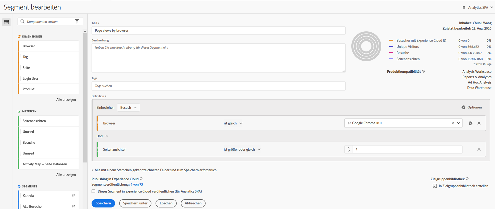
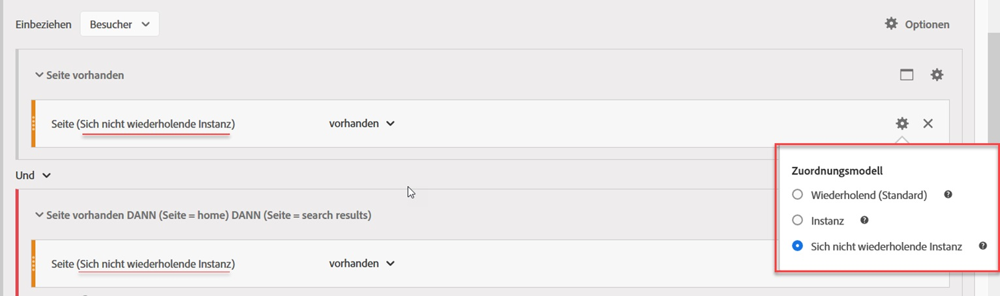
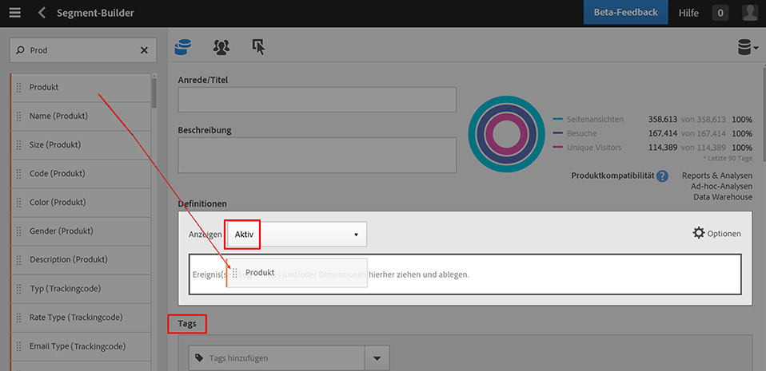
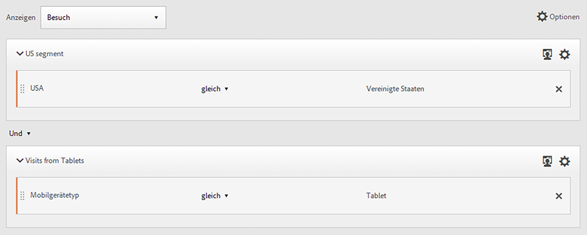

# Segmentaufbau

Mit dem [!UICONTROL Segmentaufbau] können Sie einfache oder komplexe Segmente erstellen, mit deren Hilfe Besucherattribute und Aktionen bei Besuchen und Seitentreffern identifiziert werden. Er bietet eine Arbeitsfläche zum Ziehen und Ablegen von metrischen Dimensionen, Ereignissen und anderen Segmenten, um Besucher mithilfe von Hierarchielogik, Regeln und Operatoren zu segmentieren.

Es gibt mehrere Möglichkeiten für den Zugriff auf den Segment Builder:

* **Obere Navigation von Analytics**: Klicken Sie auf **[!UICONTROL Analytics]** > **[!UICONTROL Komponenten]** > **[!UICONTROL Segmente]**.
* **[!UICONTROL Analysis Workspace]**: Klicken Sie auf **[!UICONTROL Analytics]** > **[!UICONTROL Workspace]**, öffnen Sie ein Projekt und klicken Sie auf **[!UICONTROL + Neu]** > **[!UICONTROL Segment erstellen]**.
* **[!UICONTROL Reports &amp; Analytics]**: Klicken Sie auf **[!UICONTROL Analytics]** > **[!UICONTROL Berichte]**, öffnen Sie einen vorhandenen Bericht, klicken Sie auf das Segmentsymbol  im linken Navigationsmenü und klicken Sie dann auf **[!UICONTROL Hinzufügen]**.
* **[!UICONTROL Report Builder]**: [Hinzufügen oder Bearbeiten von Segmenten in Report Builder](https://docs.adobe.com/content/help/de-DE/analytics/analyze/report-builder/data-requests/segmentation.html).

## Builder-Kriterien {#section_F61C4268A5974C788629399ADE1E6E7C}

Sie können Regeldefinitionen und Container hinzufügen, um Ihre Segmente zu definieren.

1. **[!UICONTROL Titel]**: Benennen Sie das Segment.
1. **[!UICONTROL Beschreibung]**: Geben Sie eine Beschreibung für das Segment ein.
1. **[!UICONTROL Tags]**: [Kennzeichnen Sie das Segment](/help/components/segmentation/segmentation-workflow/seg-workflow.md), das Sie erstellen, mit einem Tag, indem Sie ein vorhandenes aus der Liste auswählen oder ein neues erstellen.
1. **[!UICONTROL Definitionen]**: Dies ist der Bereich, in dem Sie [Segmente erstellen und konfigurieren](/help/components/segmentation/segmentation-workflow/seg-workflow.md), Regeln hinzufügen und Container verschachteln und sequenzieren.
1. **[!UICONTROL Anzeigen]**: (Auswahl des obersten Containers.) Hiermit können Sie die Ebene des [Containers](/help/components/segmentation/seg-overview.md) der obersten Ebene auswählen ([!UICONTROL Besucher], [!UICONTROL Besuch], [!UICONTROL Treffer]). Standardmäßig ist der Trefferbehälter der Behälter der obersten Ebene.
1. **[!UICONTROL Optionen]**: (Zahnrad)-Symbol

   * **[!UICONTROL Behälter hinzufügen]**: Hiermit fügen Sie (unter dem obersten Behälter) einen neuen Behälter zur Segmentdefinition hinzu.
   * **[!UICONTROL Ausschließen]**: Hiermit definieren Sie das Segment, indem Sie eine oder mehrere Dimensionen, Segmente oder Metriken ausschließen.

1. **[!UICONTROL Dimensionen]**: Komponenten werden aus der Liste der Dimensionen (orangefarbene Seitenleiste) gezogen und abgelegt.
1. **[!UICONTROL Operator]**: Sie können Werte mithilfe ausgewählter Operatoren vergleichen und beschränken.
1. **[!UICONTROL Wert]**: Der Wert, den Sie für die Dimension, das Segment oder die Metrik eingegeben oder ausgewählt haben.
1. **[!UICONTROL Attributionsmodelle]**: Diese Modelle sind nur für Dimensionen verfügbar und bestimmen, für welche Werte in einer Dimension ein Segment erstellt werden soll. Dimensionsmodelle sind besonders bei der sequenziellen Segmentierung nützlich.

   * **[!UICONTROL Wiederholend]** (Standard): Umfasst Instanzen und beibehaltene Werte für die Dimension.
   * **[!UICONTROL Instanz]**: Umfasst Instanzen für die Dimension.
   * **[!UICONTROL Nicht wiederholende Instanz]**: Umfasst eindeutige Instanzen (nicht wiederholend) für die Dimension. Dies ist das im Fluss angewendete Modell, wenn Wiederholungsinstanzen ausgeschlossen werden.

   

   **Beispiel: Treffersegment mit eVar1 = A**

   | Beispiel | A | A | A (persistent) | B | A | C |
   |---|---|---|---|---|---|---|
   | Wiederholend | X | X | X | – | X | – |
   | Instanz | X | X | – | – | X | – |
   | Nicht wiederholende Instanz | X | – | – | – | X | – |
1. **[!UICONTROL And/Or/Then]**: Weist die [!UICONTROL AND/OR/THEN]-Operatoren zwischen Containern oder Regeln zu. Mit dem Operator „THEN“ können Sie [sequenzielle Segmente definieren](/help/components/segmentation/segmentation-workflow/seg-sequential-build.md).
1. **[!UICONTROL Metrik]** (Grüne Seitenleiste): Metrik, die aus der Liste „Metriken“ gezogen und abgelegt wurde.
1. Operator **[!UICONTROL Vergleich]**: Sie können Werte mithilfe ausgewählter Operatoren vergleichen und beschränken.
1. **[!UICONTROL Wert]**: Der Wert, den Sie für die Dimension, das Segment oder die Metrik eingegeben oder ausgewählt haben.
1. **[!UICONTROL X]** (Löschen): Hiermit können Sie diesen Teil der Segmentdefinition löschen.
1. **[!UICONTROL Veröffentlichung über Experience Cloud]**: Durch das Veröffentlichen eines Adobe Analytics-Segments in Experience Cloud können Sie das Segment für die Marketing-Aktivität in [!DNL Audience Manager] und in anderen Aktivierungskanälen verwenden. [Weitere Informationen ...](/help/components/segmentation/segmentation-workflow/seg-publish.md)
1. **[!UICONTROL Zielgruppenbibliothek]**: Die Zielgruppendienste von Adobe verwalten die Übersetzung von Besucherdaten in die Zielgruppensegmentierung. Auf diese Weise erfolgt die Erstellung und Verwaltung von Zielgruppen so ähnlich wie die Erstellung und Verwendung von Segmenten, mit dem zusätzlichen Vorteil, dass die Zielgruppensegmente für die Experience Cloud freigegeben werden können. [Weitere Informationen ...](https://docs.adobe.com/content/help/de-DE/core-services/interface/audiences/audience-library.html)
1. **[!UICONTROL Suche]**: Durchsucht die Liste der Dimensionen, Segmente oder Metriken.
1. **[!UICONTROL Dimensionen]** (Liste): Klicken Sie auf die Kopfzeile zum Erweitern.
1. **[!UICONTROL Metriken]**: Klicken Sie auf die Kopfzeile zum Erweitern.
1. **[!UICONTROL Segmente]**: Klicken Sie auf die Kopfzeile zum Erweitern.
1. **[!UICONTROL Report Suite-Auswahl]**: Erlaubt die Auswahl der Report Suite, unter der dieses Segment gespeichert wird. Sie können das Segment weiterhin in allen Report Suites verwenden.
1. **[!UICONTROL Segmentvorschau]**: Liefert eine Vorschau der Schlüsselmetriken, die anzeigen, ob es sich um ein gültiges Segment handelt und wie breit das Segment ist. Stellt eine Aufschlüsselung des Datensatzes dar, den Sie erwarten können, wenn Sie dieses Segment anwenden. Zeigt 3 konzentrische Kreise und eine Liste mit der Anzahl und dem Prozentsatz der Übereinstimmungen für [!UICONTROL Treffer], [!UICONTROL Besuche] und [!UICONTROL Besucher] für einen mit diesem Segment ausgeführten Datensatz. Dieses Diagramm wird beim Erstellen oder Ändern der Segmentdefinition sofort aktualisiert.
1. **[!UICONTROL Produktkompatibilität]**: Liefert eine Liste der Produkte von Adobe Analytics (Analysis Workspace, [!UICONTROL Reports &amp; Analytics], Data Warehouse), mit denen das von Ihnen erstellte Segment kompatibel ist. Die meisten Segmente sind mit allen Produkten kompatibel. Es sind jedoch nicht alle Operatoren und Dimensionen mit allen Analytics-Produkten kompatibel. Dies betrifft insbesondere [Data Warehouse](/help/components/segmentation/seg-reference/seg-compatibility.md). Dieses Diagramm wird bei Änderungen der Segmentdefinition sofort aktualisiert.
1. **[!UICONTROL Speichern]** oder **[!UICONTROL Abbrechen]**: Speichert oder bricht das Segment ab. Nachdem Sie auf **[!UICONTROL Speichern]** geklickt haben, gelangen Sie zum Segment-Manager, in dem Sie das Segment verwalten können.

Die Funktionsweise von Segmenten mit eingebetteten Datumsbereichen ist in Analysis Workspace und [!UICONTROL Reports &amp; Analytics] weiterhin unterschiedlich: In Workspace wird der Datumsbereich des Bedienfelds mit dem eingebetteten Datumsbereich des Segments überschrieben. Im Gegensatz dazu erhalten Sie in [!UICONTROL Reports &amp; Analytics] die Schnittmenge des Datumsbereichs des Berichts und des eingebetteten Datumsbereichs des Segments.

## Segmente erstellen {#build-segments}

1. Ziehen Sie einfach eine Dimension, ein Segment oder ein metrisches Ereignis aus dem linken Fenster in das Feld [!UICONTROL Definitionen].

   

   Nach dem Ziehen eines Elements in das Feld [!UICONTROL Definitionen] wird der standardmäßige [!UICONTROL Trefferbehälter] der obersten Ebene angezeigt. Über das Dropdown-Menü **[!UICONTROL Anzeigen]** können Sie den Behältertyp in „Besuch“ oder „Besucher“ ändern.

1. Legen Sie den [Operator](/help/components/segmentation/seg-reference/seg-operators.md) im Dropdown-Menü fest.
1. Geben Sie für das ausgewählte Element einen Wert ein oder wählen Sie einen aus.
1. Fügen Sie, sofern erforderlich, mithilfe von **[!UICONTROL Und]**-, **[!UICONTROL Oder]**- oder **[!UICONTROL Dann]**-Regeln weitere Behälter hinzu.
1. Sehen Sie sich nach dem Platzieren der Behälter und dem Festlegen der Regeln rechts oben im Validierungsdiagramm die Ergebnisse des Segments an. Der Validator zeigt den Prozentsatz und die absolute Anzahl der Seitenansichten, Besuche und Unique Visitors an, die mit dem erstellten Segment übereinstimmen.
1. Taggen Sie unter **[!UICONTROL Tags]** den Behälter, indem Sie ein vorhandenes [Tag](/help/components/segmentation/segmentation-workflow/seg-tag.md) auswählen oder ein neues erstellen.
1. Klicken Sie zum **[!UICONTROL Speichern]** des Segments auf Speichern.

Sie gelangen jetzt zum [Segment-Manager](/help/components/segmentation/segmentation-workflow/seg-manage.md). Dort können Sie Ihr Segment auf verschiedene Arten taggen, freigeben und verwalten.

## Hinzufügen von Containern {#section_1C38F15703B44474B0718CEF06639EFD}

Sie können [ein Framework aus Containern](/help/components/segmentation/seg-overview.md) erstellen und dann Logikregeln und Operatoren dazwischen platzieren.

1. Klicken Sie auf **[!UICONTROL Optionen > Behälter hinzufügen]**.

   

   Daraufhin wird ein neuer [!UICONTROL Trefferbehälter] ohne identifizierten [!UICONTROL Treffer] (Seitenansicht) geöffnet.

   

1. Ändern Sie gegebenenfalls den Behältertyp.
1. Ziehen Sie eine Dimension, ein Segment oder ein Ereignis aus dem linken Fenster in den Behälter.
1. Fügen Sie oben in der Definition weitere neue Behälter über die Schaltfläche **[!UICONTROL Optionen]** > **[!UICONTROL Behälter hinzufügen]** der obersten Ebene hinzu oder fügen Sie Behälter aus einem Behälter hinzu, um die Logik zu verschachteln.

   **OR**

   Wählen Sie eine oder mehrere Regeln aus und klicken Sie anschließend auf **[!UICONTROL Optionen]** > **[!UICONTROL Behälter aus Auswahl hinzufügen]**. Dadurch wird Ihre Auswahl zu einem separaten Behälter.

## Verwenden von Datumsbereichen {#concept_252A83D43B6F4A4EBAB55F08AB2A1ACE}

Sie können Segmente erstellen, die rollierende Datumsbereiche enthalten, um Fragen zu laufenden Kampagnen oder Ereignissen zu beantworten.

Sie können beispielsweise ganz einfach ein Segment erstellen, das „alle, die etwas in den vergangenen 60 Tagen gekauft haben“ beinhaltet.

Erstellen Sie einen Behälter „Besuch“ und fügen Sie den Zeitraum [!UICONTROL Letzte 60 Tage] und die Metrik [!UICONTROL Menge größer als oder gleich 1] mit einem AND-Operator hinzu:

## Stapeln von Segmenten {#task_58140F17FFD64FF1BC30DC7B0A1B0E6D}

Für die Stapelung von Segmenten werden die Kriterien der einzelnen Segmente mit einem „And“-Operator kombiniert und dann gemeinsam angewendet. Dies kann in einem Workspace-Projekt direkt oder im Segment Builder erfolgen.

Wenn Sie z. B. ein Segment „Mobiltelefonbenutzer“ und ein Segment „US-Geographie“ stapeln, werden ausschließlich Daten für Mobiltelefonbenutzer in den USA geliefert.

Stellen Sie sich diese Segmente als Bausteine oder Module vor, die Sie in eine Segmentbibliothek aufnehmen können, damit Benutzer diese verwenden können, wenn sie passend erscheinen. Auf diese Art können Sie die Anzahl der benötigten Segmente drastisch reduzieren. Angenommen, Sie haben 40 Segmente:

* 20 für Mobiltelefonbenutzer in verschiedenen Ländern (USA_mobil, Deutschland_mobil, Frankreich_mobil, Brasilien_mobil usw.)
* 20 für Tabletbenutzer in verschiedenen Ländern (USA_tablet, Deutschland_tablet, Frankreich_tablet, Brasilien_tablet usw.)

Indem Sie die Segmentstapelung nutzen, können Sie Ihre Segmente auf 22 verringern und diese bei Bedarf stapeln. Sie müssten folgende Segmente erstellen:

* ein Segment für Mobilbenutzer
* ein Segment für Tabletbenutzer
* 20 Segmente für die verschiedenen Regionen

>[!NOTE]
>
>Wenn Sie zwei Segmente stapeln, werden diese standardmäßig durch eine AND-Anweisung verbunden. Dies kann nicht in eine OR-Anweisung geändert werden.

1. Wechseln Sie zum Segmentaufbau.
1. Geben Sie einen Titel und eine Beschreibung für das Segment ein.

   Schritt Ergebnis 1. Klicken Sie auf **[!UICONTROL Segmente anzeigen]**, um in der linken Navigation eine Liste der Segment anzuzeigen.

   Schritt Ergebnis 1. Ziehen Sie die Segmente, die Sie stapeln möchten, in die Arbeitsfläche der Segmentdefinition. Hier sehen Sie ein Beispiel eines Segments, das die vorhandenen Segmente „Besuche von Tablets“ und „US-Geo“ stapelt:

   

1. Speichern Sie das Segment.

   Schrittergebnis

## Segmentvorlagen {#concept_5098446CC78D441E93B8E4D1D1EA6558}

Segmentvorlagen werden für gängige Anwendungsfälle der Segmentierung bereitgestellt, z. B. „Erstbesuche“ oder „Besuche von Mobilgeräten“. Sie stehen in Workspace-Projekten und im Segment Builder als Bausteine für neue Segmente zur Verfügung.

Vorlagen werden mit dem Adobe-Logo „A“ gekennzeichnet. Nachfolgend sind einige Beispielvorlagen aufgeführt:

<table id="table_98B87D807E9344C9BEBF072C65D87B1B"> 
 <thead> 
  <tr> 
   <th colname="col1" class="entry"> Vorlagenname </th> 
   <th colname="col2" class="entry"> Definition </th> 
  </tr> 
 </thead>
 <tbody> 
  <tr> 
   <td colname="col1"> Warenkorb vorzeitig verlassen </td> 
   <td colname="col2">Daten zu Besuchern anzeigen, die Elemente zum Warenkorb hinzugefügt, aber nichts bestellt haben. In der Segmentdefinition ist der Behälter „Besuche“. Die Regel für dieses sequenzielle Segment ist 
 Zusätze zum Warenkorb ist nicht null 
 
Dann 
 
Bestellungen gleich 0. 
 </td> 
  </tr> 
  <tr> 
   <td colname="col1"> Erstbesuche </td> 
   <td colname="col2">Daten zu Besuchern mit maximal einem [1] Besuch anzeigen. In der Segmentdefinition ist der Behälter „Besuche“. Die Regel ist 
Besuchsnummer gleich 1. 
 </td> 
  </tr> 
  <tr> 
   <td colname="col1"> Nichtkäufer </td> 
   <td colname="col2">Daten zu Besuchern anzeigen, die nicht zu einem Bestellereignis beitrugen. In der Segmentdefinition ist der Behälter „Besucher“. Dieses Segment verwendet die Ausschließen-Logik. Die Regel ist 
Bestellungen ist nicht null. 
 </td> 
  </tr> 
  <tr> 
   <td colname="col1"> Nicht-Einzelseitenbesuche (Keine Absprünge) </td> 
   <td colname="col2">Daten zu Besuchern anzeigen, die mehr als einen Besuch ausgeführt haben. In der Segmentdefinition ist der Behälter „Besucher“. Dieses Segment verwendet die Ausschließen-Logik. Die Regel ist 
Einzelzugriff ist nicht null. 
 </td> 
  </tr> 
  <tr> 
   <td colname="col1"> Paid Search </td> 
   <td colname="col2">Daten zu Besuchern anzeigen, die von einer gebührenpflichtigen Suche stammen. In der Segmentdefinition ist der Behälter „Besuche“. Die Regel ist 
Gebührenpflichtige Sucherkennung gleich 1. 
 </td> 
  </tr> 
  <tr> 
   <td colname="col1"> Käufern </td> 
   <td colname="col2">Daten zu Besuchern anzeigen, die zu einem Bestellereignis beitrugen. In der Segmentdefinition ist der Behälter „Besucher“. Die Regel ist 
Bestellungen ist nicht null. 
 </td> 
  </tr> 
  <tr> 
   <td colname="col1"> Rückkehrende Besucher </td> 
   <td colname="col2">Daten zu Besuchern anzeigen, die mindestens einen Besuch durchgeführt haben. In der Segmentdefinition ist der Behälter „Besuche“. Die Regel ist 
Besuchsnummer ist größer als 1. 
 </td> 
  </tr> 
  <tr> 
   <td colname="col1"> Einzelseitenbesuche </td> 
   <td colname="col2"> Daten zu Besuchen anzeigen, bei denen ein Einzelseitenwert vorliegt, auch wenn während des Besuchs mehrere Seitenansichten übermittelt werden. Einzelseitenbesuche mit Exitlink-Ereignissen werden in das Segment einbezogen. In der Segmentdefinition ist der Behälter „Besuche“. Die Regel ist 
Einzelseitenbesuche gleich 1. 
 </td> 
  </tr> 
  <tr> 
   <td colname="col1"> Angesehenes Produkt wurde nicht dem Warenkorb hinzugefügt </td> 
   <td colname="col2">Daten zu Besuchern anzeigen, die Produkte angesehen, aber keine zum Warenkorb hinzugefügt haben. In der Segmentdefinition ist der Behälter „Besuche“. Die Regel für dieses sequenzielle Segment ist 
Produktansichten ist nicht null 
 
Dann 
 
 Warenkorbzusätze gleich 0. 
 </td> 
  </tr> 
  <tr> 
   <td colname="col1"> Besuche von Kampagnen </td> 
   <td colname="col2">Daten zu Besuchern aus Kampagnen anzeigen. In der Segmentdefinition ist der Behälter „Besuche“. Die Regel ist 
Trackingcode ist nicht null. 
 </td> 
  </tr> 
  <tr> 
   <td colname="col1"> Besuche von Mobilgeräten </td> 
   <td colname="col2">Daten zu Besuchern anzeigen, die Mobilgeräte verwenden. In der Segmentdefinition ist der Behälter „Besuche“. Die Regel ist 
Mobiles Gerät ist ungleich null. 
 </td> 
  </tr> 
  <tr> 
   <td colname="col1"> Besuche über eine kostenlose Suche </td> 
   <td colname="col2">Daten zu Besuchern anzeigen, die nicht von einer gebührenpflichtigen Suche stammen. In der Segmentdefinition ist der Behälter „Besuche“. Die Regel ist 
Gebührenpflichtige Sucherkennung gleich 0. 
 </td> 
  </tr> 
  <tr> 
   <td colname="col1"> Besuche von Nicht-Mobilgerät </td> 
   <td colname="col2">Daten zu Besuchern anzeigen, die kein Mobilgerät verwenden. In der Segmentdefinition ist der Behälter „Besuche“. Dieses Segment verwendet die Ausschließen-Logik. Die Regel ist 
Mobilgerätetyp gleich Mobiltelefon 
 
Oder 
 
Mobilgerätetyp gleich Tablet. 
 </td> 
  </tr> 
  <tr> 
   <td colname="col1"> Besuche von Smartphones </td> 
   <td colname="col2">Daten zu Besuchern anzeigen, die Smartphones verwenden. In der Segmentdefinition ist der Behälter „Besuche“. Die Regel ist 
Gerätetyp gleich Mobiltelefon. 
 </td> 
  </tr> 
  <tr> 
   <td colname="col1"> Besuche über Suchmaschinen </td> 
   <td colname="col2">Daten zu Besuchern aus Suchmaschinen anzeigen. In der Segmentdefinition ist der Behälter „Besuche“. Die Regel ist 
Referrer-Typ gleich Suchmaschinen. 
 </td> 
  </tr> 
  <tr> 
   <td colname="col1"> Besuche von sozialen Netzwerken aus </td> 
   <td colname="col2">Daten zu Besuchern aus sozialen Netzwerken anzeigen. In der Segmentdefinition ist der Behälter „Besuche“. Die Regel ist 
Referrer-Typ gleich soziale Netzwerke. 
 </td> 
  </tr> 
  <tr> 
   <td colname="col1"> Besuche von Tablets </td> 
   <td colname="col2">Daten zu Besuchern anzeigen, die Tablets verwenden. In der Segmentdefinition ist der Behälter „Besuche“. Die Regel ist 
Gerätetyp gleich Tablet. 
 </td> 
  </tr> 
  <tr> 
   <td colname="col1"> Besuche mit Besucher-ID-Cookie </td> 
   <td colname="col2">Daten zu Besuchern Ihrer Site anzeigen, für die ein persistentes Cookie erforderlich ist. In der Segmentdefinition ist der Behälter „Besuche“. Die Regel ist 
Beständiges Cookie gleich 1. 
 </td> 
  </tr> 
 </tbody> 
</table>
