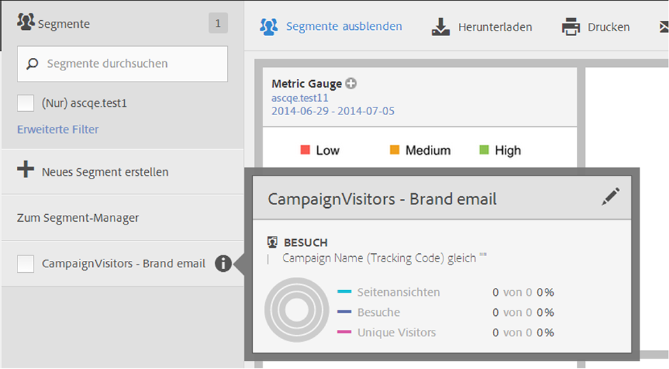

# Segmente auswählen und anwenden

So wenden Sie eines oder mehrere Segmente über die Segmentleiste auf einen Bericht an.

1. Wählen Sie den Bericht aus, auf den Sie ein Segment anwenden möchten, z. B. den [!UICONTROL Seitenbericht].
1. Klicken Sie über dem Bericht auf **[!UICONTROL Segmente anzeigen]**. Die Segmentleiste wird geöffnet.

   

1. Aktivieren Sie das Kontrollkästchen neben Segmenten oder **[!UICONTROL Segmente durchsuchen]**, um das richtige Segment zu finden.

   >[!NOTE]
   >
   >Sie können mehr als ein Segment auf einen Bericht anwenden (dies wird als Segmentstapelung bezeichnet). Wenn mehrere Segmente angewendet werden, werden die in den einzelnen Segmenten enthaltenen Kriterien mit einem AND-Operator verbunden und dann angewendet. Sie können beliebig viele Segmente stapeln.

   >[!NOTE]
   >
   >Wenn Sie neben dem Segmentnamen auf das Informationssymbol (i) klicken, erhalten Sie eine Vorschau der Schlüsselmetriken und sehen, ob Sie ein gültiges Segment besitzen und wie breit das Segment ist.

1. Sie können nach Report Suite filtern, indem Sie das Kontrollkästchen **[!UICONTROL (Nur) `<report suite name>`]** aktivieren. Dadurch werden nur die Segmente angezeigt, die zuletzt in der entsprechenden Report Suite gespeichert wurden.
1. Klicken Sie auf **[!UICONTROL Segment anwenden]**, damit der Bericht aktualisiert wird. Die angewendeten Segmente werden jetzt oben im Bericht angezeigt:

   
