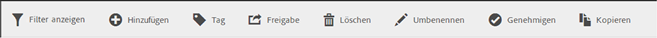

# Segmente freigeben

Abhängig von Ihren Berechtigungen können Sie Segmente für Ihre gesamte Organisation, Gruppen oder einzelne Benutzer freigeben.

| Administrator | Kann Segmente für alle, für Gruppen und für Benutzer freigeben. Gruppen werden in der Admin Console als Berechtigungsgruppen eingerichtet. |
|---|---|
| Nicht-Administrator | Kann Segmente nur für einzelne Benutzer freigeben. |

Wann sollten Segmente für das gesamte Unternehmen und wann nur für eine Benutzergruppe oder einzelne Benutzer freigegeben werden? Im Folgenden finden Sie einige Best Practices, an denen Sie sich orientieren können:

* Geben Sie als Administrator ein Segment für **[!UICONTROL Alle]** frei, wenn es für das gesamte Unternehmen von Nutzen ist und von jedem bequem verwendet werden kann. In diesem Fall sollten Sie das Segment eventuell auch [genehmigen](/help/components/segmentation/segmentation-workflow/seg-approve.md).

* Geben Sie als Administrator ein Segment für eine bestimmte **[!UICONTROL Gruppe]** frei, wenn das Segment für das entsprechende Team einen Geschäftswert bietet. Führen Sie für diesen Segmenttyp keine offizielle Genehmigung durch.
* Geben Sie als Administrator oder als einzelner Benutzer ein Segment für andere einzelne Benutzer frei, um ein Segment zu prüfen und zu validieren. Wenn er sich als nicht nützlich erweist, kann er verworfen werden. Führen Sie für diesen Segmenttyp keine offizielle Genehmigung durch.

1. Aktivieren Sie im Segment-Manager das Kontrollkästchen neben dem Segment, das Sie freigeben möchten. Die Werkzeugleiste für die Segmentverwaltung wird angezeigt:

   

1. Klicken Sie auf **[!UICONTROL Freigabe]**.

   

   Wenn Sie Administrator sind, können Sie **[!UICONTROL Alle]** oder **[!UICONTROL Gruppen]** und **[!UICONTROL Benutzer]** in Ihrer Organisation auswählen. Als Nicht-Administrator sehen Sie nur einzelne Benutzer. Benutzen Sie das Feld **[!UICONTROL Suchen]**, um nach Gruppen oder Benutzern zu suchen. 1. Klicken Sie auf **[!UICONTROL Freigeben]**.

   Neben dem Segment wird das Freigabesymbol angezeigt:  

1. Sie können nach für Sie freigegebenen Segmenten filtern, indem Sie zu **[!UICONTROL Filter]** > **[!UICONTROL Weitere Filter]** > **[!UICONTROL Für mich freigegeben]** wechseln.
