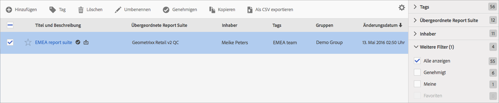

# Virtual Report Suites verwalten

Im Virtual Report Suite Manager können Administratoren Virtual Report Suites bearbeiten, hinzufügen, taggen, löschen, umbenennen, genehmigen, kopieren, exportieren und filtern. Er ist für Nicht-Admin-Benutzer nicht sichtbar.

**[!UICONTROL Analytics]** > **[!UICONTROL Komponenten]** > **[!UICONTROL Virtual Report Suites]**

>[!NOTE]
>
>Im Virtual Report Suite Manager sehen Sie nur Ihre eigenen Virtual Report Suites. Sie müssen auf **[!UICONTROL Alle anzeigen]** klicken, um die aller anderen anzuzeigen.

| Aufgabe | Beschreibung |
|--- |--- |
| Hinzufügen | Bringt Sie zum Virtual Report Suite-Builder, in dem Sie neue Virtual Report Suites erstellen können. |
| Tag | Alle Benutzer können Tags für Segmente erstellen und eines oder mehrere Tags auf ein Segment anwenden. Sie sehen Tags jedoch nur für die Segmente, deren Inhaber Sie sind. Welche Arten von Tags sollten Sie erstellen? Hier finden Sie einige Vorschläge für nützliche Tags:<ul><li>Auf Teamnamen basierende Tags wie Social Marketing, Mobile Marketing</li><li>Projekt-Tags (Analyse-Tags) wie Entrypage-Analyse</li><li>Kategorie-Tags: Männer, Region</li><li>Arbeitsablauf-Tags: Kuratiert für (einen bestimmten Geschäftsbereich), Genehmigt</li></ul> |
| Löschen | Wenn Sie eine Virtual Report Suite löschen, arbeiten terminierte Berichte und Dashboards, auf die diese Virtual Report Suite angewendet ist, normal weiter. Der Bericht oder das Dashboard verwendet die gelöschte Virtual Report Suite so lange weiter, bis Sie den terminierten Bericht erneut speichern.  Terminierte Berichte werden nicht aktualisiert, wenn Sie eine Virtual Report Suite mit demselben Namen bearbeiten. Beispiel: Angenommen, Sie haben zwei Virtual Report Suites mit demselben Namen und unterschiedlichen übergeordneten Report Suites: Sie haben ein Lesezeichen, das auf die Virtual Report Suite für die Report Suite „mainprod“verweist. Dann löschen Sie die Virtual Report Suite, weil es sich um ein Duplikat handelt. Das Lesezeichen funktioniert weiterhin und referenziert die Definition der gelöschten VRS. Wenn Sie die Definition der verbliebenen VRS ändern, ändert sich die auf das Lesezeichen angewendete VRS nicht. Es wird die alte Definition verwendet. Um dies zu beheben, müssen Sie das Lesezeichen aktualisieren, damit es die neue Definition referenziert. Wenn Sie nicht sicher sind, ob ein Lesezeichen, ein Dashboard oder ein terminierter Bericht eine VRS verwendet, können Sie den Namen der VRS ändern, damit deutlich wird, ob das Lesezeichen die VRS verwendet. |
| Umbenennen | Überall, wo die neue Virtual Report Suite angezeigt wird, wie in der Report Suite-Auswahl, wird der neue Name angezeigt. |
| Genehmigen/Nicht genehmigen | Genehmigen Sie Virtual Report Suites, um diese „offiziell“ oder „kanonisch“ zu machen. Der Vorgang kann umgekehrt werden, indem Sie die Genehmigung aufheben. |
| Kopieren | Erstellt eine eigenständige Kopie mit einer eigenen neuen Report Suite-ID, jedoch mit demselben Namen und derselben Definition. |
| In CSV exportieren | Exportiert die Definition der Virtual Report Suite in eine CSV-Datei. |
| Filter | Filtert nach Tags, übergeordneter Report Suite, Inhabern und anderen Filterkriterien („Alle anzeigen“, „Meine“, „Favoriten“ und „Genehmigt“). |
