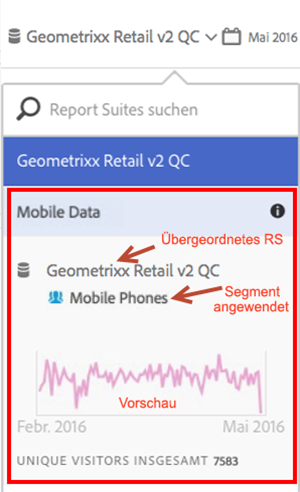

# Informationen zu Virtual Report Suites anzeigen

Klicken Sie auf das Symbol „i“ (Info) neben dem Namen der Report Suite, um die zugehörigen Informationen anzuzeigen.

## In der Report Suite-Auswahl   {#section_74E43B60C1CA4180B5ACA57574C1FA0F}

Wenn Sie in der Report Suite-Auswahl neben der Virtual Report Suite auf das Info-Symbol klicken, werden folgende Informationen angezeigt:

* Der Name der übergeordneten Report Suite.
* Der Name von darauf angewendeten Segmenten.
* Eine einfache Vorschau der Report Suite mit dem angewendeten Segment.
* Gesamtzahl der Unique Visitors.

