# Kontextbezogene Sitzungen

Kontextbezogene Sitzungen in Virtual Report Suites ändern, wie Adobe Analytics Besuche von jedem Gerät aus berechnet. In diesem Artikel werden auch die Verarbeitungsauswirkungen von Hintergrundtreffern und App-Startereignissen (beide vom Mobile SDK festgelegt) auf die Definition mobiler Besuche beschrieben.

Sie können einen Besuch auf beliebige Art und Weise definieren, ohne die zugrunde liegenden Daten zu ändern, um ihn auf die Interaktion Ihrer Besucher mit Ihren digitalen Erlebnissen abzustimmen.

## URL-Parameter für Kundenperspektive 

Mithilfe des Adobe Analytics-Datenerfassungsprozesses können Sie einen Abfrage-Zeichenfolgenparameter festlegen, der die Kundenperspektive angibt (Bezeichnung als Abfrage-Zeichenfolgenparameter „cp“). In diesem Feld wird der Status der digitalen Anwendung des Endbenutzers angegeben. Dies hilft Ihnen bei der Feststellung, ob ein Treffer generiert wurde, während sich eine mobile App in einem Hintergrundzustand befand.

## Verarbeitung von Treffern im Hintergrund 

Ein Hintergrundtreffer ist ein Treffertyp, der von der Adobe Mobile SDK-Version 4.13.6 und höher an Analytics gesendet wird, wenn sich die App in einem Hintergrundzustand befindet und eine Verfolgungsanfrage stellt. Typische Beispiele dafür umfassen Folgendes:

* Während eines Geo-Fence-Crossing-Vorgangs gesendete Daten
* Eine Push-Benachrichtigungsinteraktion

Die folgenden Beispiele erläutern die verwendete Logik bei der Bestimmung von Anfang und Ende eines Besuchs eines beliebigen Besuchers, wenn die Einstellung „Starten neuer Besuche durch Hintergrundtreffer verhindern“ für eine Virtual Report Suite aktiviert ist oder nicht.

**Wenn „Starten neuer Besuche durch Hintergrundtreffer verhindern“ nicht aktiviert ist:**

Wenn diese Funktion für eine Virtual Report Suite nicht aktiviert ist, werden Hintergrundtreffer genau wie andere Treffer behandelt. Das heißt, neue Besuche werden wie Vordergrundtreffer gestartet und sie agieren wie Vordergrundtreffer. Wenn beispielsweise ein Hintergrundtreffer weniger als 30 Minuten (Standard-Sitzungstimeout für eine Report Suite) vor einer Reihe von Vordergrundtreffern auftritt, ist der Hintergrundtreffer Teil der Sitzung.

Tritt der Hintergrundtreffer mehr als 30 Minuten vor jeglichen Vordergrundtreffern auf, erzeugt der Hintergrundtreffer einen eigenen Besuch, sodass die Gesamtzahl der Besuche 2 beträgt.

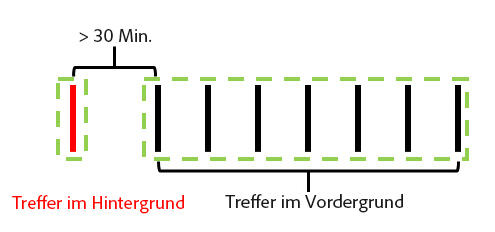

**Wenn „Starten neuer Besuche durch Hintergrundtreffer verhindern“ aktiviert ist:**

Die folgenden Beispiele veranschaulichen das Verhalten von Hintergrundtreffern, wenn diese Funktion aktiviert ist.

Beispiel 1: Ein Hintergrundtreffer tritt eine gewisse Zeitspanne (t) vor einer Reihe von Vordergrundtreffern auf.

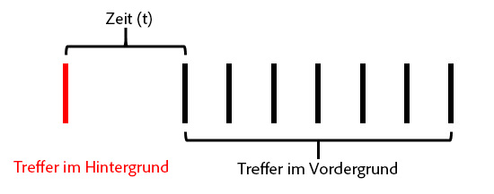

Wenn *t* in diesem Beispiel größer als das konfigurierte Besuchstimeout der Virtual Report Suite ist, wird der Hintergrundtreffer aus dem Besuch ausgeschlossen, der sich aus den Vordergrundtreffern ergibt. Wenn beispielsweise das Besuchstimeout der Virtual Report Suite auf 15 Minuten festgelegt wurde und *t* 20 Minuten beträgt, würde der durch diese Trefferserie (grüne Abgrenzung) generierte Besuch den Hintergrundtreffer ausschließen. Demnach würden eVars mit festgelegtem Besuchsablauf für den Hintergrundtreffer im folgenden Besuch **nicht** bestehen bleiben, und der Besuchssegmentcontainer würde nur die Vordergrundtreffer in der grünen Abgrenzung beinhalten.

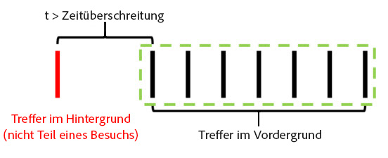

Wenn im Gegensatz dazu *t* kleiner ist als das konfigurierte Besuchstimeout der Virtual Report Suite, wird der Hintergrundtreffer als Teil des Besuchs einbezogen, so als würde es sich um einen Vordergrundtreffer handeln (durch die grüne Abgrenzung veranschaulicht):

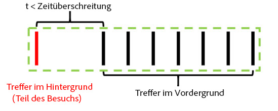

Das bedeutet:

* eVars mit festgelegtem Besuchsablauf für den Hintergrundtreffer behalten ihre Werte für die anderen Treffer während dieses Besuchs bei.
* Jegliche Werte, die für den Hintergrundtreffer festgelegt werden, werden in die logische Evaluierung des Segmentcontainers auf Besuchsebene einbezogen.

In beiden Fällen lautet die Gesamtzahl der Besuche 1.

Beispiel 2: Wenn ein Hintergrundtreffer nach einer Reihe von Vordergrundtreffern auftritt, ist das Verhalten ähnlich:

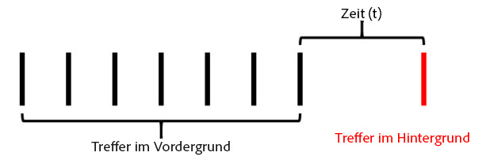

Tritt der Hintergrundtreffer nach dem konfigurierten Timeout der Virtual Report Suite auf, ist er nicht Teil einer Sitzung (grün dargestellt):

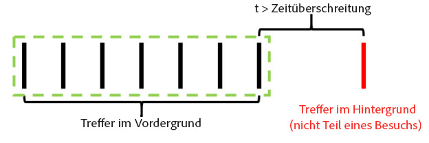

Wenn die Zeitspanne *t* kleiner wäre als das konfigurierte Timeout der Virtual Report Suite, wird der Hintergrundtreffer gleichermaßen in den Besuch einbezogen, der durch die vorherigen Vordergrundtreffer generiert wird:

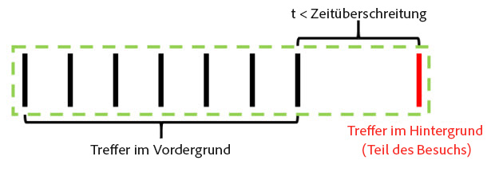

Das bedeutet:

* eVars mit festgelegtem Besuchsablauf für die vorherigen Vordergrundtreffer behalten ihre Werte für den anderen Treffer während dieses Besuchs bei.
* Jegliche Werte, die für den Hintergrundtreffer festgelegt werden, werden in die logische Evaluierung des Segmentcontainers auf Besuchsebene einbezogen.

Wie zuvor würde die Gesamtzahl der Besuche in beiden Fällen 1 lauten.

Beispiel 3: Unter bestimmten Umständen kann ein Hintergrundtreffer dazu führen, dass zwei separate Besuche in einem einzelnen Besuch kombiniert werden. Im folgenden Szenario geht einem Hintergrundtreffer eine Reihe von Vordergrundtreffern voran, die sich auch an den Hintergrundtreffer anschließt:

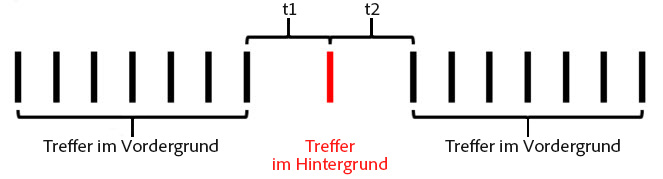

Wenn *t1* und *t2* in diesem Beispiel jeweils kleiner sind als das konfigurierte Besuchstimeout der Virtual Report Suite, werden alle diese Treffer in einem einzelnen Besuch kombiniert. Dies ist selbst dann der Fall, wenn *t1* und *t2* zusammen das Besuchstimeout übersteigen:

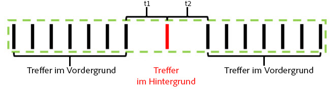

Sind *t1* und *t2* jedoch größer als das konfigurierte Timeout der Virtual Report Suite, werden diese Treffer in zwei unterschiedliche Besuche geteilt:

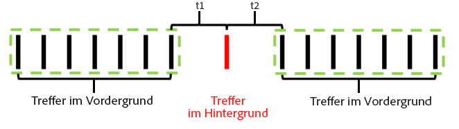

Wenn *t1* kleiner ist als das Timeout und *t2* ebenfalls kleiner als das Timeout ist, wird der Hintergrundtreffer gleichermaßen (wie in den vorherigen Beispielen) in den ersten Besuch einbezogen:

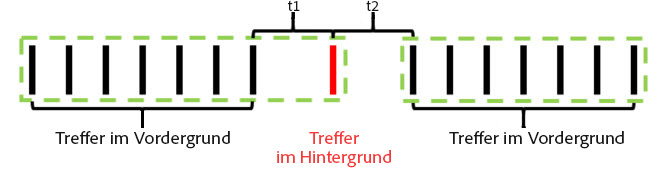

Wenn *t1* größer als das Timeout und *t2* kleiner als das Timeout ist, wird der Hintergrundtreffer in den zweiten Besuch einbezogen:

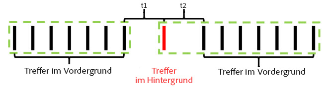

Beispiel 4: In Szenarien mit einer Reihe von Hintergrundtreffern im Zeitraum des Besuchstimeouts der Virtual Report Suite bilden die Treffer einen nicht sichtbaren „Hintergrundbesuch“, der nicht zu der Besuchsanzahl zählt und der nicht mithilfe eines Besuchssegmentierungscontainers zugänglich ist.

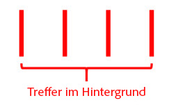

Obwohl dies nicht als Besuch gilt, behalten festgelegte eVars mit Besuchsablauf ihre Werte für die anderen Hintergrundtreffer in diesem „Hintergrundbesuch“.

Beispiel 5: In Szenarien, in denen mehrere Hintergrundtreffer nacheinander im Anschluss an eine Reihe von Vordergrundtreffern auftreten, ist es möglich (je nach Timeouteinstellung), dass die Hintergrundtreffer einen Besuch länger aufrecht erhalten als für die Zeitspanne des Besuchstimeouts. Wenn beispielsweise *t1* und *t2* zusammen größer sind als das Besuchstimeout der Virtual Report Suite, sie jedoch einzeln kleiner sind als das Timeout, umfasst der Besuch weiterhin beide Hintergrundtreffer:

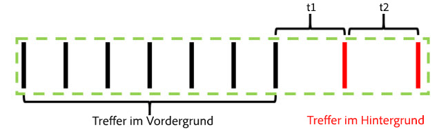

Wenn eine Reihe von Hintergrundtreffern vor einer Serie von Vordergrundereignissen auftritt, ist gleichermaßen ein ähnliches Verhalten feststellbar:

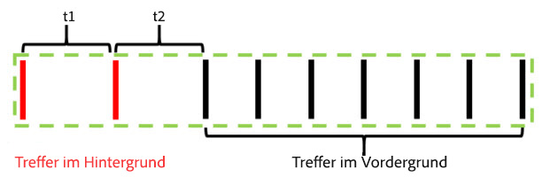

Hintergrundtreffer haben dieses Verhalten, um jegliche Zuordnungseffekte aus eVars oder anderen Variablen beizubehalten, die im Rahmen von Hintergrundtreffern festgelegt wurden. Dadurch können nachfolgende Vordergrundkonvertierungsereignisse Aktionen zugeordnet werden, die ausgeführt werden, während sich eine App im Hintergrundzustand befindet. Dies ermöglicht zudem das Einbeziehen von Hintergrundtreffern, die zu einer nachfolgenden Vordergrundsitzung geführt haben, in einen Besuchssegmentcontainer. Dies ist vor allem für die Messung der Effizienz von Push-Nachrichten hilfreich.

## Besuchsmetrikverhalten 

Die Besuchszahl basiert ausschließlich auf der Anzahl der Besuche mit mindestens einem Vordergrundtreffer. Demnach werden verwaiste Hintergrundtreffer oder „Hintergrundbesuche“ nicht in die Besuchsmetrik einbezogen.

## Zeit pro Besuch – Metrikverhalten 

Die verbrachte Zeit wird weiterhin analog zur Berechnung ohne Hintergrundtreffer mithilfe der Zeit zwischen den Treffern berechnet. Falls ein Besuch Hintergrundtreffer umfasst (weil sie nahe genug an Vordergrundtreffern aufgetreten sind), werden diese Treffer dennoch in die Berechnung der pro Besuch verbrachten Zeit einbezogen, als würde es sich um einen Vordergrundtreffer handeln.

## Einstellungen zur Verarbeitung von Treffern im Hintergrund 

Weil die Hintergrundtrefferverarbeitung nur für Virtual Report Suites mit Berichtszeitverarbeitung verfügbar ist, unterstützt Adobe Analytics zwei Methoden zur Verarbeitung von Hintergrundtreffern, um die Anzahl der Besuche in der zugrunde liegenden Report Suite beizubehalten, wobei die Funktion „Berichtszeitverarbeitung“ nicht verwendet wird. Navigieren Sie für den Zugriff auf diese Einstellung zur Adobe Analytics Admin Console, rufen Sie die Einstellungen der jeweiligen zugrunde liegenden Report Suite auf, navigieren Sie dann zum Menü „Mobile Verwaltung“ und dann zum Untermenü „Mobile App-Berichte“.

1. „Legacy-Verarbeitung Ein“: Standardeinstellung für alle Report Suites. Wenn Sie die Legacy-Verarbeitung aktiviert lassen, werden Hintergrundtreffer in der Verarbeitungspipeline wie normale Treffer behandelt, was die zugrunde liegende Report Suite ohne Zuordnung der Berichtszeit betrifft. Demnach inkrementieren Hintergrundtreffer, die in der zugrunde liegenden Report Suite angezeigt werden, Besuche als normalen Treffer. Wenn keine Hintergrundtreffer in Ihrer zugrunde liegenden Report Suite angezeigt werden sollen, ändern Sie diese Einstellung zu „Aus“.
1. „Legacy-Verarbeitung Aus“: Wenn die Legacy-Verarbeitung für Hintergrundtreffer aus ist, werden an die zugrunde liegende Report Suite gesendete Hintergrundtreffer von der zugrunde liegenden Report Suite ignoriert, und sie sind nur zugänglich, wenn eine in dieser zugrunde liegenden Report Suite erstellte Virtual Report Suite für die Verwendung der Funktion „Berichtszeitverarbeitung“ konfiguriert ist. Demnach werden von den Hintergrundtreffern erfasste Daten, die an diese zugrunde liegende Report Suite gesendet werden, nur in einer Virtual Report Suite mit aktivierter Funktion „Berichtszeitverarbeitung“ angezeigt.

   Diese Einstellung ist für Kunden vorgesehen, die die neue Verarbeitung von Hintergrundtreffern nutzen möchten, ohne die Besuchszahlen ihrer zugrunde liegenden Report Suite zu ändern.

In beiden Fällen werden Hintergrundtreffer mit denselben Kosten wie andere an Analytics gesendete Treffer abgerechnet.

## Starten neuer Besuche bei allen App-Starts 

Zusätzlich zur Verarbeitung von Hintergrundtreffern können Virtual Report Suites immer dann das Starten eines neuen Besuchs erzwingen, wenn das mobile SDK ein App-Startereignis sendet. Wenn diese Einstellung aktiviert ist, wird bei jedem Senden eines App-Startereignisses vom SDK das Starten eines neuen Besuchs erzwungen. Dabei ist es unerheblich, ob ein offener Besuch sein Timeout erreicht hat. Der Treffer mit dem App-Startereignis wird als erster Treffer des nächsten Besuchs betrachtet. Er inkrementiert die Besuchszahl und erzeugt einen gesonderten Besuchscontainer für die Segmentierung.
