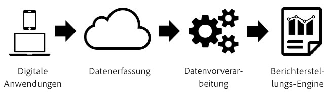
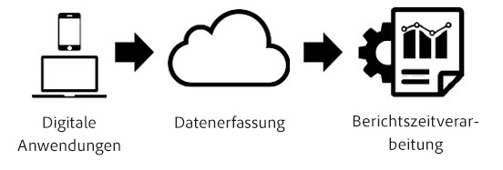

# Berichtszeitverarbeitung

Die Zeitverarbeitung von Berichten ist eine Virtual Report Suite-Einstellung, die die Verarbeitung von Daten in zerstörungsfreien, retroaktiven Daten ermöglicht.

> [!NOTE] Die Berichtverarbeitung ist nur für Analysis Workspace verfügbar.

„Report Time Processing“ betrifft nur die Daten in der Virtual Report Suite und hat keinen Einfluss auf Daten oder Datensammlungen in der zugrunde liegenden Report Suite. Der Unterschied zwischen Report Time Processing und der herkömmlichen Analytics-Verarbeitung lässt sich mithilfe des folgenden Diagramms am besten nachvollziehen:

Während der Datenverarbeitung in Analytics fließen die Daten durch die Datenerfassungspipeline und einen Vorverarbeitungsschritt, indem die Daten für die Berichterstellung vorbereitet werden. In diesem Schritt der Vorverarbeitung werden die Besuchsablauflogik und eVar-Persistenzlogik (unter anderem) auf die Daten angewendet, während sie erfasst werden. Der primäre Nachteil dieses Vorverarbeitungsmodells besteht darin, dass jegliche Konfiguration vorab erfolgen muss, noch bevor die Daten erfasst werden. Das heißt, dass die an den Vorverarbeitungseinstellungen vorgenommen Änderungen nur ab diesem Zeitpunkt und für neue Daten gelten. Dies ist problematisch, wenn defekte Daten eingehen oder wenn Einstellungen falsch konfiguriert wurden.

„Report Time Processing“ ist eine grundlegend andere Methode zur Verarbeitung von Analytics-Daten für die Berichterstellung. Anstatt vor dem Erfassen von Daten die Verarbeitungslogik vorab zu bestimmen, ignoriert Analytics die während des Vorverarbeitungsschritts festgelegten Daten und wendet diese Logik bei jeder Berichtsausführung an:

Diese Verarbeitungsarchitektur ermöglicht weit flexiblere Berichterstellungsoptionen. Sie können beispielsweise die Timeout-Zeitspanne für Besuche auf nicht destruktive Art und Weise beliebig ändern. Diese Änderungen spiegeln sich retroaktiv in der eVar-Persistenz und den Segmentcontainern wider, als hätten Sie diese Einstellungen vor dem Erfassen der Daten angewendet. Zudem können Sie eine beliebige Anzahl von Virtual Report Suites mit jeweils unterschiedlichen Optionen zu Report Time Processing generieren, die auf derselben zugrunde liegenden Report Suite basieren, ohne Daten in der zugrunde liegenden Report Suite zu ändern.

„Report Time Processing“ ermöglicht zudem, dass Analytics verhindert, dass Hintergrundtreffer neue Besuche starten und dass das [mobile SDK](https://marketing.adobe.com/developer/get-started/mobile/c-measuring-mobile-applications) die Berichterstellung zum Starten eines neuen Besuchs anweist, sobald ein App-Startereignis ausgelöst wird.

Die folgenden Konfigurationsoptionen sind momentan für Virtual Report Suites mit aktiviertem Report Time Processing verfügbar:

* **Timeout besuchen:** Die Einstellung "Besuch-Timeout" legt fest, wie viel Inaktivität ein individueller Besucher haben muss, bevor ein neuer Besuch automatisch gestartet wird. Die Standardeinstellung lautet 30 Minuten. Wenn Sie beispielsweise das Besuchstimeout auf 15 Minuten festlegen, wird für jede Sequenz mit erfassten Treffern eine neue Besuchsgruppierung erstellt, die nach 15 Minuten Inaktivität separiert ist. Diese Einstellung beeinflusst nicht nur Ihre Besuchszahlen, sondern auch die Art und Weise der Evaluierung von Besuchssegmentcontainern und die Besuchsablauflogik für eVars, die bei einem Besuch ablaufen. Durch eine Verringerung des Besuchstimeouts erhöht sich wahrscheinlich die Gesamtzahl der Besuche in der Berichterstellung, während eine Erhöhung des Besuchstimeouts wahrscheinlich zu einer Reduzierung der Gesamtbesuche in der Berichterstellung führt.
* **Einstellungen für Mobile App-Besuche:** Für Report Suites, die Daten enthalten, die von mobilen Apps über die [Adobe Mobile sdks](https://www.adobe.io/apis/cloudplatform/mobile.html)generiert wurden, sind zusätzliche Besuchseinstellungen verfügbar. Diese Einstellungen sind nicht destruktiv und betreffen nur Treffer, die über die Mobile SDKs erfasst wurden. Sie haben keinen Einfluss auf Daten, die außerhalb der Mobile SDKs erfasst wurden.
* **Verhindern, dass Hintergrundtreffer einen neuen Besuch starten:** Hintergrundtreffer werden von den Mobile sdks erfasst, wenn sich die App im Hintergrund befindet.
* **Einen neuen Besuch bei jedem App starten:** Zusätzlich zum Besuch-Timeout können Sie einen Besuch erzwingen, sobald ein App-Startereignis aus den Mobile sdks aufgezeichnet wurde, unabhängig vom Inaktivitätsfenster. Diese Einstellung nimmt Einfluss auf die Besuchsmetrik und den Besuchssegmentcontainer sowie die Besuchsablauflogik für eVars.
* **Neuen Besuch mit Ereignis starten:** Eine neue Sitzung beginnt, wenn ein Ereignis ausgelöst wird, unabhängig davon, ob eine Sitzung abgelaufen ist. Zur neuen Sitzung gehört auch das Ereignis, das sie ausgelöst hat. Zudem können Sie mehrere Ereignisse nutzen, um eine Sitzung zu starten, und eine neue Sitzung wird dann begonnen, wenn beliebige dieser Ereignisse in den Daten auftreten. Diese Einstellung wirkt sich auf Ihre Besuchszählung, den Besuchssegmentierungs-Container sowie die Besuchsablauflogik von eVars aus.

„Report Time Processing“ unterstützt nicht alle Metriken und Dimensionen, die in der herkömmlichen Analytics-Berichterstellung verfügbar sind. Virtual report suites utilizing Report Time Processing are only accessible in Analysis Workspace and will not be accessible in [!UICONTROL Reports &amp; Analytics], Ad Hoc Analysis, Data Warehouse, Report Builder, Data Feeds, or the reporting API.

Zudem werden bei „Report Time Processing“ nur Daten verarbeitet, die aus dem Datumsbereich der Berichterstellung stammen (nachfolgend als „Datumsfenster“ bezeichnet). Demnach bleiben auf „laufen nie ab“ festgelegte eVar-Werte für einen Besucher vor dem Datumsbereich der Berichterstellung in den Berichterstellungsfenstern nicht erhalten, und sie erscheinen nicht in Berichten. Das heißt auch, dass Kundenloyalitätsmessungen ausschließlich auf den im Berichterstellungsdatumsbereich vorhandenen Daten und nicht auf dem gesamten Verlauf vor dem Berichterstellungsdatumsbereich basieren.

Nachstehend finden Sie eine Liste der Metriken und Dimensionen, die bei Verwendung von „Report Time Processing“ momentan nicht unterstützt werden:

* **Analytics für Target:** Derzeit nicht unterstützt. Eine künftige Unterstützung ist geplant.
* **Analytics für reservierte Metriken/Dimensionen der Advertising Cloud:** Derzeit nicht unterstützt. Eine künftige Unterstützung ist geplant.
* **Einzelzugriffsmetrik:** Dauerhaft nicht unterstützt.
* **Listenvariablen:** Derzeit nicht unterstützt. Eine künftige Unterstützung ist geplant.
* **Zähler-evars:** Dauerhaft nicht unterstützt.
* **Marketingkanäle-Variablen:** Derzeit nicht unterstützt. Eine künftige Unterstützung ist geplant.
* **Tage seit letztem Kauf:** Aufgrund der Art des Zeitpunkts der Berichterstellung für die Berichterstellung wird diese Dimension nicht unterstützt.
* **Dimension "Tage bis Erstkauf" :** Aufgrund der Art des Zeitpunkts der Berichterstellung für die Berichterstellung wird diese Dimension nicht unterstützt.
* **Dimension Rückkehrhäufigkeit:** Aufgrund der Art des Zeitpunkts der Berichterstellung für die Berichterstellung wird diese Dimension nicht unterstützt. Ein alternativer Ansatz mithilfe einer Besuchsanzahlmetrik in einem Segment oder der Besuchsmetrik in einem Histogrammbericht kann verwendet werden.
* **Tage seit der letzten Besuchszeit:** Aufgrund der Art des Zeitpunkts der Berichterstellung für die Berichterstellung wird diese Dimension nicht unterstützt.
* **Ursprüngliche Dimension der Einstiegsseite:** Aufgrund der Art des Zeitpunkts der Berichterstellung für die Berichterstellung wird diese Dimension nicht unterstützt.
* **Lineare Zuweisungsevars:** Derzeit nicht unterstützt. Eine künftige Unterstützung ist geplant.
* **Dimension der ursprünglich verweisenden Domäne:** Derzeit nicht unterstützt. Eine künftige Unterstützung ist geplant.
* **Besuchnummer:** Aufgrund der Art des Datums mit der Zeitverarbeitung für die Berichterstellung wird diese Metrik nicht unterstützt. Alternativ können Sie in mobilen Apps eine berechnete Metrik verwenden, einschließlich Besucher/Besuche mit der App-Installationsmetrik zur Identifizierung neuer Besucher oder Besuche.
* **Transaktions-ID-Datenquellen:** Derzeit nicht unterstützt. Eine künftige Unterstützung ist geplant.

Nachstehend finden Sie eine Liste mit Dimensionen und Metriken, die je nach den ausgewählten Einstellungen für „Report Time Processing“ betroffen sind:

* Wenn "Hintergrund-Treffer verhindern, dass ein neuer Besuch gestartet wird" aktiviert ist, werden die folgenden Änderungen vorgenommen. Weitere Informationen finden Sie unter [Kontextbezogene Sessionisierung](vrs-mobile-visit-processing.md) .
   * **Absprünge/Absprungrate:** Hintergrundtreffer, die nicht von einem Treffertreffer gefolgt sind, werden nicht als Absprünge betrachtet und tragen nicht zur Absprungrate bei.
   * **Besuchszeit pro Besuch:** Nur Besuche mit Vordergrundtreffern tragen zu dieser Metrik bei.
   * **Zeit pro Besuch:** Nur Besuche mit Vordergrundtreffern tragen zu dieser Metrik bei.
   * **Einstiegs-/Ausstiegsdimensionen und Metriken:** In dieser Dimension werden nur Einstiege und Ausstiege aus Besuchen mit Vordergrundtreffern angezeigt.
   * **Metrik für Unique Visitors:** Unique Visitors enthalten keine Besucher, die im Berichtsdatumsbereich nur Hintergrundtreffer hatten.
* **Besuche:** Besuche spiegeln die Einstellungen wider, die die Virtual Report Suite konfiguriert hat, was sich von der Basis-Report Suite unterscheiden kann.
* **Serialisierte Ereignisse mit Ereignis-IDs:** Ereignisse, die die Ereignis-Serialisierung mit einer Ereignis-ID verwenden, werden nur für Ereignisse dedupliziert, die innerhalb des Berichtsdatumsbereichs für einen Besucher auftreten. Diese Ereignisse werden nicht global für alle Datumsangaben oder Besucher aufgrund der Windowing-Datums-Zeitverarbeitung für Berichte dedupliziert.
* **Käufe/Umsatz/Bestellungen/Einheiten:** Wenn die Kauf-ID verwendet wird, werden diese Metriken nur für doppelte Kauf-IDs dedupliziert, die innerhalb des Berichtsdatumsbereichs für einen Besucher statt für das gesamte Datum oder die globale Besucher aufgrund des windowing-Datums der Berichtszeitverarbeitung auftreten.
* **Nicht Merchandising evars/reservierte evars:** In einer evar festgelegte Werte bleiben nur bestehen, wenn der Wert im Berichtsdatumsbereich festgelegt wurde, da der Datumsbereich für die Berichtszeitverarbeitung des Berichts angegeben wurde. Außerdem können zeitbasierte Ablaufzeiträume eine Stunde früh oder eine Stunde ablaufen, wenn die Persistenz eine Sommerzeitänderung umfasst.
* **Merchandising evars/reservierte evars:** Siehe oben. Zudem wird bezüglich der Konversionssyntax „Beliebige Treffer“ verwendet, wenn die Bindung auf „Beliebiges Ereignis“ festgelegt ist.
* **Treffertyp:** Diese Dimension gibt an, ob ein Treffer Vorder- oder Hintergrund ist.
