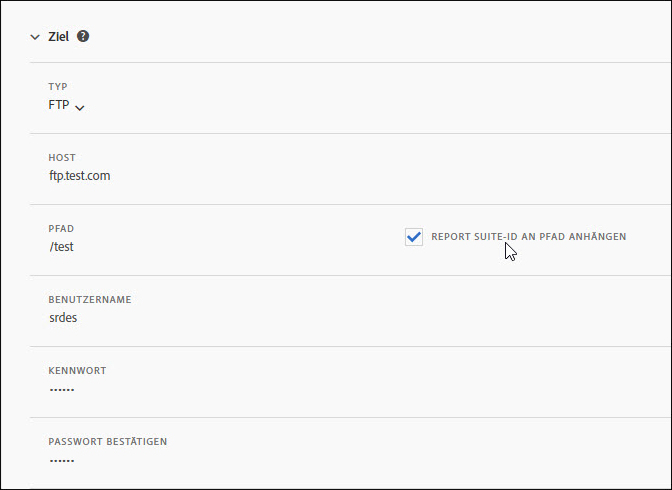

# Feed-Ziel

Im Abschnitt „Feed-Ziel“ wird die Verteilung des Feeds definiert.

Es gibt vier Verteilungskanäle:

* FTP
* SFTP
* Amazon S3
* Azure Blob

## FTP {#section_D2B521C49BDE4F91A1999FE222CF306F}

Datenfeed-Daten können für einen von Adobe oder vom Kunden gehosteten FTP-Speicherort bereitgestellt werden.

Wenn Sie auswählen, dass die Daten auf Ihren FTP-Server hochgeladen werden sollen, müssen Sie Adobe den entsprechenden Benutzernamen sowie das Kennwort und den Upload-Pfad zur Verfügung stellen. Sie müssen Ihren eigenen Vorgang zur Verwaltung des Speicherplatzes auf dem Server implementieren, da Adobe keine Daten auf dem Server löscht.

## SFTP {#section_8D9215E441474D2BBC56228C2BC926E5}

Datenfeed-Daten können für einen von Adobe oder vom Kunden gehosteten sFTP-Speicherort bereitgestellt werden.

Wenn Sie den Upload von Daten auf Ihren FTP-Server auswählen, müssen Sie Adobe den entsprechenden Benutzernamen und den Upload-Pfad zur Verfügung stellen.

<!-- 

Adobe Customer Care will provide you with a Public key. Verify in recording.

 -->

Sie müssen Ihren eigenen Vorgang zur Verwaltung des Speicherplatzes auf dem Server implementieren, da Adobe keine Daten auf dem Server löscht.

## Amazon S3 {#section_4191CD7B8D3F419EB850B286B542C14A}

Sie können Ihre Dateien in einen Amazon S3-Behälter hochladen. Die Daten werden bei der Speicherung automatisch (auf den Amazon-Servern) verschlüsselt. Wenn Sie die Daten herunterladen, werden sie automatisch entschlüsselt.

Wenn Sie sich für einen Upload von Daten über Amazon S3 entscheiden, müssen Sie einen Behälternamen, eine Zugriffsschlüssel-ID, einen geheimen Schlüssel und einen Ordnernamen bereitstellen.

Daten-Feeds kommunizieren mit den folgenden 11 Standard-AWS-Regionen (gegebenenfalls unter Verwendung des entsprechenden Signaturalgorithmus)

* us-east-1
* us-west-1
* us-west-2
* ap-south-1
* ap-northeast-2
* ap-southeast-1
* ap-southeast-2
* ap-northeast-1
* eu-central-1
* eu-west-1
* sa-east-1

Peking, AWS-Region China (cn-north-1), wird zurzeit nicht unterstützt.

## Azure Blob {#section_1E9F1D0E7EAB4189A5D748FCA57D63D1}

Sie können Daten in einen Azure Blob-Speicher hochladen.

## Felder {#section_AD54B41BC7C945DC85F5FB8FCD4A4792}

In der folgenden Tabelle werden alle Optionen für sämtliche Verteilungskanäle aufgeführt. Die verfügbaren Optionen sind vom ausgewählten Verteilungskanal abhängig.

<table id="table_F743C620C82349D9943A13B99EA312BA"> 
 <thead> 
  <tr> 
   <th colname="col1" class="entry"> Feld </th> 
   <th colname="col2" class="entry"> Beschreibung </th> 
  </tr> 
 </thead>
 <tbody> 
  <tr> 
   <td colname="col1"> 
Zugriffsschlüssel 
 </td> 
   <td colname="col2"> 
Geben Sie den Amazon S3-Zugriffsschlüssel ein. 
 </td> 
  </tr> 
  <tr> 
   <td colname="col1"> 
Behälter 
 </td> 
   <td colname="col2"> 
Geben Sie den Speicherort des Amazon S3-Behälters ein. 
 
Dieser Wert muss mit dem entsprechenden S3-Behälterformat übereinstimmen. (See <a href="https://docs.aws.amazon.com/awscloudtrail/latest/userguide/cloudtrail-s3-bucket-naming-requirements.html" format="html" scope="external"> https://docs.aws.amazon.com/awscloudtrail/latest/userguide/cloudtrail-s3-bucket-naming-requirements.html</a>.) 
 
 
Hinweis: Einzelheiten zu den Amazon S3-Einstellungen finden Sie unter <a href="../../../export/analytics-data-feed/feed-troubleshooting.md#section_6797EBBB7E6D44D4B00C7AEDF4C2EE1D" format="dita" scope="local">BucketOwnerFullControl-Einstellung für Amazon S3-Datenfeeds</a>. 
 
 </td> 
  </tr> 
  <tr> 
   <td colname="col1"> 
Behälter 
 </td> 
   <td colname="col2"> 
Geben Sie den Namen des Azure Blob-Behälters ein. 
 </td> 
  </tr> 
  <tr> 
   <td colname="col1"> 
 Host 
 </td> 
   <td colname="col2"> 
Geben Sie das FTP- oder SFTP-Hostverzeichnis an. 
 
Dieser Wert muss dem korrekten FTP/SFTP-Format entsprechen, <code>ftp.domain.com/subdomain</code> oder <code>sftp.domain.com/subdomain</code>. 
 
 Die Standardports 21 und 22 für FTP und sFTP sind erforderlich. 
 </td> 
  </tr> 
  <tr> 
   <td colname="col1"> 
Passwort 
 
Passwort bestätigen 
 </td> 
   <td colname="col2"> 
Geben Sie das FTP-Kennwort ein. Zur Bestätigung neu eingeben 
 </td> 
  </tr> 
  <tr> 
   <td colname="col1"> 
Pfad 
 </td> 
   <td colname="col2"> 
Wählen Sie den Pfad zum Host oder Behälter aus. Dieser Pfad muss bereits vor der Feed-Erstellung vorhanden sein. 
 
 
Hinweis: Einzelheiten zu den Amazon S3-Einstellungen finden Sie unter <a href="../../../export/analytics-data-feed/feed-troubleshooting.md#section_6797EBBB7E6D44D4B00C7AEDF4C2EE1D" format="dita" scope="local">BucketOwnerFullControl-Einstellung für Amazon S3-Datenfeeds</a>. 
 
 </td> 
  </tr> 
  <tr> 
   <td colname="col1"> 
Konto 
 </td> 
   <td colname="col2"> 
 Geben Sie das Konto des Azure-Speichers ein. 
 </td> 
  </tr> 
  <tr> 
   <td colname="col1"> 
Öffentlicher Schlüssel 
 </td> 
   <td colname="col2"> 
Stellen Sie den öffentlichen SFTP-Schlüssel bereit. 
 
Sie müssen den öffentlichen Schlüssel herunterladen, um das SFTP Repository einrichten zu können. 
 
 
Hinweis: Zum Erstellen des Feeds muss der öffentliche Schlüssel nicht heruntergeladen werden. 
 
 
Sie können einen öffentlichen Schlüssel verwenden, den Sie bereits beim Erstellen eines vorherigen Feeds heruntergeladen haben. 
 
Weitere Informationen finden Sie unter <a href="https://marketing.adobe.com/resources/help/en_US/whitepapers/ftp/ftp_sftp_dw.html" format="html" scope="external">https://marketing.adobe.com/resources/help/de_DE/whitepapers/ftp/ftp_sftp_dw.html</a>. 
 </td> 
  </tr> 
  <tr> 
   <td colname="col1"> 
Schlüssel 
 
Schlüssel bestätigen 
 </td> 
   <td colname="col2"> 
 Geben Sie Ihren Zugriffsschlüssel für den Speicher ein. Erneut eingeben und bestätigen. 
 
 
Hinweis: Unter <a href="https://docs.microsoft.com/en-us/azure/storage/common/storage-create-storage-account#view-and-copy-storage-access-keys" format="https" scope="external">https://docs.microsoft.com/de-de/azure/storage/common/storage-create-storage-account#view-and-copy-storage-access-keys</a> erfahren Sie, wie Sie auf Zugangsschlüssel zugreifen können. 
 
 </td> 
  </tr> 
  <tr> 
   <td colname="col1"> 
Geheimer Schlüssel 
 
Geheimen Schlüssel bestätigen 
 </td> 
   <td colname="col2"> 
Geben Sie den geheimen Amazon S3-Schlüssel ein. Geben Sie ihn zur Bestätigung erneut ein. 
 </td> 
  </tr> 
  <tr> 
   <td colname="col1"> 
Typ 
 </td> 
   <td colname="col2"> 
Wählen Sie den Zieltyp aus. 
 
 
     <ul id="ul_B893EEDA73A34DE0AEB8570BE9027F21"> 
      <li id="li_325546FCEB404C50AA6829573CCA340B">FTP (Standard) </li> 
      <li id="li_6A2C03115903484797485D073A610607">AmazonS3 </li> 
      <li id="li_C24540F6FCD24702B7693A515CEBE977">SFTP </li> 
      <li id="li_8E03CA78E7FE427C9F6F8B112BC76266">Azure Blob </li> 
     </ul> 
 
Nach Auswahl des Zieltyps ändert sich die Feldliste und spiegelt die verfügbaren Optionen für das ausgewählte Ziel wider. 
 </td> 
  </tr> 
  <tr> 
   <td colname="col1"> 
Benutzername 
 </td> 
   <td colname="col2"> 
Geben Sie den FTP-Benutzernamen ein. 
 </td> 
  </tr> 
 </tbody> 
</table>

