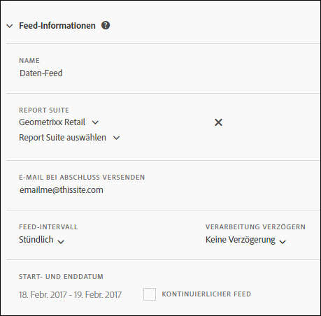

# Feed-Informationen

Im Abschnitt „Feed-Informationen“ können Sie den Feed benennen, die Report Suite angeben, für die der Feed ausgeführt werden soll, die Feed-Wiederholung bestimmen und angeben, wann der Feed startet und endet.

<table id="table_C98C7C3CE4194BEF819E792793EBC517">
 <thead>
  <tr>
   <th colname="col1" class="entry"> Feld </th>
   <th colname="col2" class="entry"> Beschreibung </th>
  </tr>
 </thead>
 <tbody> 
  <tr> 
   <td colname="col1"> 
Name (Erforderlich) 
 </td>
   <td colname="col2"> 
Geben Sie einen Feed-Namen ein. 
 
Der Name muss innerhalb der ausgewählten Report Suite eindeutig sein. Er kann bis zu 255 Zeichen enthalten. 
 </td>
  </tr>
  <tr>
   <td colname="col1"> 
Report Suite (erforderlich) 
 </td>
   <td colname="col2"> 
Geben Sie die Report Suites für die Feed-Abfrage an. 
 
Es muss mindestens eine Report Suite ausgewählt werden. Sie können dieselbe Report Suite nicht zweimal angeben. 
 
Alle für den angemeldeten Benutzer verfügbaren nicht Virtual Report Suites sind verfügbar. 
</td>
  </tr>
  <tr>
   <td colname="col1"> 
E-Mail bei Abschluss versenden (erforderlich) 
 </td>
   <td colname="col2"> 
Geben Sie den E-Mail-Empfänger an, der die aktualisierten Feed-Bereitstellungen erhält. 
 
Dieses Feld darf nicht leer sein. Es muss eine ordnungsgemäß formatierte E-Mail-Adresse enthalten. 
 </td>
  </tr>
  <tr>
   <td colname="col1"> 
Feed-Intervall (erforderlich) 
 </td>
   <td colname="col2"> 
Geben Sie die Zeitplanwiederholung an. 
 
Anmerkung: Stellen Sie aufgrund der potenziellen Größe der Zip-Dateien des Datenfeeds sicher, dass Ihr ETL-Prozess ein 64-Bit-Zip-Dienstprogramm verwendet. 
 </td>
  </tr>
  <tr>
   <td colname="col1"> 
Verarbeitung verzögern (optional) 
 </td>
   <td colname="col2"> 
Geben Sie die auf die einzelnen Zeitplaninstanzen anzuwendende Verzögerung an. 
 </td>
  </tr>
  <tr>
   <td colname="col1"> 
Start- und Enddatum (erforderlich) 
 
Kontinuierlicher Feed (optional) 
 </td>
   <td colname="col2"> 
Planen Sie die Termine für den Start und das Ende des Feeds. 
 

     <ul id="ul_509977336CD34032924B48E043E8CBC7">
      <li id="li_BFB5B6ADCB184D839C9BA42DB3DCAF32">Startdatum: wird standardmäßig auf das Datum des aktuellen Tags festgelegt </li>
      <li id="li_34F8DB45D9B54076840D1A0B782812D3">Enddatum: wird standardmäßig auf das Datum des folgenden Tags festgelegt </li>
     </ul>
     
 </td>
  </tr>
 </tbody>
</table>