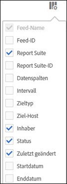

# Sortieren von Spalten

Sie können bestimmen, welche Spalten verfügbar sind, und Sie können sie gemäß Ihren Anforderungen sortieren.

1. To determine which columns are visible, click the **[!UICONTROL Columns Configuration]** button.

   

1. Klicken Sie zum Sortieren einer Spalte auf die Spaltenüberschrift.

   Alphabetische Spalten werden in alphabetischer Reihenfolge sortiert. Klicken Sie auf die Kopfzeile, um in umgekehrter alphabetischer Reihenfolge zu sortieren.

   Numerische Spalten werden numerisch sortiert. Klicken Sie auf die Kopfzeile, um zwischen der Sortierung von unten nach oben und von oben nach unten zu wechseln.
