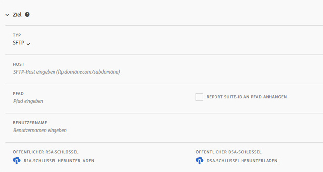
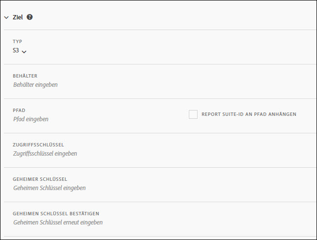
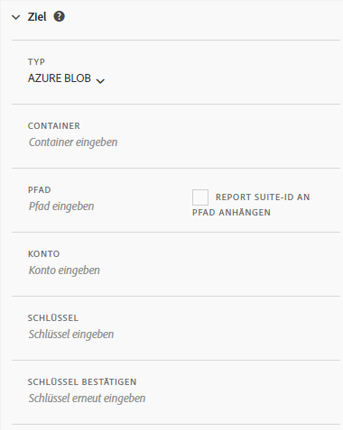

# Erstellen oder Bearbeiten eines Daten-Feeds

Durch das Erstellen eines Daten-Feeds weiß Adobe, wohin Rohdatendateien gesendet werden sollen und was Sie in die einzelnen Dateien aufnehmen möchten. Auf dieser Seite werden die einzelnen Einstellungen aufgelistet, die Sie beim Erstellen eines Daten-Feeds anpassen können.

Das Vorliegen grundlegender Kenntnisse zu Daten-Feeds ist empfehlenswert, bevor Sie diese Seite lesen. Beachten Sie die Informationen unter [Daten-Feed-Übersicht](data-feed-overview.md), um sicherzustellen, dass Sie die Anforderungen zum Erstellen eines Daten-Feeds erfüllen.

## Feed-Informationsfelder

* **Name**: Der Name des Daten-Feeds. Muss innerhalb der ausgewählten Report Suite eindeutig sein. Er kann bis zu 255 Zeichen enthalten.
* **Report Suite:** Die Report Suite, auf der der Daten-Feed basiert. Wenn mehrere Daten-Feeds für dieselbe Report Suite erstellt werden, müssen sie unterschiedliche Spaltendefinitionen haben. Nur Quell-Report Suites unterstützen Daten-Feeds. Virtual Report Suites werden nicht unterstützt.
* **E-Mail nach Abschluss**: Die E-Mail-Adresse, die benachrichtigt werden soll, wenn die Verarbeitung eines Feeds abgeschlossen ist. Die E-Mail-Adresse muss korrekt formatiert sein.
* **Feed-Intervall**: Stündliche Feeds enthalten Daten aus einer Stunde. Tägliche Feeds enthalten die Daten eines ganzen Tages.
* **Verarbeitung verzögern**: Warten Sie einen bestimmten Zeitraum, bevor Sie eine Daten-Feed-Datei verarbeiten. Eine Verzögerung kann nützlich sein, um mobilen Implementierungen die Möglichkeit zu geben, dass Offlinegeräte online gehen und Daten senden können. Sie kann auch verwendet werden, um die serverseitigen Prozesse Ihrer Organisation bei der Verwaltung zuvor verarbeiteter Dateien zu berücksichtigen. In den meisten Fällen ist keine Verzögerung erforderlich. Ein Feed kann um bis zu 120 Minuten verzögert werden.
* **Start- und Enddaten**: Das Startdatum gibt das erste Datum an, an dem Sie einen Daten-Feed erstellen möchten. Legen Sie dieses Datum in der Vergangenheit fest, um sofort mit der Verarbeitung von Daten-Feeds für historische Daten zu beginnen. Feeds werden bis zum Enddatum verarbeitet.
* **Kontinuierlicher Feed**: Mit diesem Kontrollkästchen wird das Enddatum entfernt, sodass ein Feed unbegrenzt ausgeführt werden kann. Wenn ein Feed die Verarbeitung historischer Daten abschließt, wartet er, bis die Datenerfassung für die jeweilige Stunde bzw. dem jeweiligen Tag abgeschlossen ist. Sobald die aktuelle Stunde oder der aktuelle Tag abgeschlossen ist, beginnt die Verarbeitung nach der angegebenen Verzögerung.

## Zielfelder

Die unter den Zielfeldern verfügbaren Felder hängen vom Zieltyp ab.

### FTP

Datenfeed-Daten können für einen von Adobe oder vom Kunden gehosteten FTP-Speicherort bereitgestellt werden. Erfordert einen FTP-Host, einen Benutzernamen und ein Kennwort. Verwenden Sie das Pfadfeld, um Feed-Dateien in einem Ordner zu platzieren. Ordner müssen bereits vorhanden sein; Feeds geben einen Fehler aus, wenn der angegebene Pfad nicht vorhanden ist.

### SFTP

SFTP-Unterstützung für Daten-Feeds ist verfügbar. Erfordert einen SFTP-Host und Benutzernamen. Außerdem muss die Ziel-Site einen gültigen öffentlichen RSA- oder DSA-Schlüssel enthalten. Sie können den entsprechenden öffentlichen Schlüssel beim Erstellen des Feeds herunterladen.

### S3

Sie können Feeds direkt an Amazon S3-Behälter senden. Erfordert einen Behälternamen, eine Zugriffsschlüssel-ID und einen geheimen Schlüssel. Weitere Informationen finden Sie unter [Benennungsanforderungen für Amazon S3-Behälter](https://docs.aws.amazon.com/awscloudtrail/latest/userguide/cloudtrail-s3-bucket-naming-requirements.html) in der Amazon S3-Dokumenation.

Die folgenden 16 standardmäßigen AWS-Regionen werden unterstützt (gegebenenfalls unter Verwendung des entsprechenden Signaturalgorithmus):

* us-east-2
* us-east-1
* us-west-1
* us-west-2
* ap-south-1
* ap-northeast-2
* ap-southeast-1
* ap-southeast-2
* ap-northeast-1
* ca-central-1
* eu-central-1
* eu-west-1
* eu-west-2
* eu-west-3
* eu-north-1
* sa-east-1

>[!NOTE]
>
>Die Region „cn-north-1“ wird nicht unterstützt.

### Azure Blob

Daten-Feeds unterstützen Azure Blob-Ziele. Erfordert einen Container, ein Konto und einen Schlüssel. Amazon verschlüsselt die Daten automatisch während der Ruhezeit. Wenn Sie die Daten herunterladen, werden sie automatisch entschlüsselt. Weitere Informationen finden Sie unter [Erstellen eines Speicherkontos](https://docs.microsoft.com/de-de/azure/storage/common/storage-quickstart-create-account?tabs=azure-portal#view-and-copy-storage-access-keys) in der Dokumentation zu Microsoft Azure.

>[!NOTE]
>
>Sie müssen Ihren eigenen Prozess implementieren, um Speicherplatz auf dem Feed-Ziel zu verwalten. Adobe löscht keine Daten vom Server.

## Datenspaltendefinitionen

Es sind alle Spalten verfügbar, unabhängig davon, ob sie über Daten verfügen. Ein Daten-Feed muss mindestens eine Spalte enthalten.

* **Escapezeichen entfernen**: Beim Erfassen von Daten können einige Zeichen (z. B. Zeilenumbrüche) Probleme verursachen. Aktivieren Sie dieses Kontrollkästchen, wenn diese Zeichen aus Feed-Dateien entfernt werden sollen.
* **Komprimierungsformat**: Die verwendete Art der Komprimierung. Gzip gibt Dateien im `.tar.gz`-Format aus. Zip gibt Dateien im `.zip`-Format aus.
* **Verpackungstyp**: Eine einzelne Datei gibt die `hit_data.tsv`-Datei in einer einzigen, potenziell riesigen Datei aus. Mehrere Dateien paginieren Ihre Daten in 2-GB-Blöcke (unkomprimiert). Wenn mehrere Dateien ausgewählt sind und die nicht komprimierten Daten für das Berichtsfenster weniger als 2 GB betragen, wird eine Datei gesendet. Adobe empfiehlt die Verwendung mehrerer Dateien für die meisten Daten-Feeds.
* **Spaltenvorlagen**: Adobe empfiehlt, beim Erstellen vieler Daten-Feeds eine Spaltenvorlage zu erstellen. Bei Auswahl einer Spaltenvorlage werden automatisch die angegebenen Spalten in der Vorlage eingefügt. Adobe stellt standardmäßig auch mehrere Vorlagen bereit.
* **Verfügbare Spalten**: Alle in Adobe Analytics verfügbaren Datenspalten. Klicken Sie auf [!UICONTROL Alle hinzufügen], um alle Spalten in einen Daten-Feed einzubeziehen.
* **Einbezogene Spalten**: Die Spalten, die in einen Daten-Feed aufgenommen werden sollen. Klicken Sie auf [!UICONTROL Alle entfernen], um alle Spalten aus einem Daten-Feed zu entfernen.
* **CSV herunterladen**: Lädt eine CSV-Datei herunter, die alle einbezogenen Spalten enthält.
