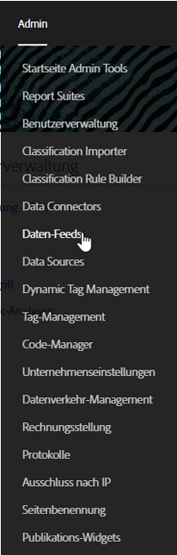
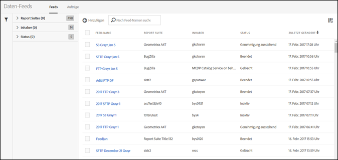
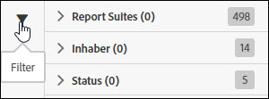
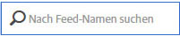

# Verwalten von Daten-Feeds

Mit dem Daten-Feed-Manager können Sie Daten-Feeds für Ihre Organisation erstellen, bearbeiten und löschen. Wenn Sie berechtigt sind, auf den Daten-Feed-Manager zuzugreifen, können Sie Daten-Feeds für alle Report Suites verwalten, die für Sie sichtbar sind.

Gehen Sie wie folgt vor, um auf das Daten-Feed-Management zuzugreifen:

1. Melden Sie sich bei [experiencecloud.adobe.com](https://experiencecloud.adobe.com) an.
2. Klicken Sie oben rechts auf das 9-Raster-Menü und dann auf [!UICONTROL Analytics].
3. Klicken Sie im oberen Menü auf [!UICONTROL Admin] > [!UICONTROL Daten-Feeds].

## Navigieren der Oberfläche

Wenn Sie zur Seite „Daten-Feed-Manager“ gelangen, sieht die Oberfläche wie folgt aus:

Wenn keine Feeds eingerichtet wurden, wird auf der Seite die Schaltfläche [!UICONTROL Neuen Daten-Feed erstellen] angezeigt.

### Filter und Suche

Verwenden Sie Filter und suchen Sie nach dem gewünschten Feed.

Klicken Sie ganz links auf das Filtersymbol, um die Filteroptionen ein- oder auszublenden. Filter sind nach Kategorie geordnet. Klicken Sie auf das Chevron, um die Filterkategorien ein- oder auszublenden. Markieren Sie das Kontrollkästchen, um diesen Filter anzuwenden.

Suchen Sie nach einem Feed anhand des Namens.

### Feeds und Aufträge

Klicken Sie auf die Registerkarte „Aufträge“, um einzelne Aufträge anzuzeigen, die von den jeweiligen Feeds erstellt werden. Siehe [Verwalten von Daten-Feed-Aufträgen](df-manage-jobs.md).

### Fügen Sie

Klicken Sie in der Nähe der Registerkarten „Feeds“ und „Aufträge“ auf die Schaltfläche + [!UICONTROL Hinzufügen], um einen neuen Feed zu erstellen. Weitere Informationen finden Sie unter [Hinzufügen eines Feeds](create-feed.md).

### Spalten

Jeder erstellte Feed zeigt mehrere Spalten mit Informationen an. Klicken Sie auf eine Spaltenüberschrift, um sie in aufsteigender Reihenfolge zu sortieren. Klicken Sie erneut auf eine Spaltenüberschrift, um sie in absteigender Reihenfolge zu sortieren. Wenn eine bestimmte Spalte nicht angezeigt wird, klicken Sie auf das Spaltensymbol oben rechts.

* **Feed-Name**: Erforderliche Spalte. Zeigt den Feed-Namen an.
* **Feed-ID**: Zeigt die Feed-ID an, eine eindeutige Kennung.
* **Report Suite**: Die Report Suite, aus der der Feed Daten referenziert.
* **Report Suite-ID**: Die eindeutige Kennung der Report Suite.
* **Datenspalten**: Gibt an, welche Datenspalten für den Feed aktiv sind. In den meisten Fällen gibt es so viele Spalten, dass sie in diesem Format nicht alle angezeigt werden können.
* **Intervall**: Gibt an, ob der Feed stündlich oder täglich ist.
* **Zieltyp**: Der Zieltyp für den Feed. Zum Beispiel FTP, Amazon S3 oder Azure.
* **Zielhost**: Der Speicherort der Datei. Beispiel: `ftp.example.com`.
* **Inhaber**: Das Benutzerkonto, über das der Feed erstellt wurde.
* **Status:** Der Status des Feeds.
   * Aktiv: Der Feed ist betriebsfähig.
   * Genehmigung ausstehend: Unter bestimmten Umständen muss ein Feed von Adobe genehmigt werden, bevor er Aufträge generieren kann.
   * Gelöscht: Der Feed wurde gelöscht.
   * Abgeschlossen: Die Verarbeitung des Feeds wurde abgeschlossen. Ein abgeschlossener Feed kann bearbeitet, angehalten und abgebrochen werden.
   * Ausstehend: Der Feed wurde erstellt, ist aber noch nicht aktiv. Feeds bleiben für eine kurze Übergangszeit in diesem Zustand.
   * Inaktiv: Entspricht einem Status „angehalten“. Wenn der Feed reaktiviert wird, wird die Bereitstellung von Aufträgen an derselben Stelle fortgesetzt.
* **Zuletzt geändert**: Das Datum, an dem der Feed zuletzt geändert wurde. Datum und Uhrzeit werden in der Zeitzone der Report Suite mit GMT-Verschiebung angezeigt.
* **Startdatum**: Das Datum des ersten Auftrags für diesen Feed. Datum und Uhrzeit werden in der Zeitzone der Report Suite mit GMT-Verschiebung angezeigt.
* **Enddatum**: Das Datum des letzten Auftrags für diesen Feed. Laufende Daten-Feeds haben kein Enddatum.

## Daten-Feed-Aktionen

Aktivieren Sie das Kontrollkästchen neben einem Daten-Feed, um verfügbare Aktionen anzuzeigen.

* **Auftragsverlauf**: Zeigen Sie alle Aufträge an, die mit diesem Daten-Feed verknüpft sind. Leitet Sie automatisch zur [Oberfläche für die Verwaltung von Aufträgen](df-manage-jobs.md) weiter.
* **Löschen**: Löscht den Daten-Feed und ändert dessen Status zu [!UICONTROL Gelöscht].
* **Kopieren**: Ermöglicht die [Erstellung eines neuen Feeds](create-feed.md) mit allen Einstellungen des aktuellen Feeds. Ein Daten-Feed kann nicht kopiert werden, wenn mehrere Feeds ausgewählt sind.
* **Anhalten**: Beendet die Verarbeitung für den Feed und setzt dessen Status auf [!UICONTROL Inaktiv].
* **Aktivieren**: Nur für inaktive Feeds verfügbar. Ruft die Verarbeitungsdaten an der Stelle ab, an der aufgehört wurde, und füllt ggf. alle Daten rückwirkend auf.
