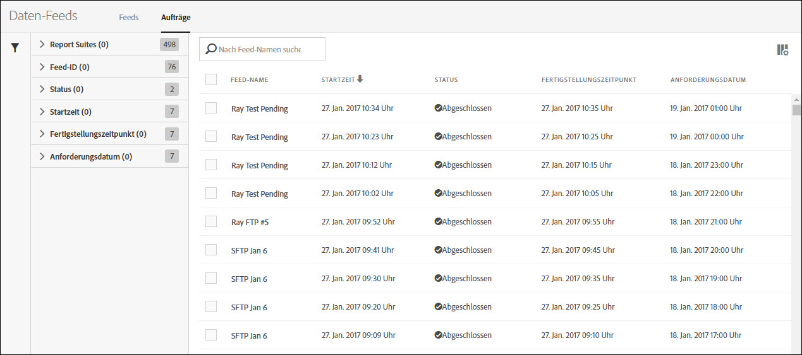
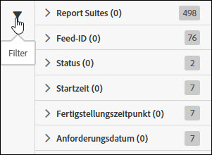
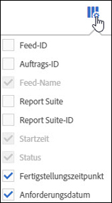

# Verwalten von Daten-Feed-Aufträgen

Aufträge sind einzelne Aufgaben, die eine komprimierte Datei ausgeben. Sie werden von Feeds erstellt und verwaltet.

Gehen Sie wie folgt vor, um auf das Daten-Feed-Auftragsmanagement zuzugreifen:

1. Melden Sie sich bei [experiencecloud.adobe.com](https://experiencecloud.adobe.com) an.
2. Klicken Sie oben rechts auf das 9-Raster-Menü und dann auf [!UICONTROL Analytics].
3. Klicken Sie im oberen Menü auf [!UICONTROL Admin] > [!UICONTROL Daten-Feeds].
4. Klicken Sie oben auf die Registerkarte „Aufträge“.

## Navigieren der Oberfläche

Ein Daten-Feed-Auftrag ist eine einzelne Instanz, in der Adobe eine komprimierte Datei für ein bestimmtes Berichtsfenster verarbeitet und ausgibt. Der Auftragsmanager bietet eine detailliertere Ansicht mit dem Status einzelner Aufträge.

### Filter und Suche

Verwenden Sie Filter und suchen Sie nach dem gewünschten Auftrag.

Klicken Sie ganz links auf das Filtersymbol, um die Filteroptionen ein- oder auszublenden. Filter sind nach Kategorie geordnet. Klicken Sie auf das Chevron, um die Filterkategorien ein- oder auszublenden. Markieren Sie das Kontrollkästchen, um diesen Filter anzuwenden.

Suchen Sie nach einem Auftrag anhand des Namens.

### Feeds und Aufträge

Klicken Sie auf die Registerkarte „Feeds“, um allgemeine Feeds anzuzeigen, die diese Aufträge erstellen. [Datenquellen verwalten](df-manage-feeds.md).

### Spalten

Jeder Auftrag zeigt mehrere Spalten mit Informationen an. Klicken Sie auf eine Spaltenüberschrift, um sie in aufsteigender Reihenfolge zu sortieren. Klicken Sie erneut auf eine Spaltenüberschrift, um sie in absteigender Reihenfolge zu sortieren. Wenn eine bestimmte Spalte nicht angezeigt wird, klicken Sie auf das Spaltensymbol oben rechts.

* **Feed-ID**: Zeigt die Feed-ID an, eine eindeutige Kennung. Aufträge, die von demselben Feed erstellt werden, haben dieselbe Feed-ID.
* **Auftrags-ID**: Eine eindeutige ID für den Auftrag. Alle Aufträge haben eine andere Auftrags-ID.
* **Feed-Name**: Erforderliche Spalte. Zeigt den Feed-Namen an. Aufträge, die von demselben Feed erstellt werden, haben denselben Feednamen.
* **Report Suite**: Die Report Suite, aus der der Auftrag Daten referenziert.
* **Report Suite-ID**: Die eindeutige Kennung der Report Suite.
* **Startzeit**: Der Zeitpunkt, zu dem der Auftrag gestartet wurde. Datum und Uhrzeit werden in der Zeitzone der Report Suite mit GMT-Verschiebung angezeigt. Tägliche Feeds beginnen üblicherweise gegen Mitternacht in der Zeitzone der Report Suite.
* **Status:** Der Status des Feeds.
   * Warten auf Daten: Der Auftrag ist betriebsfähig, und Daten für das Berichtsfenster werden erfasst.
   * In Verarbeitung: Der Auftrag erstellt die Datendateien und bereitet das Senden dieser Dateien vor.
   * Abgeschlossen: Der Auftrag wurde ohne Probleme abgeschlossen.
   * Fehlgeschlagen: Der Auftrag wurde nicht abgeschlossen. Informationen zur Ermittlung der Fehlerursache finden Sie unter [Fehlerbehebung bei Aufträgen](jobs-troubleshooting.md).
   * Warten auf Export: Die Daten für das Berichtsfenster wurden noch nicht vollständig verarbeitet.
   * Keine Daten: Die Report Suite enthält für das angeforderte Berichtsfenster keine Daten.
* **Abschlusszeit**: Der Zeitpunkt, zu dem der Auftrag abgeschlossen wurde. Datum und Uhrzeit werden in der Zeitzone der Report Suite mit GMT-Verschiebung angezeigt.
* **Angefordertes Datum**: Das Berichtsfenster der Datei. Tägliche Feeds zeigen in der Regel 00:00–23:59 mit einer GMT-Verschiebung an, was einem vollständigen Tag basierend auf der Zeitzone der Report Suite entspricht. Stündliche Feeds zeigen die jeweilige Stunde an, für die der Auftrag ausgeführt wird.
