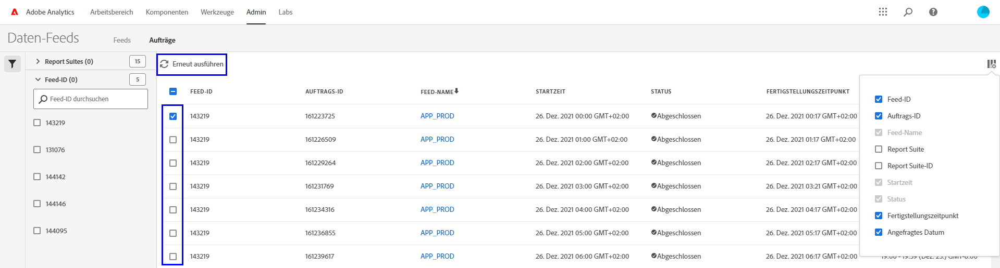

# Fehlerbehebung bei Daten-Feeds

Ermitteln Sie potenzielle Gründe, aus denen ein Vorgang möglicherweise nicht verarbeitet oder bereitgestellt werden kann.

## Fehlerbehebung bei vorhandenen Daten-Feeds

Wenn Sie über einen Daten-Feed verfügen, der normalerweise stündlich oder täglich problemlos ausgeführt wird, aber seit Kurzem fehlschlägt, überprüfen Sie jeden der folgenden Punkte:

* Verwenden Sie das [Adobe-Status-Werkzeug](https://status.adobe.com/de/experience_cloud) um festzustellen, ob geplante Wartungsfenster oder Verfügbarkeitsprobleme vorliegen. Wenn zu diesem Zeitpunkt ein bekanntes Problem vorliegt, verarbeitet Adobe automatisch geplante Daten-Feeds, sobald der Service wiederhergestellt wurde.
* Stellen Sie sicher, dass auf der FTP-Site ausreichend Speicherplatz zur Verfügung steht. Falls der FTP-Site der Speicherplatz ausgeht, löschen Sie einige Dateien vom Server, um Platz für neue Dateien zu schaffen.
* Wenn keine bekannten Probleme vorliegen und die FTP-Site über ausreichend Speicherplatz verfügt, können Sie den Daten-Feed erneut senden.

   1. Melden Sie sich bei Adobe Analytics an und navigieren Sie zu **[!UICONTROL Admin]** > **[!UICONTROL Daten-Feeds]**.
   2. Suchen Sie die gewünschten Daten-Feeds und klicken Sie auf das jeweilige Kontrollkästchen neben jedem Feed, den Sie erneut ausführen möchten.
   3. Klicken Sie auf **[!UICONTROL Erneut ausführen]**.

   

Wenn Sie die Daten-Feed-Dateien nach der erneuten Ausführung immer noch nicht erhalten, wenden Sie sich an die Kundenunterstützung.

## Fehlerbehebung bei einem neuen Daten-Feed

Wenn ein neuer Daten-Feed einen Fehler ausgibt, beheben Sie das Problem, indem Sie manuell eine Testdatei auf die FTP-Site hochladen. In den meisten Fällen können Sie die Fehlerursache mithilfe dieser Schritte ermitteln.

1. Melden Sie sich mit dem Datei-Explorer (Windows) oder Finder (Mac) bei Ihrer FTP-Site an. Vergewissern Sie sich, dass Sie das FTP-Protokoll verwenden (`ftp://`) und dass die Firewall Ihrer Organisation [IP-Adressen von Adobe](/help/technotes/ip-addresses.md) durchlässt. Wenn Sie die FTP-Site nicht erreichen können, kontaktieren Sie den Verantwortlichen für die FTP-Site, um das richtige Ziel zu bestimmen.

   

2. Ein Fenster wird angezeigt, in dem Sie nach dem Benutzernamen und Kennwort gefragt werden. Geben Sie Ihre Authentifizierungsdaten ein. Wenn die Anmeldeinformationen akzeptiert werden, wird im Fenster der aktuelle Inhalt auf der FTP-Site angezeigt. Wenn die Anmeldeinformationen nicht akzeptiert werden, wenden Sie sich an den FTP-Verantwortlichen, um zu prüfen, ob der Benutzername und das Kennwort korrekt sind. Wenn Sie SFTP verwenden, stellen Sie sicher, dass Sie jeden Schritt im [SFTP-Handbuch](../ftp-and-sftp/c-sftp/ftp-sftp.md) befolgen. Beachten Sie, dass Adobe nicht alle SFTP-Anwendungsfälle unterstützt.
3. Laden Sie eine Datei auf die FTP-Site hoch, indem Sie sie in das authentifizierte Fenster ziehen. Dafür kann jedes Bild- oder Textdokument verwendet werden. Wenn Sie einen Fehler erhalten, wenn Sie versuchen, eine Datei auf die FTP-Site zu laden, erkundigen Sie sich beim FTP-Eigentümer, ob genügend Speicherplatz vorhanden ist und ob der Benutzername Schreibberechtigungen für die FTP-Site besitzt.
4. Nachdem Sie bestätigt haben, dass sich die Datei auf der FTP-Site befindet, können Sie die im vorherigen Schritt hochgeladene Datei löschen.

Wenn alle oben genannten Schritte funktionieren und Sie dennoch weiterhin einen FTP-Fehler erhalten, wenden Sie sich an die Kundenunterstützung.
