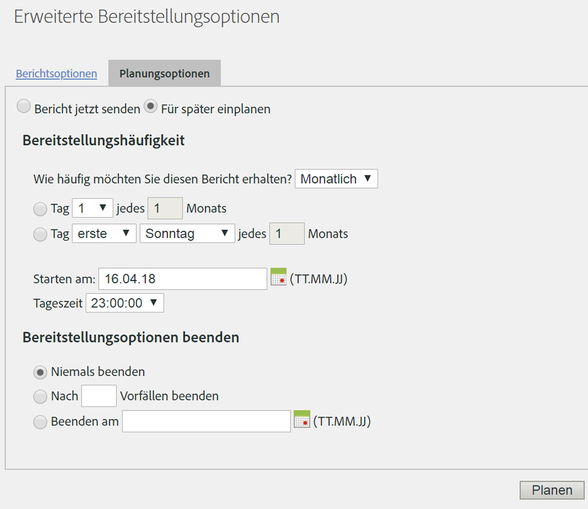

# Planen einer wiederkehrenden Anforderung

## Planen einer wiederkehrenden Anforderung {#topic_8C3CE0CE8A584F80946D24B377CB51BE}

Möchten Sie tägliche/monatliche/jährliche Data Warehouse-Anfragen planen, stellen Sie sicher, dass die *Voreinstellungen *korrekt ausgewählt wurden.

1. Wählen Sie unter [!UICONTROL Berichtsdatum] die Option **[!UICONTROL Voreingestellt]** aus.

1. Klicken Sie unter [!UICONTROL Bereitstellung planen] auf **[!UICONTROL Erweiterte Bereitstellungsoptionen]**.

1. Navigieren Sie zur Registerkarte mit den Bereitstellungsoptionen und wählen Sie **[!UICONTROL Für später einplanen]**.
1. Wählen Sie die passenden Einstellungen für [!UICONTROL Bereitstellungshäufigkeit] und [!UICONTROL Bereitstellungsoptionen beenden] aus.

   

1. Klicken Sie auf **[!UICONTROL Zeitplan]**.

