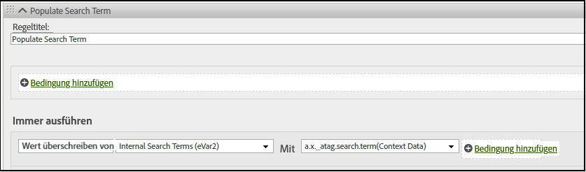

# Manuelles Zuordnen von XDM-Daten zu Analytics

Das Adobe Experience Platform (AEP) Web SDK enthält Hilfen zur manuellen Zuordnung von Daten zwischen Platform und Analytics.

Für XDM-Daten, die nicht automatisch Analytics zugeordnet werden, können Sie [Kontextdaten](https://docs.adobe.com/content/help/de-DE/analytics/implementation/vars/page-vars/contextdata.html) hinzufügen, um Ihrem [Schema](https://docs.adobe.com/content/help/de-DE/experience-platform/xdm/schema/composition.html) zu entsprechen. Anschließend können sie von Analytics-[Verarbeitungsregeln](https://docs.adobe.com/content/help/de-DE/analytics/admin/admin-tools/processing-rules/processing-rules-configuration/t-processing-rules.html) zum Ausfüllen von Analytics-Variablen verwendet werden.

Außerdem können Sie einen Standardsatz von Listen und Aktionen verwenden, um Daten mit dem AEP Web SDK zu senden oder abzurufen. Weitere Information finden Sie unter [Produkte](https://docs.adobe.com/content/help/de-DE/experience-platform/edge/implement/commerce.html).

## Kontextdaten

Zur Verwendung durch Analytics werden XDM-Daten mit Punktnotation reduziert und als `contextData` verfügbar gemacht. Die folgende Liste von Wertpaaren zeigt ein Beispiel für `context data`:

```javascript
{
          "bh": "900",
          "bw": "1680",
          "c": "24",
          "c.a.d.key.[0]": "value1",
          "c.a.d.key.[1]": "value2",
          "c.a.d.object.key1": "value1",
          "c.a.d.object.key2.[0]": "value2",
          "c.a.x.environment.browserdetails.javascriptenabled": "true",
          "c.a.x.environment.type": "browser",
          "cust_hit_time_gmt": "1579781427",
          "g": "http://example.com/home",
          "gn": "home",
          "j": "1.8.5",
          "k": "Y",
          "s": "1680x1050",
          "tnta": "218287:1:0|0,218287:1:0|2,218287:1:0|1,218287:1:0|32767,218287:1:0|1,218287:1:0|0,218287:1:0|1,218287:1:0|0,218287:1:0|1",
          "user_agent": "Mozilla/5.0 AppleWebKit/537.36 Safari/537.36",
          "v": "Y"
        }
```

## Verarbeitungsregeln

Auf alle vom Edge Network erfassten Daten kann über [Verarbeitungsregeln](https://docs.adobe.com/content/help/en/analytics/admin/admin-tools/processing-rules/processing-rules-configuration/t-processing-rules.html) zugegriffen werden. In Analytics können Sie mithilfe von Verarbeitungsregeln Kontextdaten in Analytics-Variablen einbinden.

In der folgenden Regel wird Analytics beispielsweise so eingestellt, dass **interne Suchbegriffe (eVar2)** mit den Daten gefüllt werden, die mit **a.x_atag.search.term(Kontextdaten)** verknüpft sind.




## XDM-Schema

Schemas dienen in Experience Platform zur konsistenten und wiederverwendbaren Beschreibung der Struktur von Daten. Durch die systemübergreifende einheitliche Definition von Daten wird es einfacher, die Bedeutung beizubehalten und somit Wert aus Daten zu ziehen. Analytics-Kontextdaten arbeiten mit der durch das Schema definierten Struktur.

Im folgenden Beispiel wird gezeigt, wie der [`event`-Befehl](https://docs.adobe.com/content/help/de-DE/experience-platform/edge/fundamentals/tracking-events.html) mit der `xdm`-Option zum Senden und Abrufen von Daten mit dem AEP Web SDK verwendet werden kann. In diesem Beispiel stimmt der `event`-Befehl mit dem [ExperienceEvent Commerce Details Schema](https://github.com/adobe/xdm/blob/1c22180490558e3c13352fe3e0540cb7e93c69ca/docs/reference/context/experienceevent-commerce.schema.md) überein, sodass die productListItems-Werte `name` und `SKU` verfolgt werden:


```
alloy("event",{
  "xdm":{
    "commerce":{
      "productViews":{
        "value":1
      }
    },
    "productListItems":[
      {
        "SKU":"HT105",
        "name":"Large Field Hat",
      },
      {
        "SKU":"HT104",
        "name":"Small Field Hat",
      }
    ]
  }
});
```

Weitere Informationen zum Verfolgen von Ereignissen mit dem AEP Web SDK finden Sie unter [Verfolgen von Ereignissen](https://docs.adobe.com/content/help/en/experience-platform/edge/fundamentals/tracking-events.html).