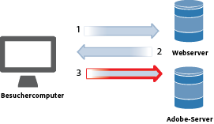
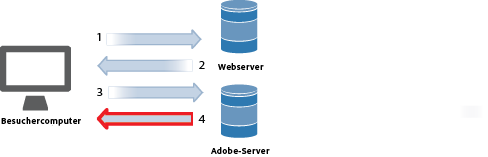
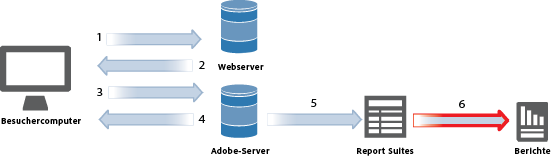
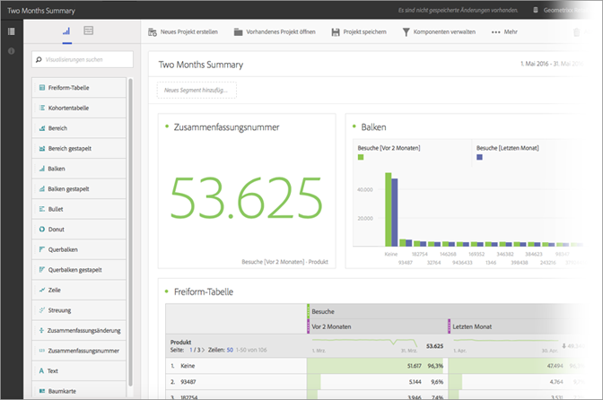

# Datenerfassung

Erfahren Sie, wie Sie aus Besuchen Ihrer Website einen Bericht in Adobe Analytics erstellen. 

Die Analytics-Datenerfassung erfolgt, indem eine spezielle Bildanforderung an die Adobe-Datenerfassungsserver gesendet wird. In den meisten Implementierungen wird auf den verfolgten Webseiten JavaScript-Code eingesetzt. Wenn eine getaggte Webseite in den Browser eines Besuchers geladen wird, führt der Browser unseren JavaScript-Code aus, dessen Logik die Besucherinformationen erfasst und die Tags korrekt ausfüllt. Den letzten Schritt der JavaScript-Verarbeitung bildet eine Bildanforderung an den Analytics-Datenerfassungsserver, der die zu übermittelnden Daten erfasst und ein kleines transparentes Bild an den Browser des Besuchers zurückgibt.

Einen häufigen Engpass bei der Browserverarbeitung bildet die für das Herunterladen der Seitenelemente (Bilder usw.) von Webservern benötigte Zeit. Die vom Browser für die Ausführung des JavaScript-Codes benötigte Zeit ist minimal. Dennoch addiert sich der letzte Schritt, in dem der Browser des Besuchers ein Bild vom Adobe-Datenerfassungsserver anfordert, zur gesamten Ladezeit der Seite. Der Gesamteffekt auf die Downloadzeit der Seite hängt von der Entfernung des Besuchers (in der Regel die Anzahl der Internet-Hops, nicht die geografische Entfernung) von den Adobe-Datenerfassungsservern ab.

Für das Senden von Daten zu Analytics stellt Adobe mehrere Methoden zur Verfügung. Mithilfe dieser Methoden werden Tracking-Informationen in Echtzeit aus folgenden Quellen erfasst:

* Applikationen, die auf das Internet zugreifen können
* Kampagnen
* Client-Server-Applikationen
* E-Mails
* Mobilgeräte
* Webbasierte Kioske
* Websites

<!-- 

Need to reconcile with Data Collection topics in the user guide, in this guide, and in reference. 

 -->

1. Wenn ein Besucher Ihre Site aufruft, erfolgt eine Anfrage an Ihren Web-Server.

   

1. Der Web-Server Ihrer Site sendet die Informationen zum Seiten-Code, und die Seiten wird im Browser angezeigt.

   

1. Die Seite wird geladen, und der Analytics JavaScript-Code wird ausgeführt.

   

   Der JavaScript-Code sendet eine Bildanforderung an den Adobe-Server und gibt die in Ihrer Implementierung definierten Variablen, Metriken und Seitendaten weiter.

   **Beispiel für JavaScript-Code:** Der JavaScript-Code wird innerhalb der Tags einer Website platziert:

   

   **Beispiel für Bildanforderung:** Ein Snippet einer Bildanforderung mit dem angegebenen Seitennamen:

   

   >[!NOTE]
   >
   >Each image request contains a random number string to prevent browser caching and ensure that subsequent image requests are made by the browser.

1. Adobe gibt ein transparentes Pixelbild zurück.

   

   Der Code erfasst automatisch zusätzliche Details (z. B. zu Betriebssystem, Browsertyp, Browserhöhe und -breite, IP-Adresse und Browsersprache).

1. Adobe-Server speichern Webanalysedaten in *`report suites`* (Ihrem Datenrepository).

   

   Eine [Report Suite](https://marketing.adobe.com/resources/help/en_US/reference/report_suites_admin.html) definiert die vollständige, unabhängige Berichterstellung über eine bestimmte Website, eine Gruppe von Websites oder eine Untergruppe von Seiten einer Webseite.

1. Report Suite-Daten erscheinen in den Berichten, auf die Sie in einem Webbrowser zugreifen können.

   

   **Beispielbericht:**

   

   Die JavaScript Code-Ausführung erfolgt schnell und hat keine größeren Auswirkungen auf die Seitenladezeiten. Dieser Ansatz ermöglicht·es Ihnen, Seiten zu zählen, die angezeigt wurden, wenn ein Besucher zum Erreichen einer Seite auf **[!UICONTROL Neu laden]** oder **Zurück]klickt, da das JavaScript auch dann ausgeführt wird, wenn die Seite aus dem Cache abgerufen wird.[!UICONTROL **

Weitere Informationen finden Sie unter:

* [Datenerfassung](../../implement/js-implementation/data-collection/query-parameters.md)
* [Datenelement erstellen](../../implement/c-implement-with-dtm/t-data-element.md#task_962EF08CE2AE49B3B739295F6E4792C2)
* [Data Warehouse](https://marketing.adobe.com/resources/help/en_US/reference/data_warehouse.html)
* [Ad Hoc Analysis ](https://marketing.adobe.com/resources/help/en_US/dsc/c_getting_started.html)
* [Data Sources](https://marketing.adobe.com/resources/help/en_US/whitepapers/ftp/ftp_datasources.html)
* [Data Connectors](https://marketing.adobe.com/resources/help/en_US/whitepapers/ftp/ftp_genesis.html)
* [Analytics Data Feed](/help/export/analytics-data-feed/c-getstarted/data-feed-overview.md)

>[!MORE_LIKE_THIS]
>       
>* [Experience Cloud-Debugger](/help/implement/impl-testing/debugger.md)

