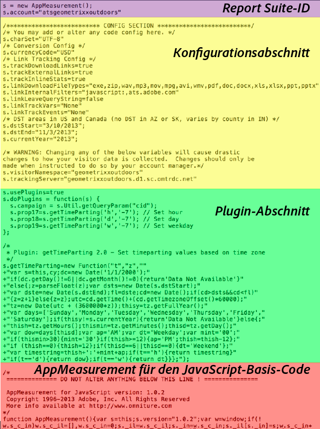

# Analytics-Code

Daten werden an eine Report Suite gesendet, um bei der Berichterstellung angezeigt zu werden. Die einfachste und gängigste Methode zum Senden von Daten an Analytics ist die DTM-Implementierung. Sie können den Code auch mit der JavaScript-Implementierung eingeben.

For information about using [!UICONTROL Dynamic Tag Management] to create the header and footer code for you, see [Add Header and Footer Code](../../implement/c-implement-with-dtm/c-headers-footers/t-header-footer-code.md#task_43C8DD699A514638B0620775C06423E5).

Here is an example of [!DNL AppMeasurement] JavaScript file, showing the code parts:

