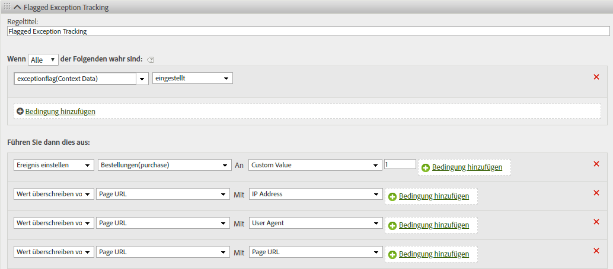

# hitGovernor

Das Plug-in „s.hitGovernor“ verfolgt die Gesamtzahl der Analytics-Bildanforderungen, die während eines vordefinierten rollierenden Zeitrahmens gesendet wurden, und kann bei Bedarf zusätzliche Logik ausführen, wenn diese Gesamtzahl einen bestimmten Schwellenwert überschreitet.

## hitGovernor {#topic_56B636A42A624B38A0A446C607ACD700}

Das Plug-in „s.hitGovernor“ verfolgt die Gesamtzahl der Analytics-Bildanforderungen, die während eines vordefinierten rollierenden Zeitrahmens gesendet wurden, und kann bei Bedarf zusätzliche Logik ausführen, wenn diese Gesamtzahl einen bestimmten Schwellenwert überschreitet.

Obwohl Traffic von Bots, Spiders, bestimmten Benutzeragenten oder einer bestimmten Liste von IP-Adressen als Bot-Traffic erkannt oder anderweitig vom Reporting ausgeschlossen werden kann, enthalten Ihre Report Suites möglicherweise Traffic, der nicht berücksichtigt werden sollte. Zum Beispiel könnte eine unangemessen hohe Anzahl von Klicks oder Seitenaufrufen in einem sehr kurzen Zeitraum (d. h. ungefähr eine Anfrage pro Sekunde) ein Anzeichen für verfälschten Traffic sein.

Mit diesem Plug-in wird dieser Traffic für den Rest der Besucherlebensdauer automatisch blockiert und kann auch dynamisch in Berichten identifiziert werden.

## Funktionsweise des Plug-ins „hitGovernor“ {#section_541BC639E31442D09B1C85A2FFCDC02C}

Das Plug-in erhöht bei jeder Bildanforderung an Ihre Tracking-Server einen Cookie-Wert und verfolgt diesen über einen rollierenden Zeitrahmen hinweg. Der Standardzeitrahmen beträgt eine Minute, kann jedoch überschrieben werden. (Weitere Informationen finden Sie unter [Implementierung](../../../implement/js-implementation/plugins/hitgovernor.md#task_D4BDB524AA294C139AFCAE2B61FEA3F2) weiter unten.) If the total number of hits during that time frame exceeds the default hit threshold (60), a final custom link image request is sent to set the *`exceptionFlag`* context data variable. Dieser standardmäßige Schwellenwert für Treffer kann auch überschrieben werden. 

Bei Bedarf kann die Erfassung von Traffic für diesen bestimmten Besucher von diesem Zeitpunkt an für einen Standardzeitraum von 60 Tagen verhindert werden. Das Blockieren des Datenverkehrs erfordert eine zusätzliche Codezeile in Ihrer doPlugins-Funktion, wie unten beschrieben. Der Zeitrahmen kann ebenfalls angepasst werden. The logic allows time to either include that visitor's IP address, User Agent, or [!DNL Experience Cloud] Visitor ID in the proper permanent exception logic, or to reset the timeout period after the sixty days have elapsed. Wenn dieser Traffic nach 60 Tagen vom Plug-in als betrügerisch identifiziert wird, wird der Traffic erneut als Ausnahme gekennzeichnet und für weitere 60 Tage nicht erfasst.

## Berichterstellung {#section_E742F19B528041808454744DB2C7007C}

Es müssen keine Standardvariablen oder Ereignisse eingerichtet werden. Es wird jedoch dringend empfohlen, dass Sie Logik für Verarbeitungsregeln einrichten, um Variablen und Ereignisse entsprechend einzustellen. Diese benutzerspezifischen Variablen und Ereignisse können Folgendes enthalten:

* [!DNL Experience Cloud] Visitor ID
* IP-Adresse
* Benutzeragent
* Gekennzeichnetes Ausnahmeereignis

Durch das Erstellen von Segmenten für diese Variablen können Sie dann Segmente und virtuelle Report Suites anlegen, um die Auswirkungen dieser mehrdeutigen Treffer auf die Website insgesamt anzuzeigen.

Es wird empfohlen, mithilfe der erfassten Reporting-Werte die Bot-Regeln, DB VISTA-Regeln oder Firmen-IP-Ausschlüsse zu aktualisieren.

## Implementierung {#task_D4BDB524AA294C139AFCAE2B61FEA3F2}

Implementieren des Plug-ins „hitGovernor“:

1. Ändern Sie die AppMeasurement-Bibliothek.

   Um das Plug-in zu initialisieren, fügen Sie diese Codezeile (fettgedruckt) innerhalb der Funktion `registerPostTrackCallback` in den Code der AppMeasurement-Bibliothek ein.

   >[!NOTE]
   >
   >Although the `registerPostTrackCallback` functionality is included in AppMeasurement libraries 1.8.0+, it is not included in any custom code configuration by default. Sie wird im Anschluss an die doPlugins-Funktion und *außerhalb* von ihr aufgenommen.

   ```
    s.registerPostTrackCallback(function(){ 
   
<b> s. campaign();</b>});
```
Below the doPlugins section of your AppMeasurement file, include the plugin code contained in [Plugin Source Code](../../../implement/js-implementation/plugins/hitgovernor.md#reference_76423C81A7A342B2AC4BE41490B27DE0), below.

The hit limit threshold, hit timing threshold, and traffic exclusion time frames can all be overridden by setting these variables, outside of the plugin itself and preferably with your other configuration variables:

<table id="table_9959A40F5F0B40B39DB86E21D03E25FD"> 
<thead> 
<tr> 
<th colname="col1" class="entry"> Variable </th> 
<th colname="col2" class="entry"> Syntax </th> 
<th colname="col3" class="entry"> Description </th> 
</tr> 
</thead>
<tbody> 
<tr> 
<td colname="col1"> <p>Hit Limit Threshold </p> </td> 
<td colname="col2"> <p> <code> s.hl = 60; </code> </p> </td> 
<td colname="col3"> <p>The total number of hits that should not be exceeded during a given timeframe. </p> </td> 
</tr> 
<tr> 
<td colname="col1"> <p>Hit Time Threshold </p> </td> 
<td colname="col2"> <p> <code> s.ht = 10; </code> </p> </td> 
<td colname="col3"> <p>The window, in seconds, for when hits are recorded. This number is divided by six to determine the rolling timing windows. </p> </td> 
</tr> 
<tr> 
<td colname="col1"> <p>Exclusion Threshold </p> </td> 
<td colname="col2"> <p> <code> s.he = 60; </code> </p> </td> 
<td colname="col3"> <p>Number of days that the exclusion cookie is set for that visitor. </p> </td> 
</tr> 
</tbody> 
</table>

>[!NOTE]
>
>Your implementation might use a different object name than the default analytics "s" object. If so, please update the object name accordingly.

1. Configure processing rules.

This plugin records flagged exceptions as context data in a link tracking image request. As such, processing rules must be configured to assign track those flagged exceptions into appropriate variables like those below.



1. (Optional) Include the traffic-blocking code in doPlugins.

After traffic has been identified as an exception, any subsequent hits from that visitor can be blocked entirely by including this code within the `doPlugins` function:
```
//Check for hit campaignflag if
(s. Util. cookieread (' s_ hg ') = = 9) s. abort = true;
```
If this code is not included, traffic from that visitor will be flagged but not blocked. 

## Plugin Source Code {#reference_76423C81A7A342B2AC4BE41490B27DE0}

This code should be added below the doPlugins section of your AppMeasurement library.
```
//Hit Gouverneur (Version 0.1 BETA, 11-13-17)
s. campaign= new Function (","
+ "var s = this; if (typeof s. hl = =' undefined ') {s. hl = 60;} if (typeof s. ht = =' u "
+" ndefined ') {s. ht = 60;} if (typeof s. he = =' undefined ') {s. he = 60;} if (s. Util "
+". cookieread (' s_ hg ') = = 8) {var i = new Date (), y = i. getfullyear (), m = i. getm "
+" onth (), d = i. getdate (), i = new Date (y, m, d + s. he); s. Util. cookiewrite (' s_ h "
+" g ', 9, i); return;} var f = s. Util. cookieread (' s_ hc '), g = Number (s. Util. coo "
+" kieread (' s_ ht ')), h = Math. floor ((new Date ()). gettime ()), ha = f!=''?f.sp"
+"lit('|').map(Number):[0,0,0,0,0],i=ha.reduce(function(ha,b){return "
+"ha+b;},0),j=g==0?0:Math.floor(((h-g)/(s.ht/6))/1000);if(g==0)s.Util"
+".cookieWrite('s_ht',h);if(i&lt;s.hl){if(j&gt;=1){if(j&gt;=6){ha=[0,0,0,0,0];"
+"}else{for(var k=0;k&lt;j;k++){ha.unshift(0);ha.pop();}}s.Util.cookieWr"
+"ite('s_ht',h);}}else{s.Util.cookieWrite('s_hg',8);s.linkTrackVars+="
+"',contextData.exceptionFlag';s.contextData['exceptionFlag']='true';"
+"s.tl(this,'o','exceptionFlag');}ha[0]++;s.Util.cookieWrite('s_hc',h"
+"a.join('|'));");

```


