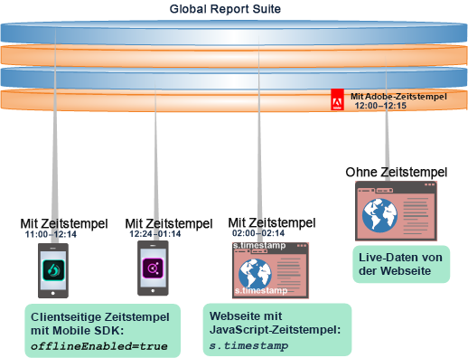
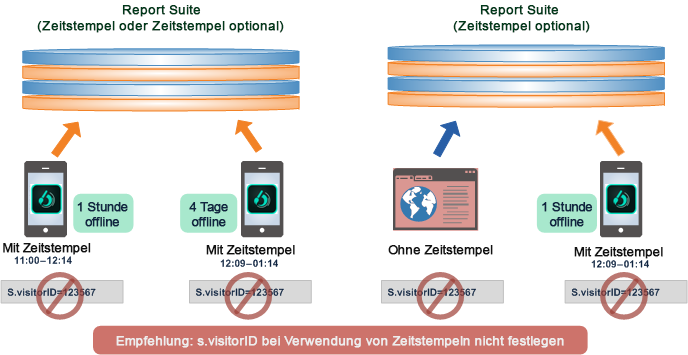
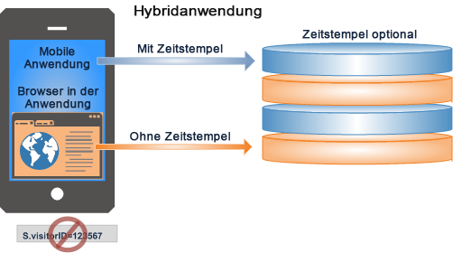

# Verwendung von „Zeitstempel optional“

In diesem Abschnitt erfahren Sie mehr zu den Vorteilen und Einschränkungen der Einstellung „Zeitstempel optional“.

„Zeitstempel optional“ ist die Standardeinstellung für alle neuen Report Suites.

* Sie können auch Daten mit und Daten ohne Zeitstempel gemeinsam in einer globalen Report Suite verwenden.
* Senden Sie Daten mit Zeitstempel von einer mobilen App an eine globale Report Suite.
* Aktualisieren Sie Apps, sodass Sie ohne Erstellung einer neuen Report Suite Zeitstempel verwenden können.

>[!NOTE]
>
>Die Einstellung der optionalen Zeitstempel ist standardmäßig für alle neuen, aus einer Vorlage generierten Report Suites festgelegt. Neue Report Suites, die aus einer vorhandenen kopiert werden, übernehmen die Einstellungen der ursprünglichen Report Suite.

Weitere Informationen zu deren Einrichtung finden Sie unter [Zeitstempel optional](https://marketing.adobe.com/resources/help/en_US/reference/timestamp-optional.html).

## Zeitstempel optional: Integration von Daten mit und ohne Zeitstempel {#section_BF17CB593044462B993FD0D28EA56518}

Mit der Funktion „Zeitstempel optional“ können Sie Daten mit und ohne Zeitstempel ohne Datenverlust kombinieren. Offline-Daten mit Zeitstempel von einem mobilen Gerät können – mittels eines clientseitigen Zeitstempelaufrufs – mit Daten ohne Zeitstempel einer Live-Webseite kombiniert oder in die Daten jeder Plattform integriert werden.

* **Daten mit Zeitstempel**: Client-side timestamp data is captured and sent directly with the device data using client-side timestamp variables: Javascript on a web page, or using a Mobile SDK call ( [!DNL offlineEnabled=true]) in a mobile app.
* **Daten ohne Zeitstempel**: Adobe versieht Daten einer Report Suite ohne Zeitstempel mit einem Zeitstempel, sobald die Daten beim Erfassungsserver eintreffen.

Eine Report Suite kann eine der folgenden Zeitstempeleinstellungen haben:

* Zeitstempel nicht zugelassen (Einstellen der Besucher-ID unterstützt)
* Zeitstempel erforderlich (Einstellen der Besucher-ID nicht unterstützt)
* Zeitstempel optional (Einstellen der Besucher-ID unterstützt, aber nicht bei Treffern mit Zeitstempel)

## Informationen zu den Funktionen von „Zeitstempel optional“ {#section_63B2FA9A2AB24B3993E84D2C2B4BF2CE}

„Zeitstempel optional“ ermöglicht die Berichterstattung über mehrere Report Suites, und zwar unabhängig davon, ob clientseitige Zeitstempel enthalten sind oder nicht. Wenn Sie die Option „Zeitstempel optional“ gewählt haben, können Sie Ihre App so aktualisieren, dass Zeitstempel, nach wie vor aber auch Daten ohne Zeitstempel aus früheren Apps verwendet werden.

| In früheren Versionen … | Zusätzlich … |
|--- |--- |
| Daten mit Zeitstempel konnten nicht in eine globale Report Suite ohne Zeitstempel übertragen werden. Trefferdaten von Offline-Geräten wurden daher bei dem Versuch, sie einer Report Suite ohne Zeitstempel hinzuzufügen, verworfen.   Trefferdaten aus Offline-Daten wurden daher bei dem Versuch, sie einer Report Suite ohne Zeitstempel hinzuzufügen, verworfen. | Wenn Sie eine App so aktualisieren möchten, dass sie Zeitstempel erfasst und verwendet, müssen Sie eine neue Report Suite einrichten.  Nach der Aktualisierung zur Verwendung von Zeitstempeln war ein Speichern in die alte Report Suite oder die Integration vorhandener Daten nicht mehr möglich. |

Mit **Zeitstempel optional** können Sie nicht zeitgestempelte Daten einer Live-Webseite mit Offline-Daten von mobilen Geräten integrieren oder Ihre App ohne Zeitstempel zu einer App aktualisieren, die Zeitstempel verwendet. 

## Kombinieren von Daten zu einer globalen Report Suite {#section_5BE3BDF56007402BB1F5C3144D5FE1E0}

Sie können Daten auf verschiedene Weise zu einer globalen Report Suite kombinieren: über Multi-Suite-Tagging, Vista-Regeln und importierte Batchdateien aus Offline-Quellen.

>[!IMPORTANT]
>
>Planen Sie den Entwurf für jeden Komponentendatensatz sorgfältig, damit die Kombination in einer globalen Report Suite sinnvoll ist.

## Best Practices in Verbindung mit Zeitstempeln {#section_9436394E5D7E4F8A8B369B6D11BB2B2B}

Nachfolgend finden Sie Best Practices in Verbindung mit Zeitstempeln sowie einige Anforderungen und Einschränkungen, derer Sie sich bewusst sein sollten, wenn Sie Daten mit und ohne Zeitstempel integrieren möchten.

* Im Allgemeinen müssen die Zeitstempel für einen bestimmten Besucher oder Besuch in korrekter chronologischer Reihenfolge bei Adobe eintreffen.

   Daten außerhalb der Reihenfolge können verspätet eintreffende Daten aus Offline-Datenerfassungen, verspätet eintreffende Treffer oder nicht synchronisierte Zeiten von Offline-Mobilgeräten sein. Diese nicht chronologischen Daten können Berechnungen (z. B. die Angabe der Dauer), Zuordnungen (eVar-Persistenz), Besucherzahlen und Pfadsetzungsberichte beeinträchtigen.

   

* Die Verwendung von Zeitstempeln bei gleichzeitiger Verwendung einer [s.visitorID](https://marketing.adobe.com/resources/help/en_US/sc/implement/?f=visid_custom) wird nicht empfohlen. Dadurch können die Daten in nicht chronologischer Reihenfolge erscheinen.

* Hybridanwendungen mit einer App (Offline-Daten mit Zeitstempel), die einen Webbrowser öffnet (Live-Daten ohne Zeitstempel), sollten keine Zeitstempel verwenden. Die Daten der Sitzung würden dadurch nicht korrekt gemeldet werden.

   

   Zudem sollten Hybridanwendungen keine Besucher-IDs verwenden.
