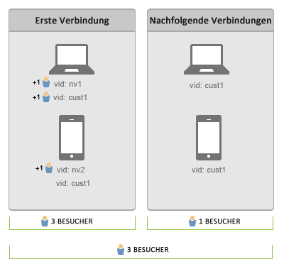

# Benutzer geräteübergreifend verbinden

>[!IMPORTANT]
>
>Diese Methode zur geräteübergreifenden Identifizierung von Besuchern wird nicht mehr empfohlen. Weitere Informationen finden Sie in der [Adobe Experience Cloud Device Co-op-Dokumentation](https://marketing.adobe.com/resources/help/en_US/mcdc/).

Mithilfe der geräteübergreifenden Identifizierung erkennen Sie Ihre Besucher auch auf anderen Geräten wieder. Bei der geräteübergreifenden Besucherkennung werden Benutzer mithilfe der Besucherkennungsvariablen „s.visitorID“ geräteübergreifend zugeordnet.

Wenn Sie eine passende [!UICONTROL Besucher-ID]-Variable angeben, sucht das System nach allen anderen Besucherprofilen, die die gleiche [!UICONTROL Besucher-ID] besitzen. Existiert ein solches Profil, wird ab diesem Punkt das bereits im System vorhandene Besucherprofil genutzt und das vorherige Besucherprofil wird nicht mehr eingesetzt.

Die [!UICONTROL Besucher-ID] wird für gewöhnlich festgelegt, nachdem sich ein Besucher authentifiziert hat oder eine andere Aktion durchgeführt hat, an der er – unabhängig davon, welches Gerät er verwendet hat – identifiziert werden kann. Es wird empfohlen, den Benutzernamen zu verschlüsseln oder eine interne ID zu verwenden, die keine personenbezogenen Daten enthält.

Einem Besucher, der sich im  [vorherigen Beispiel](/help/implement/js-implementation/xdevice-visid/xdevice-connecting.md) von verschiedenen Geräten aus anmeldet, wird so immer das gleiche Benutzerprofil zugeordnet. Wenn sich der Besucher später auf einem Gerät abmeldet, funktioniert die Zuordnung weiter, da die [!UICONTROL Besucher-ID], die auf jedem Gerät in einem Cookie gespeichert wird, diesem Besucherprofil bereits zugewiesen ist. Es wird empfohlen, die [!UICONTROL s.visitorID]-Variable nach Möglichkeit immer mit Werten zu füllen – dies dient zur Vorbeugung, falls das Cookie mit der [!UICONTROL Besucher-ID] gelöscht wird.

## Unique Visitor und Besuchsanzahl {#section_70330AB6724C4E419A4BD0BDD54641AC}

Betrachten Sie die folgende Verbindungsfolge bei zwei Geräten:

**Bei der ersten Datenverbindung**

* Die Besucherdeduplizierung ist nicht rückwirkend.

Nach der Authentifizierung am Laptop werden Treffer mit beiden Besucher-IDs (`nv1` und `cust1`) von Adobe Analytics als dieselbe Person betrachtet. Die Besucherdeduplizierung ist allerdings nicht rückwirkend. Daher werden zwei Unique Visitors gezählt.

Bei der ersten Datenverbindung am Mobilgerät wird der Kunde nicht erkannt. Daher wird ein neuer Unique Visitor gezählt. Nach der Authentifizierung des Benutzers (`cust1`) am Mobilgerät ordnet Adobe Analytics `cust1` wieder der auf der Haupt-Site angegebenen Besucher-ID zu, sodass keine weiteren Unique Visits gezählt werden.

Durch jede Authentifizierung mit einem neuen Gerät oder Browser wird ein Unique Visitor hinzugefügt.

**Bei nachfolgenden Datenverbindungen**

Bei nachfolgenden Datenverbindungen mit authentifizierten Geräten wird die Anzahl der Unique Visitors nicht erhöht.
