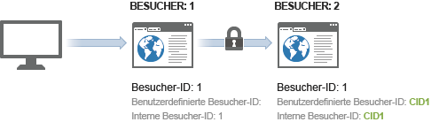
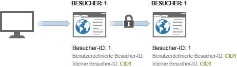

# Beispiel zur geräteübergreifenden Besucheridentifizierung

>[!IMPORTANT]
>
>Diese Methode zur geräteübergreifenden Identifizierung von Besuchern wird nicht mehr empfohlen. Weitere Informationen finden Sie unter [Cross-Device Analytics](/help/components/cda/overview.md) im Benutzerhandbuch zu den Komponenten.

Das folgende Beispiel veranschaulicht die geräteübergreifende Besucheridentifizierung anhand eines Beispiels von Server-Aufrufen, die in einer üblichen Kundeninteraktion gesendet werden.

| Server-Aufruf | Aktion | Besucher-ID-Cookie | Besucher-ID-Variable | Effektive Besucher-ID | Anzahl besuchter Seiten | Besuchsnummer |
|--- |--- |--- |--- |--- |--- |--- |
| 1 | Ein Besucher klickt auf einen Link in einer Marketing-E-Mail und gelangt so von seinem privaten Computer aus auf Ihre Website. Dieser Besucher hat Ihre Website zuvor bereits 7 Mal besucht. | 3 | – | 3 | 1 | 8 |
| 2-8 | Er ruft 7 weitere Seiten auf Ihrer Website auf. | 3 | – | 3 | 2-8 | 8 |
| 9 | Authentifiziert sich auf privatem Computer. | 1 | CID1 | CID1 | 9  (Dies ist der erste Treffer für CID1, also übernimmt CID1 und wird für das Besucherprofil von Besucher-ID 1 weiterverwendet.) | 8 |
| 10 | Besucht eine weitere Seite. | 1 | CID1 | CID1 | 10 | 8 |
| 11 | Öffnet Ihre Website auf seinem Laptop im Büro. Dieser Besucher hat Ihre Website zuvor nicht mithilfe dieses Geräts besucht. | 2 | – | 2 | 1 | 3 |
| 12 | Authentifiziert sich auf Laptop. | 2 | CID1 | CID1 | 1 | 9 |
| 13 | Zeigt eine weitere Seite an. | 2 | CID1 | CID1 | 2 | 9 |

## Besuchszählung

Analytics zählt einen Besuch bei jedem Treffer, bei dem die Besuchsseitenzahl gleich 1 ist.

In der obigen Tabelle wurde ein neuer Besuch viermal gezählt: bei Treffern 1, 9, 11 und 12.

## Besucherzählung

In Analytics wird jede einzelne Besucher-ID als ein Unique Visitor gezählt.

In der obigen Tabelle wurde ein neuer Besucher dreimal gezählt: bei Treffern 1, 9 und 10.

Wenn Sie die geräteübergreifende Besucheridentifizierung verwenden, kann sich die Anzahl der Unique Visitors, die Sie sehen, erhöhen. So kann der Besucher während desselben Besuchs doppelt gezählt werden: Das erste Mal bei seinem ersten Besuch, und das zweite Mal nach seiner Authentifizierung.

Nach der anfänglichen Zuordnung verhält sich die Besuchsanzahl wieder wie gewohnt, da der Besucher über das Besucher-Cookie zugeordnet wird. Wenn der Besucher später wieder auf Ihre Website zurückkehrt und sich authentifiziert, wird die Besucheranzahl nicht überhöht, da sich die effektive Besucher-ID nach der Authentifizierung nicht mehr geändert hat.

Stellen Sie sicher, dass Sie bei der Identifizierung von Unique Visitors so konsistent wie möglich sind. Verwenden Sie beispielsweise immer die `visitorID`-Variable, wenn der Benutzer authentifiziert ist.
