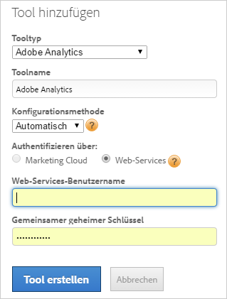

# Adobe Analytics-Tool hinzufügen

Stellen Sie Adobe Analytics mithilfe des Dynamic Tag Managements bereit, indem Sie das Adobe Analytics-Tool erstellen und den Seiten-Code entweder automatisch oder manuell konfigurieren. Für die meisten Benutzer wird die automatische Methode empfohlen.

>[!NOTE] Für ein verbessertes Besucher-Tracking empfehlen wir dringend, den [Identitätsdienst](https://marketing.adobe.com/resources/help/de_DE/mcvid/) zu aktivieren.

## Hinzufügen eines Adobe Analytics-Tools {#section_D5066B21581B4F7F811AD0027BF44EA5}

1. Klicken Sie auf  **[!UICONTROL  *`Web Property Name`*]** > **[!UICONTROL Overview]** > **[!UICONTROL Add a Tool]** > **[!UICONTROL Adobe Analytics]** .

   

1. Füllen Sie die Felder aus:

<table id="table_1CFB53FE72E74CCB8CAA5D4E3873D286"> 
 <thead> 
  <tr> 
   <th colname="col1" class="entry"> Element </th> 
   <th colname="col2" class="entry"> Beschreibung </th> 
  </tr> 
 </thead>
 <tbody> 
  <tr> 
   <td colname="col1"> 
Tool-Typ 
 </td> 
   <td colname="col2">Der Typ des Tools, z. B. Adobe Analytics. </td> 
  </tr> 
  <tr> 
   <td colname="col1"> 
Tool-Name 
 </td> 
   <td colname="col2">Ein beschreibender Name für dieses Tool. Dieser Name wird auf der Registerkarte Übersicht unter Installierte Tools angezeigt. </td> 
  </tr> 
  <tr> 
   <td colname="col1" morerows="1"> 
Konfigurationsmethode 
 </td> 
   <td colname="col2"> 
 <b>Automatisch</b> (empfohlen): Verwaltung der Konfiguration mit dem Dynamic Tag Management. Diese Methode ermöglicht die automatische Synchronisierung von Adobe Analytics-Report Suites per Experience Cloud-Anmeldung oder Web-Services-ID und verwaltet den AppMeasurement-Code. 
 
Sobald die Konten verknüpft sind, ruft das Dynamic Tag Management die IDs und Namen der Adobe Analytics-Report Suite ab und fügt sie in die Benutzeroberfläche für die Tool-Konfiguration ein, wodurch Tools schneller und mit einem geringeren Risiko von Benutzerfehlern implementiert werden können. 
 
 
Hinweis: Sie müssen die Option Automatisch wählen, wenn Sie Adobe Analytics Premium-Kunde sind. 
 
 
Füllen Sie die Felder der automatischen Konfiguration aus: 
 
    <ul id="ul_8D9797B01E444B9C85B862A9F96B447C"> 
     <li id="li_0AC84C1F37B24C658F2178E50ECCC4B0"> 
 <b>Experience Cloud</b> (Standardwert): Verwendet Experience Cloud-Single Sign-On. Geben Sie Ihre Experience Cloud-ID und Ihr Kennwort ein. 
 </li> 
     <li id="li_6C80468835D04CC09F4AEC46D1300310"> 
<b>Web-Services</b>: Geben Sie Ihren Web-Services-Benutzernamen und den gemeinsamen geheimen Schlüssel an. 
 
Die Anmeldedaten für gemeinsame geheime Schlüssel befinden sich unter  Admin  &gt;  Unternehmenseinstellungen &gt; <a href="https://docs.adobe.com/content/help/de-DE/analytics/admin/company-settings/web-services-admin.html">Web-Services</a>. 
 
Entwickler finden unter <a href="https://marketing.adobe.com/developer/de_DE/get-started/enterprise-api/c-get-web-service-access-to-the-enterprise-api">Get Web Service Access to the Enterprise API</a> (Web-Service-Zugriff auf die Enterprise-API sichern) Informationen zum Abrufen der Web-Services-Anmeldedaten. 
 </li> 
    </ul> </td> 
  </tr> 
  <tr> 
   <td colname="col2"> 
 <b>Manuell</b>: Manuelle Verwaltung des AppMeasurement-Codes. Der Analytics AppMeasurement Code kann unter  Admin Tools &gt;  Code-Manager heruntergeladen werden. 
 
Klicken Sie auf <a href="https://marketing.adobe.com/resources/help/en_US/sc/implement/appmeasure_mjs.html">JavaScript (neu)</a>, um Informationen zum lokalen Download des Codes zu erhalten, damit Sie ihn kopieren und in das Feld Code bearbeiten in der <a href="/help/implement/other/dtm/c-aa-tool/library-management.md">Bibliotheksverwaltung</a> einfügen können. 
 
Füllen Sie die Felder für eine manuelle Konfiguration aus: 
 
    <ul id="ul_CFB6CE78AEB743EF8B47BAAC42E2DB0A"> 
     <li id="li_5B7046CD95AB416F8C113B381A264D91"> 
<b>Produktionskonto-ID: </b>(Erforderlich) Ihr Produktionskonto für die Datenerfassung. Bei Analytics ist dies Ihre Report Suite-ID. Das Dynamic Tag Management installiert automatisch das richtige Konto in der Produktions- und Staging-Umgebung. 
 </li> 
     <li id="li_14E840FD79A0451BABEDD15DC0584768"> 
<b>Staging-Konto-ID: </b>(Erforderlich) Wird in Ihrer Entwicklungs- oder Testversion verwendet. Bei Analytics ist dies Ihre Report Suite-ID. Mit einem Staging-Konto werden Ihre Testdaten von der Produktion getrennt. 
 </li> 
     <li id="li_69E6C6A41F5240E1ABE8ABE0B9D151FC"> 
<b>Tracking-Server: Geben Sie die Informationen für Ihren Tracking-Server </b>an. 
 
Mit den Variablen Tracking-Server und SSL-Tracking-Server können Erstanbieter-Cookies bereitgestellt werden, in denen die Domäne enthalten ist, in der Bildabfrage und Cookie geschrieben wurden. Weitere Informationen finden Sie im Artikel zur <a href="https://helpx.adobe.com/de/analytics/kb/determining-data-center.html">ordnungsgemäßen Angabe der Variablen „trackingServer“ und „trackingServerSecure“</a>. 
 </li> 
     <li id="li_1A7271C68205428F8CA5548A96CACBEC"> 
<b>SSL-Tracking-Server:</b> Angabe der SSL-Tracking-Serverdaten. 
 </li> 
    </ul> </td> 
  </tr> 
 </tbody> 
</table>

1. Click **[!UICONTROL Create Tool]** to create the tool and display it for editing.

   Werkzeuge werden auf der [!UICONTROL Overview] Registerkarte angezeigt, unter [!UICONTROL Installed Tools].

1. (Bedingt) Konfigurieren Sie das Tool nach Bedarf weiter, indem Sie die Anweisungen unter den Links unten ( [!UICONTROL General], [!UICONTROL Library Management], [!UICONTROL Global Variables], [!UICONTROL Pageviews & Content], [!UICONTROL Link Tracking], [!UICONTROL Referrers & Campaigns], [!UICONTROL Cookies]und [!UICONTROL Customize Page Code]) befolgen.

Weiterführende Informationen finden Sie in den [häufig gestellten Fragen zu Adobe Analytics](/help/implement/faq.md).

## Ein bestehendes Adobe Analytics-Tool bearbeiten {#section_148B16AF429B4949B06238D90635B726}

Ein bestehendes Adobe Analytics-Tool kann bearbeitet werden, um die Konfigurierungseinstellungen anzupassen.

1. Click the   icon next to an installed tool from the [!UICONTROL Overview] tab.
1. Bearbeiten Sie die Felder nach Bedarf.

   Die folgende Tabelle enthält nur die Elemente, die sich von den Elementen unterscheiden, die beim Erstellen eines Analytics-Tools verfügbar sind (siehe Beschreibung oben). Sie können jedoch jedes beliebige Element auf der Seite ändern, wie in beiden Tabellen beschrieben.

<table id="table_2B60CD109CFF4839AB7F91D61125EDFF"> 
 <thead> 
  <tr> 
   <th colname="col1" class="entry"> Element </th> 
   <th colname="col2" class="entry"> Beschreibung </th> 
  </tr> 
 </thead>
 <tbody> 
  <tr> 
   <td colname="col1"> 
Automatische Konfiguration aktivieren 
 </td> 
   <td colname="col2"> 
Hinweis: Durch Aktivierung dieser Einstellung wird eine manuell konfigurierte Implementierung zur automatischen Konfigurationsmethode geändert, die unter Konfigurationsmethode beschrieben ist. 
 
Diese Option ermöglicht dem Dynamic Tag Management das automatische Abrufen Ihrer Adobe Analytics-Kontokonfiguration. 
 
Es wird der neueste verfügbare AppMeasurement-Code verwendet und es werden Upgrade-Benachrichtigungen zur Auswahl angezeigt, sobald neue Versionen verfügbar werden. Sie können bei Bedarf, z. B. aus Kompatibilitätsgründen, auch frühere AppMeasurement-Versionen wiederherstellen. Es werden bis zu fünf frühere Versionen angezeigt. 
 </td> 
  </tr> 
  <tr> 
   <td colname="col1"> 
Berechtigungen aktualisieren 
 </td> 
   <td colname="col2"> 
Aktualisieren Sie beispielsweise die API, um mit einem Benutzer verbundene Report Suites zu aktualisieren. 
 </td> 
  </tr> 
 </tbody> 
</table>

1. (Bedingt) Konfigurieren Sie das Tool nach Bedarf weiter, indem Sie die Anweisungen unter den Links unten ( [!UICONTROL General], [!UICONTROL Library Management], [!UICONTROL Global Variables], [!UICONTROL Pageviews & Content], [!UICONTROL Link Tracking], [!UICONTROL Referrers & Campaigns], [!UICONTROL Cookies]und [!UICONTROL Customize Page Code]) befolgen.
1. Klicken Sie auf **[!UICONTROL Save Changes]**.
