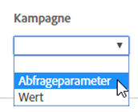

# Referrer und Kampagnen

Beschreibung der Felder des [!UICONTROL Dynamic Tag Managements] für Referrer- und Kampagnenoptionen bei der Bereitstellung des [!UICONTROL Dynamic Tag Managements] in Adobe [!DNL Analytics].

**[!UICONTROL *`Property`*]** > **[!UICONTROL  Tool bearbeiten ]** > **[!UICONTROL  Referrer und Kampagnen ]**

<table id="table_09AE3BFF0F12442F9C19CD96451F93E4">
 <thead>
  <tr>
   <th colname="col1" class="entry"> Element </th>
   <th colname="col2" class="entry"> Beschreibung </th>
  </tr>
 </thead>
 <tbody>
  <tr>
   <td colname="col1"> Verweisende Stelle überschreiben </td>
   <td colname="col2"> 
Überschreibt den Wert, der in der Variablen  s.referrer festgelegt ist, die normalerweise mit dem im Browser festgelegten Referrer aufgefüllt ist. 
 
Siehe <a href="../../../vars/page-vars/referrer.md">Verweisende Stelle</a>. 
 </td>
  </tr>
  <tr>
   <td colname="col1"> Kampagne </td>
   <td colname="col2"> 
Eine Variable, die Marketing-Kampagnen kennzeichnet, über die Besucher zu Ihrer Website gelangen. Der Wert einer Kampagne wird normalerweise einem Abfragezeichenfolgenparameter entnommen. 
 
Siehe <a href="../../../vars/page-vars/campaign.md">Kampagne</a>. 
 </td>
  </tr>
 </tbody>
</table>

Verwenden Sie die DTM-Oberfläche, um auszuwählen, ob eine Abfragezeichenfolge oder ein Wert (bezogen aus einem Datenelement) verwendet werden soll oder nicht:

Sie können entweder die Abfragezeichenfolge direkt über die Oberfläche eingeben oder sich auf ein anderes Datenelement beziehen, wenn Sie Kampagnen auf andere Art und Weise verfolgen.
