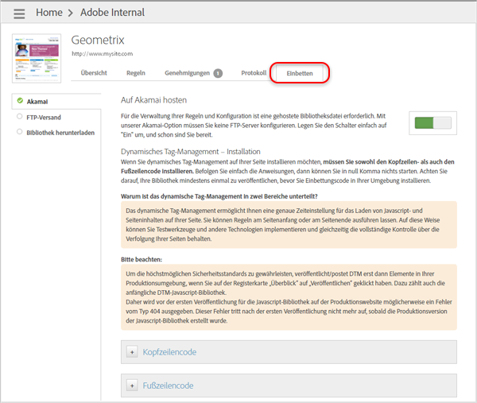

# Kopf- und Fußzeilencode hinzufügen

Verwenden Sie das Dynamic Tag Management, um Kopf- und Fußzeilencode hinzuzufügen, mit dem das Laden von JavaScript und Seiteninhalten Ihrer Site definiert wird. Sie müssen sowohl den Kopf- als auch den Fußzeilencode auf jeder Seite Ihrer Website einfügen – unabhängig von der verwendeten Hosting-Option.

Da das Dynamic Tag Management Codebausteine sowohl in der Kopf- als auch in der Fußzeile einbindet, können Sie Regeln am Seitenanfang oder am Seitenende ausführen. Dies ermöglicht die Implementierung von Test-Tools und anderen Verfahren; gleichzeitig behalten Sie die Kontrolle bei der Nachverfolgung Ihrer Seiten.

Mithilfe des Dynamic Tag Managements werden Staging- und Produktions-Einbettungscodes erstellt, mit denen Ihre Änderungen in der Staging-Umgebung getestet werden können, bevor Sie sie in die Produktionsumgebung übernehmen.

>[!IMPORTANT]
>
>Für eine erfolgreiche Implementierung ist es wichtig, dass Sie den Anweisungen in der Adobe-Hilfe genau folgen. Insbesondere müssen Sie den Kopfzeilencode im Abschnitt `<head>` Ihrer Dokumentvorlagen platzieren. Außerdem müssen Sie den Fußzeilencode direkt vor dem schließenden `</body>`-Tag einfügen. Das Einfügen dieser Einbettungscodes an einer anderen Stelle im Markup, die Verwendung asynchroner Methoden zum Anhängen der Einbettungscodes oder das beliebige Umbrechen von Einbettungscodes stellen *keine* unterstützte Implementierung des Dynamic Tag Managements dar. Die Einbettungscodes müssen genau so wie angegeben implementiert werden.
>
>Eine nicht unterstützte Implementierung führt zu unerwarteten Ergebnissen und macht es dem Kundendienst und dem technischen Service unmöglich, Sie bei Ihrer Implementierung zu unterstützen.

1. Öffnen Sie die Registerkarte „[!UICONTROL Einbettung]“ in der Benutzeroberfläche des Dynamic Tag Managements, wählen Sie eine Hosting-Option (wie beispielsweise Akamai) und schalten Sie dann den Umschalter auf „Ein“.

   Schritt Ergebnis 1. Kopieren Sie den Produktions-Kopfzeilencode, der auf der Registerkarte „Einbettung“ des Dynamic Tag Managements bereitgestellt wird, und fügen Sie ihn im Abschnitt [!DNL HEAD] des HTML-Codes Ihrer Website ein.

   

   Platzieren Sie den Code so nah wie möglich am `<head>` -Tag platziert haben. Dieser Codeabschnitt sollte auf jeder Seite Ihrer Live-Produktions-Website platziert werden.

   >[!NOTE]
   >
   >Produktions-Einbettungscode gibt nur die veröffentlichten Elemente in dieser [Eigenschaft](/help/implement/other/dtm/t-create-web-property.md) an. Einbettungscode für das Staging gibt jedoch alle Elemente in der zugehörigen Eigenschaft wieder, unabhängig von ihrem Veröffentlichungsstatus. Um nicht veröffentlichte Elemente auf Ihrer Produktions-Website zu testen, aktivieren Sie Staging lokal in der Konsole, siehe Anweisungen unter  [Nicht veröffentlichte Regeln für Akamai-Hosting testen](/help/implement/other/dtm/c-rules/t-test-rules-akamai.md).

1. Kopieren Sie den Produktions-Fußzeilencode und fügen Sie ihn im [!DNL BODY]-Bereich Ihres Website-HTML-Codes ein.

   Platzieren Sie den Code so nah wie möglich am `</body>` -Tag platziert haben.
1. Kopieren Sie den Staging-Kopf- und Fußzeilencode und wiederholen Sie dann die oben beschriebenen Schritte für Ihre Staging-Website.

   >[!NOTE]
   >
   >Die Codeabschnitte für Produktions- und Staging-Codes unterscheiden sich dahingehend, dass der Dateiname in der Staging-Version mit [!DNL -staging] ergänzt wird. Der Fußzeilencode bleibt in der Staging- und Production-Version gleich.
