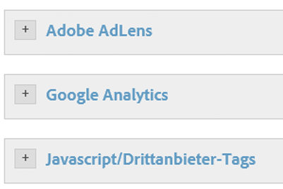
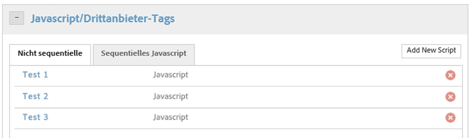

# Aktionen einrichten, die von der Bedingung ausgelöst werden

Richten Sie Aktionen ein, die von der Bedingung ausgelöst werden sollen.

Nachdem Sie die Bedingung eingerichtet haben, müssen Sie die Aktionen einrichten, die von der Bedingung ausgelöst werden sollen. Zu diesen Aktionen zählen beispielsweise [!DNL Analytics]-Ereignisse, Drittanbieter-Tags oder benutzerdefinierte Skripte. Im folgenden Beispiel wird beschrieben, wie Sie Skripte oder Drittanbieter-Tags einrichten.

Neben integrierten Tools wie [!DNL Adobe Analytics] und Google Analytics kann das Dynamic Tag Management jede Art von JavaScript auslösen oder HTML in Ihre Website einfügen – in ausgewählten Seiten oder in spezifischen Szenarios.

Jede Regel kann beliebig viele Skripte auslösen oder HTML-Codes einfügen.

>[!NOTE]
>
>Da DTM es Ihnen ermöglicht, benutzerdefinierten Code in Ihre Seite aufzunehmen, müssen Sie darauf achten, keine Sicherheitslücken durch seitenübergreifende Skripterstellung (XSS) zu erzeugen (weitere Informationen finden Sie im [OWASP-Leitfaden](https://www.owasp.org/index.php/Cross-site_Scripting_(XSS))). Bei der Verwendung von Datenelementen in Skripten muss besonders vorsichtig vorgegangen werden. Gehen Sie stets davon aus, dass Datenelementwerte von nicht vertrauenswürdigen Quellen übermittelt werden könnten.

**So richten Sie Aktionen ein, die von der Bedingung ausgelöst werden**

1. Klicken Sie auf **[!UICONTROL JavaScript/Drittanbieter-Tags]**, um Ihrer Regel ein neues Skript hinzuzufügen.

   

1. Klicken Sie auf **[!UICONTROL Neues Skript hinzufügen]**.

   

1. Benennen Sie das Skript.
1. Geben Sie an, wie das Skript ausgelöst werden soll, und fügen Sie den gewünschten Inhalt in den Textbereich ein. 

1. Klicken Sie auf **[!UICONTROL Code speichern]**. Das Skript wird der Warteschlange für die Regel hinzugefügt. 

