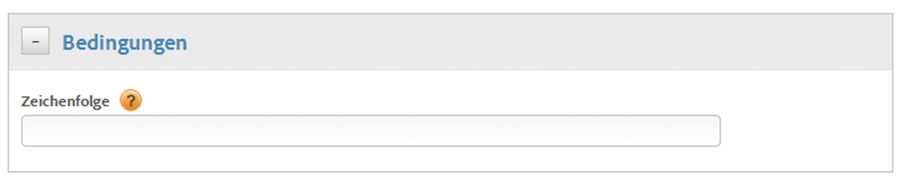

# Erstellen Sie Bedingungen für Direktaufrufregeln

Erstellen Sie Bedingungen für Direktaufrufregeln.

1. Geben Sie im Dialogfeld **[!UICONTROL Bedingungen]** ohne Anführungszeichen die Zeichenfolge an, die bei Ihrem Direktaufruf an `_satellite.track()` weitergegeben wird.

   

   >[!NOTE]
   >
   >Verwenden Sie bei der oben beschriebenen Angabe der Zeichenfolge, die über die Benutzeroberfläche bei einem Direktaufruf an `_satellite.track()` übermittelt wird, keine Anführungszeichen. Wenn Sie [benutzerdefinierten Seiten-Code](/help/implement/other/dtm/c-aa-tool/customize-page-code.md) im Editor angeben, müssen Anführungszeichen verwendet werden.

