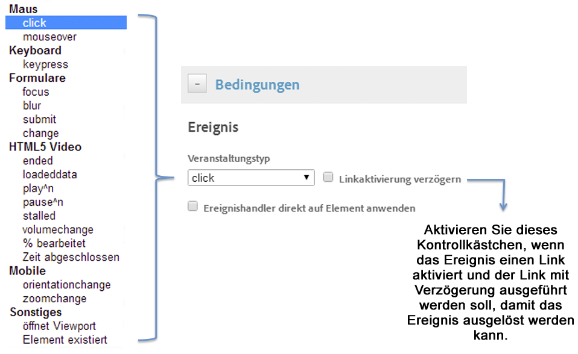
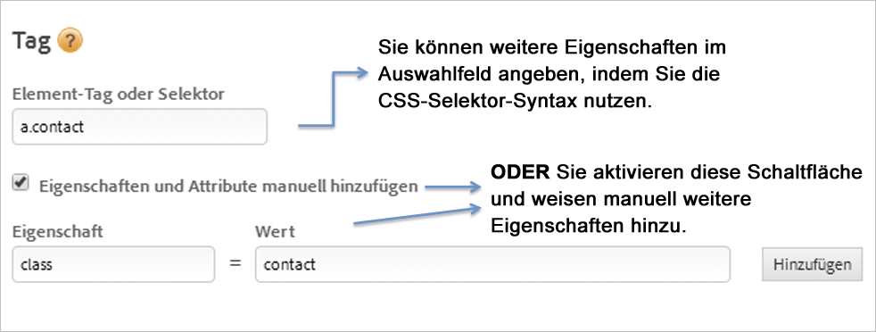
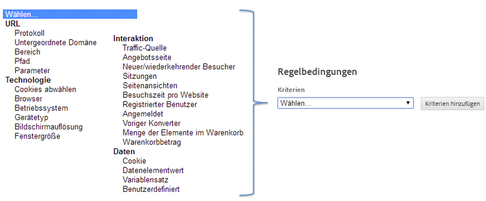

# Bedingungen für ereignisbasierte Regeln erstellen

Die Bedingungen bestimmen, ob eine ereignisbasierte Regel ausgelöst wird.

1. Wählen Sie die Art der Interaktion aus, die Sie verfolgen möchten, z. B. Mausklicks oder Senden eines Formulars.

   

   Weitere Informationen finden Sie unter [Ereignistypen](https://docs.adobe.com/content/help/de-DE/dtm/using/resources/rules/t-rules-event-conditions.html) in der Produktdokumentation zum Adobe Tag Management.

1. Aktivieren Sie nach Bedarf die folgenden Optionen:

   | Element | Beschreibung |
   |--- |--- |
   | Linkaktivierung verzögern | Aktivieren, wenn das Ereignis einen Link aktiviert und Sie wünschen, dass der Link verzögert wird, bis das Ereignis ausgelöst werden kann. |
   | Ereignishandler direkt auf Element anwenden | Der Ereignishandler wird direkt auf das spezifische Element angewendet, auf das die Ausrichtung erfolgt. Diese Einstellung ist mit dem Bubbling- und Ebenen-Konzept in einem Browser verknüpft. |

   Wenn Sie beispielsweise innerhalb eines Verankerungs-Tags wie `` auf ein Bild klicken, erwarten Sie möglicherweise, dass der Klick mit dem Verankerungs-Tag verknüpft ist, da sich das Tag in einem Bubble-Stream befindet. Wenn Sie den Klick jedoch in den Entwickler-Tools analysieren, wirkt er sich tatsächlich nur auf das ``-Tag aus. Um sicherzustellen, dass das Ereignis korrekt behandelt wird, verknüpfen Sie den Klick mit dem ``-Tag und erwarten Sie nicht, dass der Browser den Klick an ein übergeordnetes Element übergibt (Bubbling). Ein Ereignis (z. B. ein Klick) kann potenziell an `<body>` übergeben werden. Es ist daher wichtig zu verstehen, an welche Einstellung das Ereignis tatsächlich gebunden ist, und diese zielgerichtet anzusprechen, um sicherzugehen, dass die Regel korrekt ausgelöst wird.

   *Bubbling* bedeutet, dass das Ereignis zuerst von dem innersten Element erfasst und behandelt wird und anschließend an übergeordnete Elemente weitergegeben wird.

1. Geben Sie den Namen des Tags an, das Sie verfolgen möchten, sowie zusätzliche Eigenschaften, über die das Tag verfügt und die Sie abgleichen möchten.

   

   Informationen zum Auffinden des richtigen Element-Tags finden Sie unter [Using the CSS Selector](https://docs.adobe.com/content/help/de-DE/dtm/using/resources/rules/t-rules-event-conditions.html#concept_DDF500DCB8214658AEDECDE69ED1D4AF) (Verwenden des CSS-Selektors) in der Produktdokumentation für das Dynamic Tag Management.

1. Wählen Sie zusätzliche Kriterien oder Bedingungstypen aus, die Sie an die Regel binden möchten, oder richten Sie sie ein.

   

1. Legen Sie Ihre bevorzugte Eventbubbling-Einstellung fest.

   Eventbubbling ist eine Möglichkeit der Ereignisübergabe im HTML-DOM.

   | Wenn Sie... | Option verwenden |
   |--- |--- |
   | Sie möchten zugehörige Interaktionen in untergeordneten Elementen des Regel-Selektors zulassen, den Sie als Auslöser der Regel angegeben haben. | Eventbubbling für untergeordnete Elementen zulassen. |
   | Sie möchten das Bubbling verhindern, wenn das untergeordnete Element bereits ein eigenes Ereignis auslöst. | Nicht zulassen, wenn untergeordnetes Element bereits ein Ereignis auslöst. |
   | Sie möchten nicht, dass die Ereignisse im ausgewählten Regel-Selektor in der Ereignishierarchie das Element selbst übersteigen. | Eventbubbling zu übergeordneten Elementen nicht zulassen. |
