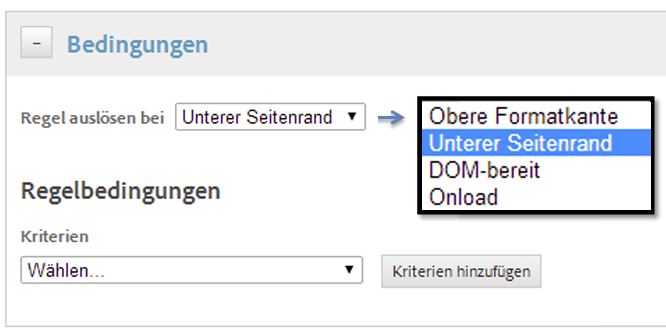
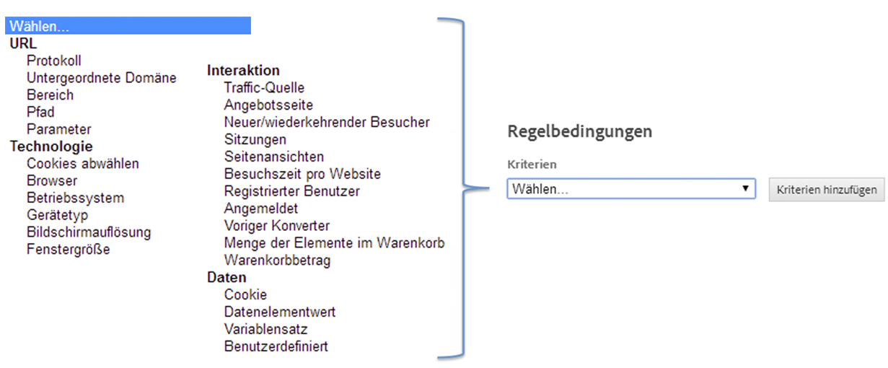

# Bedingungen für Seitenladeregeln erstellen

Erstellen Sie Regeln, die bestimmen, auf welchen Seiten eine Regel ausgelöst wird.

1. Geben Sie an, an welcher Position auf der Seite die Regel ausgelöst wird.

   Der Zeitpunkt, zu dem Regeln auf einer Seite ausgelöst werden, gewinnt an Bedeutung, wenn es Abhängigkeiten zu Seiteninhalten innerhalb der Regel gibt.

   

1. Geben Sie die Bedingung an, durch die die Regel ausgelöst wird.

   Sie können beispielsweise **[!UICONTROL Pfad]** auswählen, um spezifische Seiten anzugeben, für die die Regel ausgelöst werden soll.

   

