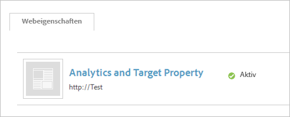

# Adobe Analytics manuell implementieren (alt)

Erstellen Sie ein Adobe Analytics-Tool für die Implementierung mithilfe des [!UICONTROL Dynamic Tag Managements]. Diese Anleitung beschreibt eine manuelle Implementierung (alte Methode).

Informationen zur automatischen Implementierungsverwaltung finden Sie unter  [Adobe Analytics-Tool hinzufügen](/help/implement/other/dtm/c-aa-tool/analytics-dtm.md).

Wenn Sie eine manuelle Konfiguration auf automatisch umstellen möchten, bearbeiten Sie ein Tool und klicken Sie auf **[!UICONTROL Automatische Konfiguration aktivieren]**.

1. Laden Sie den Analytics-Messungscode herunter:
   1. Klicken Sie in Analytics auf **[!UICONTROL Admin]** > **[!UICONTROL Code-Manager]**.
   1. Klicken Sie auf **[!UICONTROL JavaScript (neu)]**, um den Code lokal herunterzuladen.
1. In [!UICONTROL Dynamic Tag Management] [erstellen Sie eine Webeigenschaft](/help/implement/other/dtm/t-create-web-property.md).

   

   Nachdem Sie die Webeigenschaft erstellt haben, ist diese auf der Registerkarte [!UICONTROL Webeigenschaften] im [!UICONTROL Dashboard] zur Bearbeitung verfügbar. Es ist nicht erforderlich, die Webeigenschaft zu aktivieren..

1. Fügen Sie der Eigenschaft ein Analytics-Tool hinzu:
   1. Klicken Sie dazu auf der Registerkarte **[!UICONTROL Webeigenschaften]** auf die Eigenschaft.
   1. Klicken Sie auf der Registerkarte **[!UICONTROL Übersicht]** auf **[!UICONTROL Tool hinzufügen]**.
   1. Wählen Sie im Menü **[!UICONTROL Tool-Typ]** die Option **[!UICONTROL Adobe Analytics]** aus.

      

   1. Konfigurieren Sie die folgenden Felder:

      | Element | Beschreibung |
      |---|---|
      | Tool-Typ | Experience Cloud-Lösung, z. B. Analytics, Target, Social usw. |
      | Tool-Name | Der Werkzeugname. Dieser Name wird auf der Registerkarte [!UICONTROL Übersicht] unter [!UICONTROL Installierte Tools] angezeigt. |
      | Produktions-Konto-ID | Eine ID für Ihr Produktions-Konto zur Datensammlung. Das Dynamic Tag Management installiert automatisch das richtige Konto in der Produktions- und Staging-Umgebung. |
      | Staging-Konto-ID | Eine ID, die für Ihre Entwicklungs- oder Testumgebung verwendet wird. Mit einem Staging-Konto werden Ihre Testdaten von der Produktion getrennt. |

1. Klicken Sie auf **[!UICONTROL Tool erstellen]**.

   Auf der Registerkarte [!UICONTROL Übersicht] wird das installierte Tool angezeigt.

1. Klicken Sie zur Konfiguration des Codes auf **[!UICONTROL Einstellungen]** .

   Klicken Sie mindestens auf **[!UICONTROL Cookies]** und konfigurieren Sie Ihren Tracking-Server und den SSL-Tracking-Server.

1. Klicken Sie auf **[!UICONTROL Allgemein]** und [fügen Sie den grundlegenden AppMeasurement-Code](/help/implement/other/dtm/c-aa-tool/t-appmeasurement-code.md) ein.
1. Definieren Sie eine [Seitenladeregel](/help/implement/other/dtm/c-rules/t-rules-create.md), um [!DNL Analytics]-Daten zu erfassen.

   Sie können nun Regeln zum Sammeln von Analysedaten definieren. Möglicherweise möchten Sie zuerst einige Datenelemente definieren. Mithilfe von Datenelementen können Sie Daten aus der Seite extrahieren, die Sie verwenden können, um Ihre Regel zu konfigurieren. Sie können zu Beginn eine Seitenladeregel definieren, die keine Bedingungen zum Sammeln von [!DNL Analytics]-Daten auf den einzelnen Seiten enthält.
1. [Fügen Sie auf der Registerkarte „Einbettung“ den Kopf- und Fußzeilencode hinzu](/help/implement/other/dtm/c-headers-footers/t-header-footer-code.md).

   Für die Staging-Umgebung können Sie die Standard-Hostingoption Amazon beibehalten. Sie können diese Option bei Bedarf vor der Implementierung in der Produktionsumgebung ändern.
1. (Optional) Klicken Sie auf der Registerkarte „Optionen“ auf **[!UICONTROL Einstellungen]** und konfigurieren Sie den Adobe Analytics-Code.

   >[!NOTE]
   >
   >Die Einstellungen auf der Seite [!UICONTROL Adobe Analytics] („Allgemein“, „Cookies“ usw.) heben Einstellungen in Ihrem `s_code` auf. Wenn diese Einstellungen in Ihrem `s_code` vorhanden sind, müssen sie an dieser Stelle nicht wiederholt werden.

