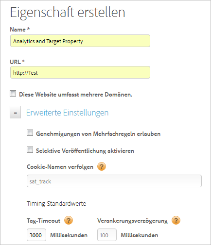

# Webeigenschaft erstellen

Eine Webeigenschaft kann aus einer beliebigen Gruppierung von einer oder mehreren Domänen und Subdomänen mit einer Regelbibliothek bestehen, die in eingebettetem Code enthalten sind.

>[!NOTE]
>
>Nur Benutzer mit ausreichenden Admin-Rechten können eine Eigenschaft erstellen. Weitere Informationen zu Rollen finden Sie unter [Erstellen und Verwalten von Gruppen in DTM](https://docs.adobe.com/content/help/de-DE/dtm/using/admin/groups.html) in der Produktdokumentation zu Dynamic Tag Management.

Sie können diese Assets mit DTM verwalten und verfolgen. Angenommen, Sie haben mehrere Websites, die auf einer Vorlage basieren, und Sie möchten auf all diesen Websites dieselben Assets verfolgen. Sie können eine Webeigenschaft auf mehrere Domänen anwenden.

Allgemeine Informationen zu Webeigenschaften und Best Practices finden Sie unter  [Web-Eigenschaften](https://docs.adobe.com/content/help/de-DE/dtm/using/admin/web-property.html) in der Produktdokumentation zu Dynamic Tag Management.

1. Navigieren Sie zu Ihrer Firmenseite und klicken Sie dann auf **[!UICONTROL Eigenschaft hinzufügen]**.

   

1. Füllen Sie die Felder aus:

   <table id="table_376D72251C4D4C4CA878D10C18D2532C"> 
    <thead> 
    <tr> 
    <th colname="col1" class="entry"> Element </th> 
    <th colname="col2" class="entry"> Beschreibung </th> 
    </tr> 
    </thead>
    <tbody> 
    <tr> 
    <td colname="col1">  Name </td> 
    <td colname="col2"> 
Der Name Ihrer Eigenschaft. 
 </td> 
    </tr> 
    <tr> 
    <td colname="col1">  URL </td> 
    <td colname="col2"> 
Die Basis-URL der Eigenschaft. 
 </td> 
    </tr> 
    <tr> 
    <td colname="col1"> Diese Website umfasst mehrere Domänen.  </td> 
    <td colname="col2"> 
Sie können Domänen hinzufügen oder entfernen, wenn die Besucherdaten zwischen Domänen beibehalten werden sollen. Wenn diese Option ausgewählt ist, bleiben die Daten zu dem Besuch über Subdomänen hinweg bestehen. 
 
Mit dieser Einstellung können Sie festlegen, wie Sie den Traffic zwischen verbundenen Subdomänen oder Domänen verfolgen möchten. Links zu Subdomänen werden als ausgehende Links betrachtet. Besuche in Subdomänen werden separat verfolgt. 
 </td> 
    </tr> 
    </tbody> 
    </table>

1. (Optional) Konfigurieren Sie [!UICONTROL Erweiterte Einstellungen].

   <table id="table_6E687FBE6ACC4301BCCD837F4DCBB9C9"> 
    <thead> 
    <tr> 
    <th colname="col1" class="entry"> Element </th> 
    <th colname="col2" class="entry"> Beschreibung </th> 
    </tr> 
    </thead>
    <tbody> 
    <tr> 
    <td colname="col1">  Genehmigungen für mehrere Regeln zulassen </td> 
    <td colname="col2"> 
Es können gleichzeitig mehrere Regeln für diese Eigenschaft genehmigt werden. Bei der Standardgenehmigung ist nur die Genehmigung einer einzelnen Regel zulässig. 
 </td> 
    </tr> 
    <tr> 
    <td colname="col1">  Selektive Veröffentlichung aktivieren </td> 
    <td colname="col2"> 
Gibt an, ob Benutzer auswählen können, welche genehmigten Regeln veröffentlicht werden. Dies ist die Standardoption. 
 </td> 
    </tr> 
    <tr> 
    <td colname="col1">  Tracking-Cookie-Name </td> 
    <td colname="col2"> 
Überschreibt den Standard-Tracking-Cookie-Namen. Sie können den Namen, den das Dynamic Tag Management verwendet, zur Verfolgung Ihres Opt-out-Status für den Erhalt anderer Cookies anpassen. 
 </td> 
    </tr> 
    <tr> 
    <td colname="col1">  Tag-Timeout </td> 
    <td colname="col2"> 
Gibt an, wie lange das Dynamic Tag Management auf das Auslösen eines Tags wartet, bevor das Zeitlimit überschritten und die Tag-Anforderung abgebrochen wird. 
 
 Aufgrund der Funktionsweise des Dynamic Tag Managements können Sie auch einen hohen Wert eingeben. DTM verfügt über effektive Methoden, sicherzustellen, dass langsame Tags keine negativen Auswirkungen auf das Benutzererlebnis haben. 
 </td> 
    </tr> 
    <tr> 
    <td colname="col1">  Verankerungsverzögerung </td> 
    <td colname="col2"> 
Gibt an, wie lange das Dynamic Tag Management darauf wartet, dass Tags bei geklickten Links ausgelöst werden, bevor ein Wechsel zur nächsten Seite erfolgt. Der Standardwert beträgt 100 Millisekunden. 
 
Größere Verzögerungen erhöhen die Genauigkeit des Trackings. Adobe empfiehlt eine Verzögerung von 500 Millisekunden oder weniger; eine solche wird vom Benutzer nicht wahrgenommen. 
 
Das Dynamic Tag Management wartet die gegebene Zeitspanne ab, wird das Signal jedoch früher ausgelöst, wird die Verzögerung verkürzt. (Das bedeutet, dass der Benutzer nicht immer die volle Verzögerungsdauer abwarten muss.) 
 </td> 
    </tr> 
    </tbody> 
    </table>

1. Klicken Sie auf **[!UICONTROL Eigenschaft erstellen]**.
