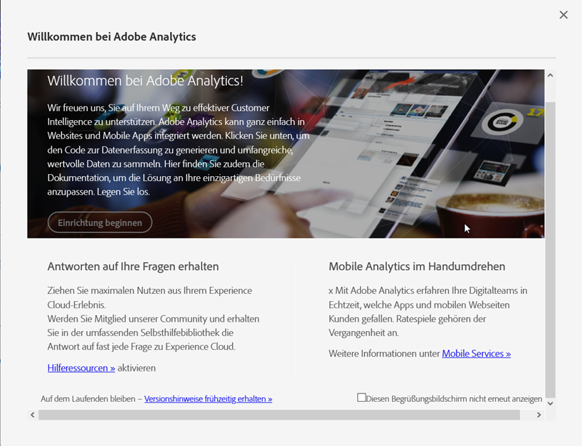

# Implementierungs-Modal

<!-- https://activation.adobedtm.com/index.php?redirected=1 -->

Das modale Fenster „Willkommen bei Adobe Analytics“ bietet einen vereinfachten Workflow zum Erstellen einer Report Suite. Adobe empfiehlt, diesen Workflow zu verwenden, wenn in Ihrem Unternehmen weitere Report Suites benötigt werden.

## Voraussetzungen

Ihre Adobe ID muss Zugriff auf Adobe Analytics und Adobe Experience Platform Launch haben. Wenn Sie keinen Zugriff auf Launch haben, können Sie in eine Endlosauthentifizierungsschleife versetzt werden, in der Sie aufgefordert werden, Ihre Anmeldeinformationen zu überprüfen. Wenden Sie sich an einen Systemadministrator in Ihrem Unternehmen, um Zugriff auf Launch zu erhalten.

## Zugriff auf das Modal

Greifen Sie auf das Modal zu, um eine Report Suite mit den folgenden Schritten zu erstellen.

1. Melden Sie sich mit Ihren Adobe ID-Anmeldeinformationen bei [experiencecloud.adobe.com](https://experiencecloud.adobe.com) an.
2. Klicken Sie oben auf das 9-Raster-Symbol und dann auf [!UICONTROL Adobe Analytics].
3. Wenn Sie noch keine Report Suite erstellt haben, wird das Modal automatisch angezeigt. If a report suite exists for this login company, click the Help icon in the top right, then click [!UICONTROL Welcome to Adobe Analytics].

>[!NOTE] Die [!UICONTROL Welcome to Adobe Analytics] Option wird nur angezeigt, wenn Sie sich über die Adobe Experience Cloud anmelden. Wenn Sie sich über veraltete Domänen anmelden, ist das Modal nicht verfügbar.

## Erstellen einer Report Suite

Click the [!UICONTROL Start Setup] button to begin the report suite creation workflow.

### Eigenschaftstyp

Der Eigenschaftstyp hilft Adobe bei der Festlegung einiger Backend-Einstellungen, je nachdem, wo Sie Analytics implementieren möchten.

* **Website**: Wenn Sie Adobe Analytics nur für eine Website implementieren möchten.
* **Native App**: Wenn Sie Adobe Analytics nur für eine App implementieren möchten.
* **Beide**: Wenn diese Report Suite Daten für eine Website und eine App enthält.

### Branchen

Geben Sie Ihr primäres Geschäftsmodell an. Diese Einstellung unterstützt Adobe bei der Vorkonfiguration einiger Variablennamen und Einstellungen, die auf Ihrem primären Geschäftsmodell basieren.

### Datenschicht

Eine [Datenschicht](data-layer.md) ist ein JavaScript-Objekt, das alle in Ihrer Implementierung verwendeten Variablen an einer hilfreichen Stelle organisiert. Weitere Informationen finden Sie unter [Datenschichten](data-layer.md).

### Daten-Repository

Geben Sie der Report Suite einen benutzerfreundlichen Namen. Ihre Report Suite-ID (RSID) wird automatisch anhand des Anzeigenamens und des Anmeldeunternehmens generiert.

### Zeitzone

Stellen Sie sicher, dass Adobe die richtige Zeitzone für die Report Suite erkannt hat.

### Geschätzte Seitenansichten pro Tag

Schätzen Sie, wie viel Traffic Ihre Website oder App pro Tag erhält. Anhand dieser Informationen kann Adobe der Report Suite die richtige Menge an Verarbeitungsressourcen zuweisen.

### Basiswährung

Legen Sie fest, in welcher Währung die Report Suite Geldwerte speichert.

>[!IMPORTANT] Stellen Sie sicher, dass Sie die richtige Währung angeben, insbesondere wenn Sie Umsatzberichtspflichten unterliegen. Es ist schwierig, die Basiswährung nach dem Beginn der Datenerfassung zu ändern.

## Ressourcen für die Implementierung

Nachdem die Report Suite erstellt wurde, haben Sie zwei Möglichkeiten, um mit der Implementierung fortzufahren:

* **Zu Adobe Experience Platform Launch**: Verknüpft Sie mit [launch.adobe.com](https://launch.adobe.com), um Ihre Implementierung zu konfigurieren und den Bereitstellungscode herunterzuladen. Siehe [Implementieren mit Launch](../launch/overview.md). Adobe empfiehlt in den meisten Fällen die Verwendung von Launch.
* **Implementierungscode herunterladen**: Bietet einen direkten Link zum Herunterladen von JavaScript-Dateien für eine manuelle JavaScript-Implementierung. Siehe [AppMeasurement für JavaScript](../js/overview.md).
