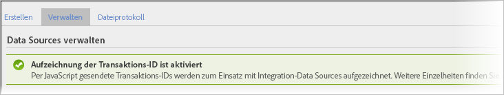

# Transaktions- und Kundenintegration

Data Sources bietet zwei zusätzliche Möglichkeiten, um Ereignisse, die offline auftreten, in Ihre Online-Daten zu integrieren.

* [Transaktions-ID-Aufzeichnung aktivieren](/help/import/c-data-sources/datasrc-integrating-offline-data.md#section_30D6D47AEC0F4A36B87EBFE4C858F20C)
* [Transaktionsintegration](/help/import/c-data-sources/datasrc-integrating-offline-data.md#section_B3F281CEFF9B47E9A07F9851D61D415D)
* [Kundenintegration](/help/import/c-data-sources/datasrc-integrating-offline-data.md#section_9F4AAD710D2543BDA834090A98115FBF)

Diese Integrationen ordnen Offline-Daten einer bestimmten Online-Transaktion oder einem Online-Besucher zu.

## Transaktions-ID-Aufzeichnung aktivieren {#section_30D6D47AEC0F4A36B87EBFE4C858F20C}

Die Transaktions-ID kann von der Benutzeroberfläche aus aktiviert/deaktiviert werden, ohne dass ClientCare miteinbezogen werden muss.

Navigieren Sie zu **[!UICONTROL Admin]** > **[!UICONTROL Report Suites]** > Report Suite auswählen > **[!UICONTROL Einstellungen bearbeiten]** > **[!UICONTROL Allgemein]** > **[!UICONTROL Allgemeine Kontoeinstellungen]**.

<!-- 

When contacting Customer Care, be prepared to provide the following information: 
 
<ul id="ul_C425C7A074484650AFCCF0425E8E3F47"> 
 <li id="li_7640C0C4DF0C49749A3C37E5461DC22F">Report Suite ID of the data source for which you need transaction ID recording enabled. 
In Data Sources, the report suite ID is the first part of the login appended by a random number that identifies the specific data source that was set up. For example, <code> RSID-drmossdev5 Login-drmossdev5_0001343430</code>. 
 </li> 
 <li id="li_4FB0E3EC7BE94A2DBEE9063365A71C9C">The Transaction ID expiration window (described in <a href="/help/import/c-data-sources/datasrc-tid-visitor-profile.md"  > Transaction ID and Visitor Profiles</a>). By default this is 90 days, but it can be extended to up to 2 years. </li> 
</ul>

 -->

Um festzustellen, ob die Transaktions-ID-Aufzeichnung aktiviert ist, navigieren Sie zu **[!UICONTROL Analytics]** > **[!UICONTROL Admin]** > **[!UICONTROL Data Sources]**.

Auf der Registerkarte [!UICONTROL Verwalten] wird der Status der Transaktions-ID-Aufzeichnung angezeigt.

## Kundenintegration {#section_9F4AAD710D2543BDA834090A98115FBF}

Kunden-IDs werden zur Angabe der Offline-Aktivität eines Kunden verwendet und stellen somit eine Verbindung zur Online-Aktivität her. Diese sollten in folgenden Fällen verwendet werden:

* Eine Kunden-ID wird in die Variable   *`visitorID`* festgelegt.
* Es gibt keinen designierten Punkt, an dem Kundenaktivitäten in die Offline-Aktivität wechseln, wie die Empfehlung eines Interessenten oder ein Kauf.

Informationen zum Konfigurieren dieser Art Datenquelle, siehe   [Besucher-ID](/help/import/c-data-sources/c-datasrc-types/datasrc-visitorid.md)

## Transaktionsintegration {#section_B3F281CEFF9B47E9A07F9851D61D415D}

Mithilfe von Transaktions-IDs können Sie den Status eines Besuchers zu einem bestimmten Zeitpunkt aufzeichnen. Diese sollten verwendet werden, wenn es einen bestimmten Zeitpunkt gibt, an dem Kunden normalerweise vom Online- zum Offline-Erlebnis wechseln. Beispiel:

* Empfehlen eines Interessenten an einen Vertriebsmitarbeiter, um den Kunden zu kontaktieren.
* Tätigen eines Online-Kaufs, der später u. U. im Laden zurückgegeben wird.
* Kaufen eines Produkts, für das sie später Support benötigen.

Der Wechsel von der Online- in die Offline-Umgebung verläuft oftmals anonym.

Transaktions-ID-Ereignisse zwar nicht in Metriken für Beiträge zu Besuchen enthalten (in Marketingberichten angezeigt), wohl aber in den Metriken zum Besucherbeitrag (nur in der Ad-hoc-Analyse) enthalten.

Der Grund hierfür besteht darin, dass die Transaktions-ID-Daten nicht mit einem Besuch (weil das Offline-Ereignis normalerweise nicht Teil des Online-Ereignisses ist), sondern mit dem Besucher verbunden sind. 

Siehe [Transaktions-ID](/help/import/c-data-sources/c-datasrc-types/datasrc-transactionid.md).
