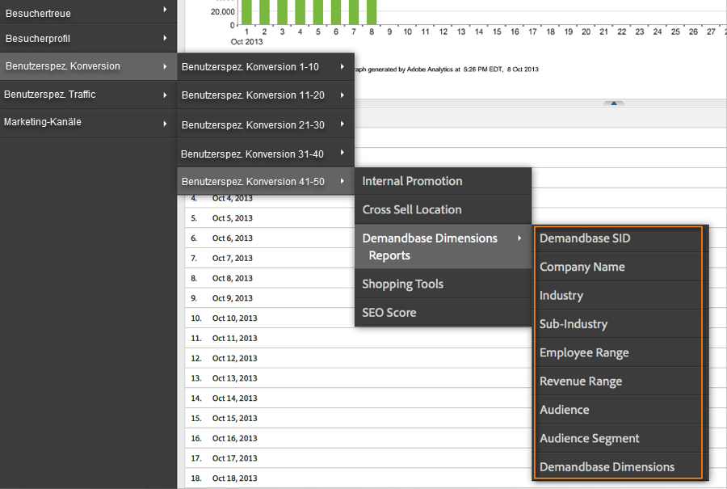
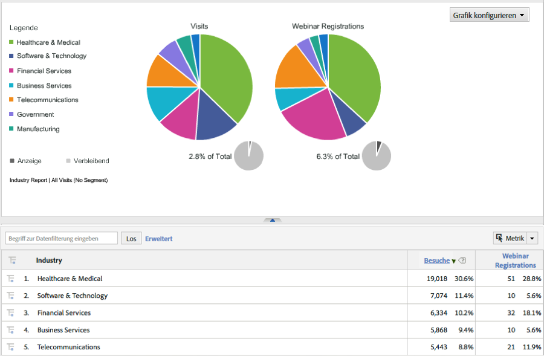

# Bereitstellen der Integration {#deploying-the-integration}

Die Bereitstellung dieser Integration ist ein einfacher Prozess, der die folgenden Aktionen erfordert.

## Abschließen des Adobe-Integrationsassistenten {#completing-the-adobe-integration-wizard}

Zum Aktivieren der Integration müssen Sie den Konfigurationsassistenten auf der Data Connectors-Oberfläche ausführen.

1. Navigieren Sie in der Adobe Experience Cloud zum Bereich „Data Connectors“ (früher Genesis).
1. Starten Sie den Integrationsassistenten für Demandbase 2.0.
1. Wählen Sie die gewünschte Report Suite aus. Geben Sie dann einen Namen für die Integration ein.
1. Konfigurieren Sie die folgenden Elemente:

<table id="table_8D60DC7C48C144DC9934749E7F9F65FF"> 
 <thead> 
  <tr> 
   <th colname="col1" class="entry"> Element </th> 
   <th colname="col2" class="entry"> Beschreibung </th> 
  </tr>
 </thead>
 <tbody> 
  <tr> 
   <td colname="col1"> E-Mail  Adresse </td> 
   <td colname="col2"> Die E-Mail-Adresse des Hauptkontakts. </td> 
  </tr> 
  <tr> 
   <td colname="col1"> Beschreibung </td> 
   <td colname="col2"> (Optional) Beschreibung für die Einrichtung dieser Integration. </td> 
  </tr> 
  <tr> 
   <td colname="col1"> Demandbase-API-Schlüssel </td> 
   <td colname="col2"> Diesen können Sie von Ihrem Demandbase-Kundenbetreuer erhalten. </td> 
  </tr> 
  <tr> 
   <td colname="col1"> Benutzerspezifische Demandbase-Dimensionsnr. </td> 
   <td colname="col2"> Dies sind die IDs für die 8 optionalen Dimensionen. Weitere Informationen finden Sie unter „Benutzerdefinierte Demandbase-Dimensionen“. </td> 
  </tr> 
  <tr> 
   <td colname="col1"> An Adobe Target senden </td> 
   <td colname="col2">Bei „true“ werden die Demandbase-Dimensionen auch mit einer ausgeblendeten mbox an Adobe Target gesendet. <p>Hinweis: Eine konfigurierte mbox.js-Datei muss auf der Webseite implementiert werden, damit Dimensionen erfasst werden. </p> </td> 
  </tr> 
 </tbody> 
</table>

1. Konfigurieren Sie die folgenden Variablenzuordnungselemente:

   | Element | Beschreibung |
   |---|---|
   | Demandbase-Dimensionen | Wählen Sie eine verfügbare eVar-Variable aus Ihrer Report Suite aus. |
   | Benutzerspezifische Demandbase-Dimensionen (optional) | Wählen Sie eine verfügbare eVar-Variable aus Ihrer Report Suite aus. |

1. Konfigurieren Sie die Namen für die benutzerspezifische Dimension (falls zutreffend).

   1. Wenn Sie in Schritt 4 ausgewählt haben, benutzerspezifische Dimensionen einzubeziehen, und die optionale eVar in Schritt 5 zugeordnet haben, müssen Sie Anzeigenamen für diese Dimensionen angeben. Wenn Sie beispielsweise „stock_ticker“ als benutzerspezifische Dimension 1 eingeben möchten, sollten Sie das Feld, in dem „Dimension 1“ enthalten ist, in „Börsenticker“ ändern.
   1. Die Namen der 8 Standarddimensionen sollte **NICHT** geändert werden (d. h. „Demandbase-SID“, „Firmenname“, „Branche“).

1. Aktivieren Sie das Kästchen, damit das Dashboard für die Demandbase-Integration automatisch für Sie erstellt wird (empfohlen).
1. Überprüfen Sie alle Konfigurationselemente. Klicken Sie dann auf **[!UICONTROL Jetzt aktivieren]**.

## Bereitstellen des Integrationscodes {#deploying-the-integration-code}

Nach Abschluss des Integrationsassistenten müssen Sie den Integrationscode für Ihren Adobe Analytics-Bereitstellungscode (s_code) bereitstellen.

>[!NOTE]
>
>Wenn Sie Adobe TagManager oder Dynamic Tag Management zur Bereitstellung von Adobe Analytics verwendet haben, können Sie den Integrationscode einfach mit einem dieser Tools hinzufügen.

1. Navigieren Sie zur Registerkarte **[!UICONTROL Support]**, laden Sie die Ressource `integration code v2_0_1` im Bereich „Ressourcen“ der Integration herunter und speichern Sie sie.

1. Nehmen Sie gegebenenfalls die erforderlichen Änderungen am Code vor. Weitere Informationen finden Sie unter „Ändern des Integrationscodes“ (auf dieser Seite).
1. Schließen Sie das Integrate-Modul ein, sofern es nicht bereits in Ihrem Adobe Analytics-Bereitstellungscode vorhanden ist.
1. Stellen Sie den Code mit einer der folgenden Methoden bereit:

   * Verwenden Sie Adobe TagManager oder Dynamic Tag Management, um den Code hinzuzufügen.
   * Sie können den Code auch an die Organisationsressource übermitteln, die für die Aktualisierung Ihres Adobe Analytics-Bereitstellungscodes zuständig ist.

>[!IMPORTANT]
>
>Testen Sie die Bereitstellung für diese Integration in einer Entwicklungs-/Staging-Umgebung, bevor Sie sie in einer Produktionsumgebung bereitstellen.

## Ändern des Integrationscodes {#modifying-the-integration-code}

In den meisten Fällen müssen Sie keine Änderungen am Integrationscode vornehmen, der vom Data Connector-Assistenten erstellt wird.

Wenn Sie jedoch Anpassungen vornehmen müssen, können Sie einige der Codeeinstellungen konsultieren, die im Folgenden beschrieben sind.

<table id="table_5405A73CEFD44466B3C39559F4A037C9"> 
 <thead> 
  <tr> 
   <th colname="col1" class="entry"> Codeeinstellung </th> 
   <th colname="col2" class="entry"> Beschreibung </th> 
  </tr>
 </thead>
 <tbody> 
  <tr> 
   <td colname="col1"> s.maxDelay </td> 
   <td colname="col2">Die maximale Anzahl von Millisekunden, welche die Adobe Analytics-Bildanforderung auf die Demandbase-Daten wartet, bevor sie an den Analytics-Erfassungsserver gesendet wird. <p>Hinweis: Diese Einstellung gilt für alle Integrationen, die möglicherweise über das Integrate-Modul ausgeführt werden. </p> </td> 
  </tr> 
  <tr> 
   <td colname="col1"> _db._key </td> 
   <td colname="col2"> Ihr Demandbase-API-Schlüssel. </td> 
  </tr> 
  <tr> 
   <td colname="col1"> _db._apiURL </td> 
   <td colname="col2"> Die URL-Vorlage für die Demandbase-API. </td> 
  </tr> 
  <tr> 
   <td colname="col1"> _db._delim </td> 
   <td colname="col2"> Das Trennzeichen, mit dem die Dimensionselemente der Demandbase getrennt werden, wenn sie an Adobe Analytics gesendet werden. Eine Änderung dieser Einstellung kann dazu führen, dass die standardmäßigen Klassifizierungsregeln nicht korrekt funktionieren. </td> 
  </tr> 
  <tr> 
   <td colname="col1"> _db._setTnt </td> 
   <td colname="col2">Bei „true“ versucht der Integrationscode, mithilfe einer ausgeblendeten mbox die Demandbase-Dimensionen als Profilparameter an Adobe Target zu senden. <p>Hinweis: Hierfür muss der mbox.js-Code auf der Seite vorhanden sein. </p> </td> 
  </tr> 
  <tr> 
   <td colname="col1"> _db._tntVarPrefix </td> 
   <td colname="col2"> Diese Zeichenfolge wird jedem Demandbase-Dimensionsnamen vorangestellt, bevor er an Adobe Target gesendet wird. Wenn diese Einstellung beispielsweise den Wert „db_“ aufweist, wird die Dimension „industry“ als „db_industry“ an Adobe Target gesendet. </td> 
  </tr> 
  <tr> 
   <td colname="col1"> _db._dimensionsArray </td> 
   <td colname="col2"> Die Demandbase-Standarddimensionen, die an Adobe Analytics gesendet werden. Es wird empfohlen, diese Einstellung nicht zu ändern. Die Eigenschaft „max_size“ ist die Anzahl der zulässigen Zeichen für die Dimension, bevor die Kürzung erfolgt. </td> 
  </tr> 
  <tr> 
   <td colname="col1"> _db._dimensionsArrayCustom </td> 
   <td colname="col2"> Die benutzerspezifischen Demandbase-Dimensionen, die an Adobe Analytics gesendet werden. Die Eigenschaft „max_size“ ist die Anzahl der zulässigen Zeichen für die Dimension, bevor die Kürzung erfolgt. </td> 
  </tr> 
  <tr> 
   <td colname="col1"> _db._cName </td> 
   <td colname="col2"> Der Name des Sitzungs-Cookies, mit dem der Status für die Demandbase-API-Kommunikation beibehalten wird. </td> 
  </tr> 
  <tr> 
   <td colname="col1"> _db._contextName </td> 
   <td colname="col2"> Der Name der contextData-Variablen, mit der die Standarddimensionen an Adobe Analytics gesendet werden. Es wird empfohlen, diese Einstellung nicht zu ändern. </td> 
  </tr> 
  <tr> 
   <td colname="col1"> _db._contextNameCustom </td> 
   <td colname="col2"> Der Name der contextData-Variablen, mit der die benutzerspezifischen Dimensionen an Adobe Analytics gesendet werden. Es wird empfohlen, diese Einstellung nicht zu ändern. </td> 
  </tr> 
 </tbody> 
</table>

## Einschließen des Integrate-Moduls {#including-the-integrate-module}

Für den Integrationscode muss das Integrate-Modul in Ihrer Adobe Analytics-Bereitstellung vorhanden sein.

Wenn Sie das Integrate-Modul noch nicht im Rahmen Ihrer Bereitstellung installiert haben, führen Sie je nach Art der Implementierung die folgenden Schritte aus.

### Für AppMeasurement v1.0+ {#section-f28d090bf2404cabaae34cd9c66fc575}

1. Entpacken Sie die AppMeasurement-ZIP-Datei, die Sie unter **[!UICONTROL Analytics]** > **[!UICONTROL Admin]** > **[!UICONTROL CodeManager]** heruntergeladen haben.

1. Öffnen Sie die Datei mit dem Namen [!DNL AppMeasurement_Module_Integrate.js].
1. Kopieren Sie die Inhalte dieser Datei und fügen Sie diese in Ihre primäre [!DNL AppMeasurement.js]-Datei ein.

   >[!NOTE]
   >
   >Fügen Sie sie direkt vor dem Kommentar DO NOT ALTER ANYTHING BELOW THIS LINE (ÄNDERN SIE NICHTS UNTERHALB DIESER LINIE) in der Datei ein.

### Für alten Code (H-Code) {#section-bba8ad8c715e4f97883e7de3269f681a}

1. Laden Sie das Integrate-Modul aus dem Bereich „Ressourcen“ auf der Data Connectors-Benutzeroberfläche herunter (unter der Registerkarte „Support“).

   

1. Kopieren Sie die Inhalte dieser Datei und fügen Sie diese in Ihre [!DNL s_code]-Datei ein.

   >[!NOTE]
   >
   >Fügen Sie sie direkt vor dem Kommentar DO NOT ALTER ANYTHING BELOW THIS LINE (ÄNDERN SIE NICHTS UNTERHALB DIESER LINIE) in der Datei ein.

## Überprüfen der Integration {#verifying-the-integration}

Überprüfen Sie anhand des Live-Trackings und der Berichterstellung, ob die Integration Daten erfolgreich erfasst.

### Live-Tracking {#section-9c20e8ff6b404ae09387ee07d675c9e2}

Überprüfen Sie mit dem Debugger-Tool für DigitalPulse, ob Demandbase-Dimensionsdaten an Adobe Analytics gesendet werden. Laden Sie nach dem Löschen der Cookies eine Seite auf Ihrer Website neu, auf welcher der Integrationscode bereitgestellt wurde. Vorausgesetzt, dass Ihre aktuelle IP einer von Demandbase anerkannten Organisation zugeordnet ist, sollten Sie die folgenden Ergebnisse sehen.

**„Reports &amp; Analysen“ (früher „SiteCatalyst“) umfasst die beiden folgenden Demandbase-Kontextdatenvariablen:**


**Target Mbox enthält Parameter für das Demandbase-Profil:**
Dies wird nur angezeigt, wenn Target auf der Seite implementiert ist UND Sie diese Integration für Adobe Target konfiguriert haben (siehe Schritt 4 des Adobe-Integrationsassistenten).


### Berichterstellung   {#section-1792fe75dc3249d0ad063dfd87a89162}

Überprüfen Sie Ihre Demandbase-Berichte in Adobe Analytics mit dem Dashboard, das automatisch mit dem Adobe-Integrationsassistenten erstellt wurde (Schritt 7).

Alternativ können Sie in der Menüstruktur von Adobe Analytics zur Demandbase-Berichterstellung navigieren (siehe Screenshots unten).

>[!NOTE]
>
>Diese Daten sollten innerhalb von 24–48 Stunden nach erfolgreicher Bereitstellung angezeigt werden.





### Häufig gestellte Fragen {#section-d926b160a2ef4f07b43ea1bc67ac2a0a}

**Was bedeutet „[k. A.]“?**

Der Demandbase-Data Connector gibt an, wenn ein Attribut nicht verfügbar ist, indem dieser Standardwert festgelegt wird. Es gibt zwei gängige Szenarien, in denen die Standardeinstellung festgelegt ist:

* Demandbase erkennt, dass der Besucher von einer IP-Adresse stammt, die nicht zu einer Firma gehört.
* Es wird ein Kontoüberwachungsattribut (beginnend mit „watch_list“) verwendet, die Firma befindet sich jedoch nicht in Ihrer Kontoüberwachungsliste.

**Warum wird „`[n/a]`“ bei bestimmten Attributen häufiger angezeigt?**

Demandbase klassifiziert alle IP-Adressen und stellt die Attribute „audience“ und „audience_segment“ bereit, auch wenn der Besucher nicht von einer Firmen-IP stammt. Wenn „audience“ Werte wie „Residential“ (Wohneinrichtung), „Wireless“ und „Hospitality“ (Bewirtung) zurückgibt, sind die übrigen Attribute wahrscheinlich nicht verfügbar.

Manchmal ist die Zielgruppe eines Besuchers „KMU“, aber andere Attribute zeigen „`[n/a]`“. Demandbase kann also den Besucher als kleines Unternehmen klassifizieren, aber das vollständige Firmenprofil ist nicht verfügbar. Dies geschieht in der Regel bei den kleinsten Firmen, wenn mehr als ein kleines Unternehmen denselben Dienstleister oder IP-Adressblock verwendet.

### Hinweise für Entwickler {#section-d33fff55bc4b4db99f82dee418ef1bc2}

Wenn Sie den Standardwert in Ihrer Implementierung anpassen müssen, aktualisieren Sie die Zeile:

```
_db._nonOrgMatchLabel = "[n/a]";
```
