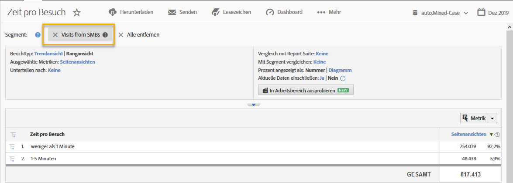

# Verwenden der Integration {#using-the-integration}

Sie können die zusätzlichen Funktionen der Integration nutzen, sobald sie bereitgestellt ist.

>[!NOTE] Es kann 24–48 Stunden dauern, bis einige der Demandbase-Daten in den Adobe Analytics-Berichten angezeigt werden.

Im Folgenden finden Sie einige Aktionen, mit denen Sie von dieser Integration in Adobe Analytics profitieren können:

## Anzeigen von Traffic- und Konversionsmetriken nach Demandbase-Dimension {#viewing-traffic-and-conversion-metrics-by-demandbase-dimension}

Diese Integration bietet neue Dimensionen, die als Adobe Analytics-Berichte verfügbar werden.

Der folgende Bericht ist ein Beispiel für die Analyse von Besuchen und Konversionsmetriken (Webinar-Registrierungen), die nach Zielgruppentyp und dann nach Branche aufgeschlüsselt wurden.

## Segmentieren nach Demandbase-Dimensionen {#segmenting-by-demandbase-dimensions}

Eine wichtige Funktion dieser Integration ist die Möglichkeit, Adobe Analytics-Segmente basierend auf den Demandbase-Dimensionen zu erstellen.

Sie können beispielsweise ein Segment erstellen, das nur Besuche von KMU-Organisationen umfasst. Sie könnten dies „Besuche von KMUs“ nennen. Die Definition lautet:

Zielgruppe ist KMU.

Weitere Informationen zum Erstellen von Segmenten finden Sie im [Analytics-Segmentierungshandbuch](https://marketing.adobe.com/resources/help/de_DE/analytics/segment/).

Dieses Segment kann dann auf praktisch jeden Bericht angewendet werden. Ein Beispiel dafür ist der hier angezeigte „Time Spent per Visit Report“ (Bericht über die pro Besuch verbrachte Zeit): 
