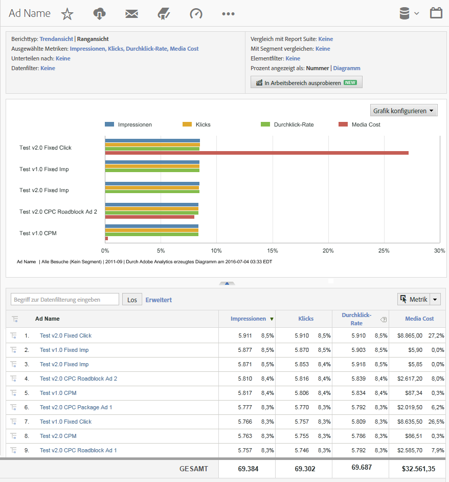

# Analytics-Berichte mit DFA-Daten {#analytics-reports-using-dfa-data}

Sobald eine Kommunikation zwischen DFA- und Adobe®-Erfassungsservern besteht, können Sie in Reports &amp; Analysen Berichte mit DFA-Daten erstellen.

Bereits zusammengestellte DFA-Berichte enthalten Folgendes:

**Kanal**: Zeigt Daten zum Vergleich von Banneranzeigen und anderen Onlineoptionen für Anzeigen wie „Gebührenpflichtige Suche“ und „E-Mail“ an.

**Bereitstellungswerkzeug**: Zeigt Daten zum Vergleich von DoubleClick for Advertisers und anderen Onlineservices an.

**Sitename**: Zeigt Daten zum Vergleich von Websites an, auf denen DFA-Banneranzeigen erschienen.

**Seitenname**: Zeigt Daten zum Vergleich einzelner Webseiten an, auf denen DFA-Banneranzeigen erschienen.

**Anzeigenname**: Zeigt Daten zum Vergleich spezieller DFA-Banneranzeigen an.

**Kampagnen**: Zeigt Daten zum Vergleich verschiedener DFA-Werbekampagnen an.

DFA-Berichte erstellen:

1. Melden Sie sich bei Adobe Experience Cloud an.
1. Öffnen Sie **[!UICONTROL Analytics]** > **[!UICONTROL Reports &amp; Analysen]**. Stellen Sie sicher, dass Sie die Report Suite ausgewählt haben, für die die DFA-Integration installiert ist.

1. Wählen Sie im Navigationsmenü links die Konversionsvariable aus, die die Daten zum DFA-Clickthrough erfasst, und wählen Sie den gewünschten DFA-Bericht aus.
1. Klicken Sie auf **[!UICONTROL Metrik hinzufügen]**. Dadurch wird das Dialogfeld für die Metrikauswahl geöffnet.
1. Überprüfen Sie die Metriken für Impressionen und Klicks in der Liste **[!UICONTROL Verfügbare Metriken]** und klicken Sie auf **[!UICONTROL Übernehmen]**.

   Im so erstellten Bericht werden Impressionen, Klicks und Umsatzdaten aufgeführt, sodass Sie erfahren, wie viel tatsächlichen Umsatz Ihre DFA-Services erzeugen.
So werden in einem DFA-Anzeigennamenbericht beispielsweise die Impressionen, Klicks und Umsatzdaten angezeigt, die direkt speziellen Banneranzeigen in Ihrer aktuellen DFA-Anzeigenkampagne zugeordnet werden können:

   

Dieser Bericht bietet folgende wichtige Aspekte:

* In der Kopfzeile des Berichts mit der Bezeichnung „DFA-Anzeigennamenbericht“ werden die Zeitspanne des Berichts (Februar 2009) sowie die Information angezeigt, dass es sich um einen Rangbericht im Horizontalbalkenformat handelt.
* Im Diagramm selbst werden die drei Metriken (Impressionen, Klicks, Umsatz) für jede im Bericht enthaltene DFA-Anzeige angezeigt.
* Die Daten für die Metriken werden im Diagramm als Prozentanteil am Metrikgesamtwert angezeigt, nicht als Zahlenwerte für jede einzelne Metrik. Diese Einstellung können Sie im Dialogfeld **[!UICONTROL Bericht konfigurieren]** ändern.
* Unter dem Diagramm werden im DFA-Anzeigennamenbericht die Berichtdetails für jede DFA-Anzeige aufgeführt und sowohl die numerischen als auch prozentualen Datenwerte für die Anzeigenleistung angegeben.
* Durch Auswählen eines speziellen DFA-Anzeigennamens können Sie ein Optionsmenü für weitere Informationen zu der jeweiligen DFA-Anzeige öffnen.
* In jeder Spalte ist eine Farbe angegeben, die sich auf die Farbe der entsprechenden Metrik im Diagramm bezieht.
* Berichte werden nach Umsatzmetrik sortiert, wobei sich die Anzeige mit dem höchsten Umsatz ganz oben befindet. Sie können diese Sortierung ändern, indem Sie auf die Bezeichnung einer anderen Spalte (Metrik) klicken.
