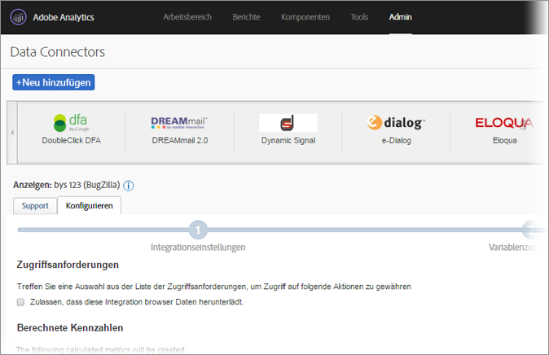
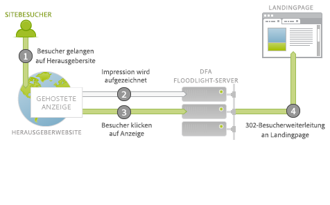
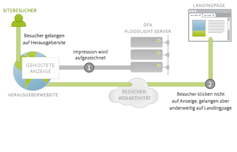
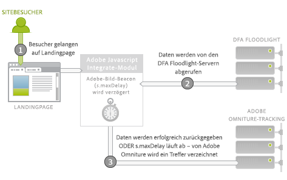
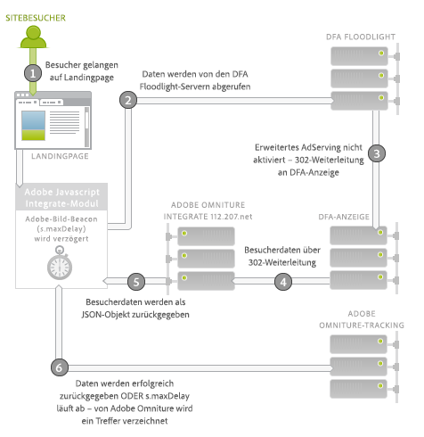

# DFA-Data Connector für Adobe Analytics {#dfa-data-connector-for-adobe-analytics}

>[!IMPORTANT]
>
>Am 1. August 2021 werden wir die Adobe Data Connector-Technologie beenden. [Weitere Informationen ...](/help/import/data-connectors/data-connectors-eol.md)

Online-Advertiser und Agenturen sind im modernen Onlinemarkt, der immer komplexer und umkämpfter wird, auf eine kontinuierliche Verbesserung ihres Verständnisses für Online-Marketingumgebungen sowie ihrer Rendite aus Werbeausgaben angewiesen. Advertiser, Agenturen und Herausgeber verfügen zwar über individuelle Werkzeuge zum Erreichen dieser Ziele, doch das manuelle Zusammenführen von Daten aus unterschiedlichen Datensystemen und Prozessen kann einen beachtlichen negativen Einfluss auf die Effizienz von Onlinemarketing-Kampagnen haben, was zu nicht optimalen Kampagnenleistungen, Datendiskrepanzen und Verwirrung führt.

Dieses Problem kann mithilfe der DoubleClick for Advertisers (DFA)-Integration gelöst werden, bei der Adobe® Data Connectors™ verwendet wird, sodass DoubleClick DFA-Daten automatisch an Reports &amp; Analytics senden kann.

**[!UICONTROL Analytics]** > **[!UICONTROL Admin]** > **[!UICONTROL Data Connectors]**

## Wesentliche Vorteile {#key-benefits}

Wesentliche Vorteile der Data Connectors-DFA-Integration sind unter anderem:

* **Mehr Konversionen**: Sichern Sie sich Trendeinblicke zur Optimierung von Anzeigenkampagnenplatzierungen und Konversionen auf der Site, die auf Benutzerverhalten und -präferenzen nach dem Klicken basieren.
* **Gemeinsamer Speicherort für Dateien**: Kombinieren Sie zur Verbesserung von unternehmensübergreifender Zusammenarbeit und der Möglichkeit, objektive Entscheidungen zu treffen, DoubleClick-DFA-Clickthrough- und -Durchsichtsdaten mit Reports &amp; Analytics.
* **Analysen mit Mehrwert**: Durch die automatische Integration von DFA und Adobe Reports &amp; Analytics können Advertiser und Agenturen Daten schneller auswerten und haben so mehr Zeit zum Analysieren von Berichten und zum Handeln.
* **Tiefgründigere Kundeneinblicke**: Sichern Sie sich mehr Kundeneinblicke – wie sie auf Ihre Site gelangen und welche Aktionen sie dort durchführen.
* **Metriken für den Lebenszykluserfolg**: Messen Sie die Effizienz Ihrer Akquisekampagnen über den gesamten Lebenszyklus Ihrer Besucher hinweg.
* **Integrierte Berichte**: Daten werden für optimierte Unternehmensprozesse und Berichte automatisch zwischen DFA und Reports &amp; Analytics synchronisiert.
* **Lebenszyklusanalyse für Besucher**: Messen Sie die Kampagneneffizienz nach mehreren benutzerdefinierten Erfolgsergebnissen und dem Lebenszykluswert.
* **Kostenmetriken**: Optimieren Sie durch den Vergleich von DFA-Kosten und den durch diese Ausgaben erzeugten Umsatz in nur einem System Ihre Kapitalrendite.

## Übersicht zur AdServing-Integration {#ad-serving-integration-overview}

Diese Integration erfasst Daten über Besucher, deren Aktionen von Anzeigen bestimmt werden, auf viele verschiedene Wege. Zunächst gibt es den so genannten Clickthrough, das heißt Besucher klicken auf eine Anzeige und werden auf eine getaggte Landingpage weitergeleitet:

Besucher gelangen zur Site eines Vermarkters, auf der die Anzeige gehostet wird. Diese Anzeige verfügt über die so genannte eindeutige Anzeigen-ID. Eine Anzeige besteht aus einer Platzierung sowie dem zugehörigen kreativen Inhalt. Sie beschreiben den Anzeigeort auf der Site des Vermarkters und den angezeigten Inhalt für Besucher. Rufen Besucher diese Anzeige, diese Platzierung oder diesen kreativen Inhalt von den DFA-Inhaltsservern ab, wird auf den DFA Floodlight-Servern für sie eine Impression getrackt (1).

Klicken Besucher auf die Anzeige (2), wird der Floodlight-Server kontaktiert, was als Klick zählt. Anschließend werden Besucher durch 302 auf die Landingpage weitergeleitet (3). Befinden sich die Besucher dann auf der Landingpage, wird dies als Clickthrough bezeichnet. Diese Seite enthält Adobe-Trackingcode, durch den Daten vom DFA Floodlight-Server abgerufen werden.

Gelangen die Besucher nach dem Tracken eines Klicks durch den Floodlight-Server nicht auf die Landingpage, wird nicht von einem Clickthrough gesprochen. Bei einigen Anzeigen oder Implementierungen kann es vorkommen, dass der Besucherbrowser nicht durch 302 weitergeleitet wird. Weitere Diskussionen zu diesem Thema finden Sie unter [Abgleich von Metrikdiskrepanzen](../dfa-data-connector-analytics/dfa-reconciling-metric-discrepancies.md).

Eine weitere Metrik, die von dieser Integration erfasst wird, tritt ein, wenn Besucher die Anzeigenimpression erhalten, nicht klicken, aber doch auf anderem Weg kurze Zeit nach der Impression auf die Landingpage gelangen.

In diesem Fall wird von einer Durchsicht gesprochen. Der Unterschied zwischen diesem Szenario und dem Clickthrough besteht darin, dass Besucher nicht auf die Anzeige klicken, sondern erst andere Aktivitäten durchführen und anschließend anderweitig zur Landingpage gelangen (2). Der einfachste Fall besteht darin, dass Besucher die URL der Landingpage in ihre Adresszeile im Browser eingeben. In anderen Fällen fahren die Besucher mit dem Browsen fort, verwenden später aber eine Suchmaschine, durch die sie auf die Landingpage gelangen. Die Besucher gelangen in jedem Fall auf die Landingpage.

## Adobe-Integration: Echtzeit-Datenerfassung {#adobe-integration-real-time-data-collection}

In der folgenden Abbildung sehen Sie, wie die Datenerfassung funktioniert.

Die Datenerfassung der Adobe-Integration beginnt, sobald die Besucher auf die Landingpage gelangen (1). Beim Adobe-Datenerfassungscode, der auf der Seite ausgeführt wird, haben die vorherigen Interaktionen der Besucher mit bereitgestellten Anzeigen keinerlei Bedeutung. Das Google-DFA-Team hat einen Service erstellt, der auf dem DFA Floodlight-Server ausgeführt wird und mit dessen Hilfe über den Adobe-Code Anzeigeninformationen zu Besuchern abgerufen werden können, die sich gerade auf der Site befinden (2). Zum Abruf dieser Daten wird das Adobe-Bild-Beacon kurzzeitig verzögert und die Daten vom Floodlight-Server abgerufen.

Wenn diese Daten ankommen oder der Abruf zu viel Zeit in Anspruch nimmt, wird ein Treffer an die Adobe-Trackingserver gemeldet (3).

Das Integrationsmodul ist ein besonderes Adobe-JavaScript-Kernmodul, durch das das Adobe-Bild-Beacon verzögert und für eine bestimmte Zeit (`s.maxDelay`). `s.maxDelay` bestimmt, wie lange das Integrate-Modul auf Daten des DFA Floodlight-Servers wartet, bis das Bild-Tag an den Browser der Besucher gesendet wird. Diese Vorgehensweise ist für die weitere Erfassung grundlegender Besucherdaten wichtig, auch wenn die DFA Floodlight-Server ausfallen oder stark ausgelastet sind. Kommen die Floodlight-Daten an, bevor   `s.maxDelay` abgelaufen ist, werden die Adobe-Trackingdaten sofort gesendet. Sie enthalten auch die zusätzlichen DFA-Daten.

Bei einem Timeout kann im Seiten-Code ein Adobe Reports &amp; Analytics-Ereignis als Zeitüberschreitungsereignis festgelegt werden. Ein solches Ereignis kann bei der Diagnose von Problemen oder bei der Anpassung von   `s.maxDelay`. Erhöhen Sie im Falle zahlreich auftretender Timeouts den Wert für `s.maxDelay`. `s.maxDelay` kann aber auch einen zu hohen Wert aufweisen. In diesem Fall kann es sein, dass Besucher die Site verlassen, bevor der `s.maxDelay`-Timer abläuft. 

Manchmal gibt der Floodlight-Server Fehler zu Besuchern aus. Dieser Fall tritt normalerweise ein, wenn dem Floodlight-Server keine Informationen zu Besuchern vorliegen, da sie zuvor noch keine Anzeigen gesehen haben oder kein DFA-Besuchercookie verwenden. Im Seiten-Code kann eine benutzerspezifische Konversionsvariable (eVar) festgelegt werden, in der diese Fehler erfasst werden. Dadurch können die Fehlerbehebung bei Implementierungsproblemen erleichtert und Fehler bei der Google-Transkation erkannt werden. Die herkömmlichsten Fehler sind, wie in folgender Tabelle beschrieben, „No History“ (Kein Verlauf), „No Cookie“ (Kein Cookie), „Query Error“ (Abfragefehler) und „Opted Out“ (Abgemeldet):

| Fehler | Name | Beschreibung |
|---|---|---|
| nh | No History | Besucher haben keine Anzeigen gesehen oder angeklickt. |
| nc | No Cookie | Besucher verfügen über kein DFA-Cookie. |
| qe | Query Error | Bei der Abfrage von Daten für den Floodlight-Server ist ein Fehler aufgetreten. |
| oo | Opted Out | Der Besucher hat sich vom Google-Impressions-/Klick-Tracking abgemeldet. |

## Adobe-Integration: Nächtlicher Datenimport {#adobe-integration-nightly-data-import}

Im Datenerfassungsteil der Integration werden Clickthrough- und Durchsichtsdaten zu Sitebesuchern gesammelt. Zur Erfassung von DFA-Klick-, Impressions- und Kostenmetriken gibt es einen nächtlichen Prozess zum Import dieser zusätzlichen Daten in die integrierte Report Suite, der von Google und Adobe koordiniert wird. Diese Metriken werden über Data Sources importiert, sind also nur zusammengefasst verfügbar und befinden sich nicht auf Besuchsebene.

## Versionsunterschiede {#version-differences}

Momentan stehen drei Versionen der DFA-Integration zur Verfügung: 1.0, 1.5 und 2.0.

In der folgenden Tabelle sind die Funktionen jeder Version der Integration zusammengefasst.

| Funktion | Version 1.0 | Version 1.5 | Version 2.0 |
|---|---|---|---|
| Nächtliche DFA-Klick- und Impressionsmetriken | Ja | Ja | Ja |
| Clickthrough- und Durchsichtstracking | Ja | Ja | Ja |
| Eingang von Daten bei der Integration auf Advertiser-Ebene | Nein | Ja | Ja |
| Eingang von Daten bei der Integration auf Floodlight-Konfigurationsebene | Nein | Nein | Ja |
| Kostenmetriken | Nein | Nein | Ja |
| Creative-Metriken | Nein | Nein | Ja |
| Abfragestrings über 2.000 Bytes | Nein | Ja | Ja |
| Verwendung des Integrate-Moduls für optimale Drittanbieterdatenerfassung | Nein | Ja | Ja |
| Timeout- und Fehlertracking | Nein | Ja | Ja |
| Keine ausgehandelte Client-Site-ID erforderlich | Nein | Nein | Ja |

### Info zu Version 1.5   {#section-b5a3e967cfa141ea8f740612336181be}

In Version 1.5 der Integration wird das Integrate-Modul für Landingpage-JavaScript eingeführt. Das Integrate-Modul ermöglicht Abfragen des DFA-Anzeigenservers (ad.doubleclick.net) mit fester Größe. Dadurch wird die Abfragenbeschränkung auf 2.000 Bytes der Vorgängerversion umgangen. Außerdem wird mit ihr der verstellbare Timeoutwert   *`s.maxDelay`* eingeführt, damit die Erfassung von Adobe-Besucherdaten auch möglich ist, wenn das Netzwerk ausfällt. Fehler und Timeouts können auch in Analytics-Variablen erfasst werden.

Auf der folgenden Abbildung sehen Sie Netzwerkinteraktionen auf der Landingpage in Version 1.5.

Das Integrate-Modul (2) fragt in Version 1.5 Daten vom Floodlight-Server (3) ab. Der Floodlight-Server veranlasst eine Weiterleitung auf den DFA-Anzeigenserver, von dem aus Besucherdaten auf dieselbe Weise zurückgegeben werden wie in Version 1.0. Es erfolgt eine 302-Weiterleitung (4) zu einem speziellen Übersetzungsservice auf integrate.112.2o7.net, durch den die Reaktionsstruktur in ein JSON-Objekt übertragen wird. Das Integrate-Modul nimmt dieses JSON-Objekt auf und gibt die Information an das Adobe-Tracking (5) weiter.

Bei einem Wechsel von Version 1.0 der Integration auf Version 1.5 gibt es eine JavaScript-Änderung. Sie können dieses JavaScript aufrufen, indem Sie sich bei Ihrem Adobe Online Marketing Suite-Konto anmelden, das Genesis-Produkt auswählen, in Ihrer DFA-Integration auf „Bearbeiten“ klicken und mit dem Assistenten fortfahren. Wenn zuvor eine Client-Site-ID zugewiesen wurde, erhalten Sie sofort einen neuen JavaScript-Code per E-Mail, sobald Sie die Integration speichern. Wenn Sie diesen Code erhalten haben, benötigen Sie außerdem eine neue Version des Kern-„s_code“ mit dem Integrate-Modul. Sie erhalten diesen Code von Ihrem Kundenbetreuer oder Implementationsberater.

Ein wichtiger Aspekt des neuen JavaScript-Codes ist, dass zwischen Version 1.5 und 2.0 keine Implementationsänderungen notwendig sind.

### Info zu Version 2.0    {#section-afd56de0c56c4489bb5ddc5798d6709a}

Durch die neueste Version der DFA-Integration gelangen Daten einer ganzen Floodlight-Konfiguration in die Integration. Vor Version 2.0 waren einzelne Integrationen an einzelne DFA-Advertiser gebunden. Durch diese Änderungen werden Klicks, Impressionen und Kostenmetriken für die gesamte Floodlight-Konfiguration in die Integrations-Report Suite eingebunden. Sie können außerdem siteübergreifende Durchsichten tracken, wenn sich die beiden Sites innerhalb derselben Floodlight-Konfiguration befinden. 

Ab Version 2.0 der Integration sind des Weiteren auch Metriken zu Medienkosten verfügbar. Sie müssen im Genesis-Assistenten ein Reports &amp; Analytics-Ereignis für Medienkosten wählen und die Währung für die Metrikangaben in der DFA-Oberfläche festlegen, um Metriken zu Medienkosten für eine Integration zu aktivieren.

Unter Version 2.0 der Integration wird die Anzahl der Timeouts voraussichtlich abnehmen, da die 302-Weiterleitungen wegfallen. Durch den Wegfall dieser Sprünge sollten weniger Timeouts auftreten und die Anzahl der DFA-Daten, die Sie integrieren können, sollte zunehmen.

Wenn es sich bei einer Floodlight-Konfiguration um eine in DFA freigegebene Konfiguration handelt, werden durch ein Upgrade von Version 1. 5 auf 2.0 Konversionsdaten aller freigegebenen Advertiser in der Floodlight-Konfiguration in die Report Suite eingeschlossen.

### Upgrade auf Version 2.0    {#section-f0bf90b9a7a1434ab1540b6c0999f4c7}

In der folgenden Tabelle sind die Inhaber der Migration auf neue Versionen der Integration zusammengefasst:

| Migration | Inhaber | Aufgaben |
|---|---|---|
| Version 1.0 auf 1.5 | Client | Implementierung von JavaScript für Version 1.5 in das Integrate-Modul |
| Version 1.5 auf 2.0 | Client | Beginn der Kommunikation des Clients mit Google zu Zeitrahmen für das Upgrade. Aktivierung des erweiterten AdServings durch Google nach Genehmigung |
