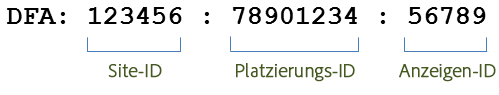
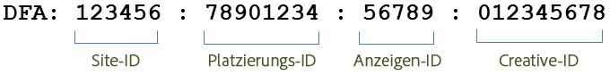

# Integrationsfunktionen {#integration-features}

Bei Aktivierung stellt die Data Connectors-DFA-Integration folgende Metriken für Ihre Adobe Analytics-Berichte zur Verfügung:

* Ansichten
* DFA-Klicks
* Impressionen
* (Optional) DFA-Kostendaten
* (Optional) DFA-Abfragen-Fehler, Timeouts

>[!NOTE] In dieser Integration werden Klicktracker (zuvor Klickbefehle) nicht unterstützt. Klicktracker werden verwendet, um die Anzahl der Klicks auf Textlinks, Links in E-Mail-Nachrichten oder andere Elemente, die auf einer Website hartcodiert sind, aufzuzeichnen.

Die Data Connectors-DFA-Integration erstellt automatisch DFA-Trackingcodes aus den von DFA zurückgegebenen Daten. Diese Rückverfolgungscodes werden so konstruiert, dass eine Anzeige mit ihrer zugehörigen Platzierung und Kreativelestellung eindeutig identifiziert werden kann. Im Folgenden wird die Struktur des Rückverfolgungscodes je nach Version der Integration beschrieben. Version 1.5 sieht wie folgt aus:

Version 2.0 sieht wie folgt aus:

Diese IDs dienen als gemeinsamer Schlüssel zwischen Genesis und DFA, um die richtigen Classifications und Metriken zuzuordnen.

| Site-ID | Die Drittanbieter-Site, auf der die Anzeige gehostet wurde. Die Site-Name-Klassifizierung enthält einen beschreibenden Namen für diese Site-ID. |
|---|---|
| Anzeigen-ID | Eine ID für die kommerzielle Nachricht, die an einen Benutzer gesendet wird. Die Klassifizierung Anzeigenname enthält den Namen der Anzeige, wie er von Ihrem Unternehmen im DFA-System definiert wurde. Beispiel: `Hybrid Coup Textlink - Build`. |
| Platzierungs-ID | Eine Darstellung in Ihrem DFA-Konto einer Website, eines Teils einer Website oder einer Gruppe von Websites, auf denen Sie Anzeigenflächen erworben haben. |
| Creative-ID | Das Bild, die Flash-SWF-Datei oder andere Ressource, die dem Besucher gezeigt werden soll. Die Klassifizierung &quot;Creative Name&quot;enthält den Namen, den Sie diesem Kreativelement in der DFA-Oberfläche angegeben haben. |

Die anderen beiden Klassifizierungen, Versand Tool (DoubleClick for Advertisers) und Kanal (Banneranzeige), haben dieselben Werte für jede DFA-Kampagne und helfen bei der Unterscheidung importierter DFA-Daten.

## SearchCenter-Deduplizierung  {#section-f809b3bb5e5142aa8ff89bcd5f0d0e49}

Die DFA-Integration unterstützt nun Adobe SearchCenter. Wenn Sie die SearchCenter-Deduplizierung über den Data Connectors-Assistenten aktivieren, sorgen Besucher-Suchvorgänge nicht dafür, dass Daten vom DFA Floodlight-Server abgerufen werden. Zudem wird *`s.campaign`* nicht von DFA ausgefüllt, sodass SearchCenter diese ausfüllen kann. Darüber hinaus füllen DFA und SearchCenter jetzt Deduplizierungswerte in die Variablen der einzelnen Produkte ein.

In der folgenden Liste wird die Logik beschrieben, die bei Aktivierung der SearchCenter-Deduplizierung aktiviert wird:

Wenn **[!UICONTROL DFA]** > **[!UICONTROL SearchCenter deduplication]** im Assistenten ausgewählt ist:

* Beim DFA-Clickthrough wird der die Zeichenfolge „DFA-Clickthrough“ von der Integration in die eingestellte SCM-eVar eingespeist.
* Im Falle einer DFA-Durchsicht wird die Zeichenfolge „DFA-Durchsicht“ von der Integration in die eingestellte SCM-eVar eingespeist.

Wenn **[!UICONTROL SearchCenter]** > **[!UICONTROL DFA deduplication]** im Assistenten ausgewählt ist:

* Im Falle einer DFA-Durchsicht wird die Zeichenfolge „DFA-Durchsicht“ von der Integration in die eingestellte SCM-eVar eingespeist.

>[!NOTE] Bei aktivierter SearchCenter > DFA-Deduplizierung und eingestelltem SearchCenter-Abfragezeichenfolgenparameter wird der Besuch bei der DFA-Verarbeitung nicht beachtet. Der SearchCenter-Abfragestringparameter sollte sich also vom DFA-Clickthrough-Parameter unterscheiden und keine Display-Anzeigen sollten den SearchCenter-Abfragestringparameter bestimmen.

