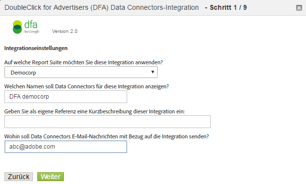

# DFA-Integration {#dfa-integration}

Bei der Konfiguration der DFA-Integration sind folgende Aufgaben enthalten:

## Konfigurieren der DFA-Integration {#configure-the-dfa-integration}

Gehen Sie die DFA-Data Connectors-Integration schrittweise durch.

Auf den Konfigurationsseiten erhalten Sie einen Überblick über die Integration sowie praktische Links für weitere Informationen. Für diese Integration fallen sowohl Adobe- als auch DoubleClick-Gebühren an. Wenden Sie sich an die jeweiligen Verkaufsmitarbeiter der beiden Unternehmen und versichern Sie sich, dass Sie die Zusammensetzung der Gebühren verstehen.

1. Melden Sie sich bei [!DNL Adobe Analytics] an.
1. Klicken Sie auf **[!UICONTROL Admin]** > **[!UICONTROL All admin]** > **[!UICONTROL Data Connectors]**.

   

1. Suchen Sie nach **[!UICONTROL DoubleClick DFA]** und klicken Sie auf **[!UICONTROL Neu hinzufügen]**.

   

   Geben Sie auf den Seiten des Integrationsassistenten die jeweiligen Informationen an und klicken Sie auf **[!UICONTROL Weiter]**. In der folgenden Tabelle werden die Informationen näher erläutert, die für den Abschluss der Integration mithilfe des Assistenten erforderlich sind.

<table id="table_8F6F7F304C36431DA5FD6E5D54F60FC0"> 
 <thead> 
  <tr> 
   <th colname="col1" class="entry"> Assistentenseite Nr. </th> 
   <th colname="col2" class="entry"> Feld </th> 
   <th colname="col3" class="entry"> Beschreibung </th> 
  </tr> 
 </thead>
 <tbody> 
  <tr> 
   <td colname="col1"> 1 </td> 
   <td colname="col2"> Integrationsname </td> 
   <td colname="col3"> Der Integrationsname, der von Genesis in der aktiven Integrationsliste der Report Suite angezeigt wird. </td> 
  </tr> 
  <tr> 
   <td colname="col1"> 1 </td> 
   <td colname="col2"> Integrations-E-Mail-Adresse </td> 
   <td colname="col3"> Die E-Mail-Adresse, an die sämtliche Benachrichtigungen zu dieser Integration gesendet werden. </td> 
  </tr> 
  <tr> 
   <td colname="col1"> 2 </td> 
   <td colname="col2"> Benutzername </td> 
   <td colname="col3"> Der für diese Integration zu verwendende DFA-API-Benutzername. Überprüfen Sie das API-Attribut in der DFA-Oberfläche, um Benutzern die API-Anmeldung zu ermöglichen. Nach der Aktivierung der API-Anmeldung wird ein Feld angezeigt, in dem ein Passwort für den Benutzer angegeben werden muss. Dieses Passwort muss zur Authentifizierung gemeinsam mit dem Benutzernamen beim Assistenten eingegeben werden. </td> 
  </tr> 
  <tr> 
   <td colname="col1"> 2 </td> 
   <td colname="col2"> Passwort </td> 
   <td colname="col3"> Das DFA-API-Passwort. </td> 
  </tr> 
  <tr> 
   <td colname="col1"> 2 </td> 
   <td colname="col2"> Advertiser-ID </td> 
   <td colname="col3"> <p>Die DFA-Advertiser- bzw. übergeordnete Floodlight-Konfigurations-ID Data Connectors verwendet diese ID, um den zu trackenden DFA-Advertiser zu identifizieren (Version 1.5 der Integration). Diese Advertiser-ID wird in Version 2.0 der Integration nicht verwendet. Stattdessen wird die übergeordnete Floodlight-Konfigurations-ID abgerufen und verwendet. Anweisungen werden auf dem Bildschirm angezeigt. </p> </td> 
  </tr> 
  <tr> 
   <td colname="col1"> 3 </td> 
   <td colname="col2"> DFA-Anzeigenvariable </td> 
   <td colname="col3"> Die Analytics-eVar, die Daten zum DFA-Kampagnenattribut, Impressionen und Klicks empfängt Dabei handelt es sich im Normalfall um die Trackingcode-eVar (  <span class="varname"> s.campaign </span>), Sie können aber jede verfügbare eVar auswählen. Data Connectors fügt außerdem die folgenden DFA-bezogenen Classifications zur ausgewählten eVar hinzu: <p><b>Kampagnen</b>: Eine Sammlung an Anzeigen mit gemeinsamer Botschaft, die auf mehreren Sites bereitgestellt werden </p> <p><b>Sitename</b>: Die Site, auf der die Anzeige bereitgestellt wurde </p> <p><b>Anzeigenname</b>: Der in Ihrem DFA-Konto festgelegte Anzeigenname </p> <p><b>Siteplatzierungsname</b>: Die Website und Seite, auf der die Anzeige bereitgestellt wurde </p> <p><b>Bereitstellungswerkzeug</b>: DoubleClick for Advertisers </p> <p><b>Kanal</b>: Banneranzeige </p> <p><b>Kostenzusammensetzung</b>: CPM, CPC oder fest, je nach Kostenzusammensetzung der Anzeige </p> <p><b>Creative-Name</b>: Der Name der kreativen Inhalte im Zusammenhang mit einer Anzeige/Platzierung/Creative-ID </p> <p><b>DFA &gt; SearchCenter-Deduplizierung</b>: Legt fest, dass DFA Werte in SearchCenter-Variablen eingibt, wenn DFA-Clickthrough- oder Durchsichtsaktionen ausgeführt werden </a> . </p> </td> 
  </tr> 
  <tr> 
   <td colname="col1"> 4 </td> 
   <td colname="col2"> Impressionen </td> 
   <td colname="col3"> Das benutzerspezifische Ereignis, an das DFA-Impressionsmetrikdaten gesendet werden. Impressionen stellen die Anzahl an Bereitstellungen der Anzeige dar. </td> 
  </tr> 
  <tr> 
   <td colname="col1"> 4 </td> 
   <td colname="col2"> Klicks </td> 
   <td colname="col3"> Wählen Sie das benutzerspezifische Ereignis, an das DFA-Klickmetrikdaten gesendet werden. Klicks stellen die Anzahl der wie durch die Weiterleitung von DFA gemessenen Klicks auf die Anzeige durch Besucher dar. Die Klickmetrik steht in Zusammenhang mit der Analytics-Clickthrough-Metrik. <p>Hinweis: DFA-Klicks und Analytics-Clickthroughs stimmen aufgrund von Unterschieden in der Erfassungsart der Daten unter Umständen nicht genau überein.  </a> </p> </td> 
  </tr> 
  <tr> 
   <td colname="col1"> 5 </td> 
   <td colname="col2"> Durchsichtsvariable </td> 
   <td colname="col3"> <p>Die Analytics-eVar, an die DFA-Durchsichtsdaten gesendet werden Mithilfe der Durchsichtsvariable können Sie erfahren, auf welche Weise Durchsichten die Konversionsraten auf Ihrer Site beeinflussen. </p> <p>Data Connectors fügt dieselben DFA-bezogenen Classifications zu dieser eVar hinzu wie zur DFA-Anzeigenvariable (weitere Informationen finden Sie oben). </p> </td> 
  </tr> 
  <tr> 
   <td colname="col1"> 5 </td> 
   <td colname="col2"> Zeit seit letzter Ansicht (Durchsichtszeit-Behältervariable) </td> 
   <td colname="col3"> Die Analytics-eVar, an die die Daten bezüglich der DFA-Zeit seit der letzten Ansicht gesendet werden Die Zeit seit der letzten Ansicht gibt an, wie viel Zeit seit der letzten Anzeigendurchsicht verstrichen ist. </td> 
  </tr> 
  <tr> 
   <td colname="col1"> 5 </td> 
   <td colname="col2"> Durchsichten </td> 
   <td colname="col3"> Das benutzerspezifische Ereignis, an das DFA-Durchsichtsmetrikdaten gesendet werden Verwenden Sie das Durchsichtsereignis mit der Durchsichtsvariablen, um herauszufinden, welche Kampagnen keinen direkten Clickthrough veranlassen, aber unter Umständen eine Rolle bei der Erhöhung des Traffics auf der Site zu einem späteren Zeitpunkt gespielt haben. <p>Das ausgewählte benutzerspezifische Ereignis wird durch Data Connectors in „Durchklick-Ansichten“ umbenannt. </p> </td> 
  </tr> 
  <tr> 
   <td colname="col1"> 6 </td> 
   <td colname="col2"> Fehlgeschlagene DFA-Abfrage </td> 
   <td colname="col3"> (Optional) Die Analytics-eVar, an die alle gemeldeten Benachrichtigungscodes zu fehlgeschlagenen DFA-Abfragen gesendet werden Mögliche DFA-Benachrichtigungscodes sind unter anderem: 
    <ul id="ul_85FC7FB19F7F4ADF83ABCA6DDB44CE19"> 
     <li id="li_0A3181DED5A149588A0D3F1584E2FE8B"><b>nc</b>: Kein DoubleClick-Cookie (No Cookie) </li> 
     <li id="li_D397AA73AD5E4086A18B87F271E4EC14"><b>oo</b>: Benutzer ist abgemeldet (Opted Out) </li> 
     <li id="li_5AC1D0C8049340B4AD857D88E275CBD6"><b>nh</b>: Kein Kampagnenverlauf (No History) </li> 
     <li id="li_73A8C5E905C54E2BB531A1FCDBC6AA1A"><b>qe</b>: Abfragefehler (Zeitüberschreitung, Serverausfall usw. – Query Error) </li> 
    </ul> </td> 
  </tr> 
  <tr> 
   <td colname="col1"> 6 </td> 
   <td colname="col2"> Timeout-Ereignis </td> 
   <td colname="col3"> <p>Das Analytics-Zählerereignis, dessen Wert bei jedem Ablauf von  <span class="varname"> s.maxDelay </span> steigt, wenn keine Reaktion von den DFA-Servern einging. Verwenden Sie dieses Ereignis zum Konfigurieren der <span class="varname"> s.maxDelay </span>-Variablen zum Abstimmen von s.maxDelay</a>. </p> </td> 
  </tr> 
 </tbody> 
</table>

## Websiteaktualisierungen für die DFA-Integration {#web-site-updates-for-the-dfa-integration}

Sobald Ihre Analytics-Report Suite für die DFA-Integration von Genesis konfiguriert wurde, müssen Sie Ihre Website und DFA-Umgebung anhand folgender Schritte konfigurieren, damit die Integration unterstützt wird:

### Verifizierung der Cookiekapazität auf der Domäne {#verify-cookie-space-on-the-domain}

Sie müssen für die Data Connectors-Integration für DFA ein Cookie auf der Seitendomäne einstellen.

Bei einigen Domänen kann die maximale Cookiekapazität für einige Webbrowser bereits erreicht sein. Dies ist aber eher selten der Fall. Um das Browsen der Besucher auf Ihrer Website nicht zu beeinträchtigen, versichern Sie sich bei Ihrem Netzwerkbetreiber, Ihrem Entwicklungsteam oder Ihrer Technikgruppe, dass das Hinzufügen eines weiteren Cookies zur Domäne der für die DFA-Integration verwendeten Seiten keinen Einfluss darauf hat. Sie müssen außerdem einen Namen für das Cookie festlegen.

### Aktualisierung Ihres DFA-Abfragestringparameters {#update-your-dfa-query-string-parameter}

Wenn Sie vor der DFA-Integration Werbekampagnen mit Adobe Analytics getrackt haben, kann es sein, dass für alle Kampagnen (E-Mail, Suche, Banner) derselbe Abfragestringparameter zur Identifizierung der jeweiligen Kampagnen-ID auf der Landingpage verwendet wird.

Zur Erkennung des richtigen Zeitpunkts für Durchsichts- und Clickthrough-Datenabfragen von DFA-Daten für Ihre DFA-Werbekampagnen muss Data Connectors identifizieren können, wann Besucher auf eine DFA-Kampagnenbanneranzeige geklickt haben. Dazu müssen Sie einen differenzierten Abfragezeichenfolgenparameter zur Landingpage-URL der DFA-Anzeigenkampagne hinzufügen, sodass Data Connectors zwischen DFA-Anzeigenkampagnenseiten und anderen Anzeigenkampagnenseiten unterscheiden kann, die sich gegebenenfalls auf Ihrer Website befinden. Der `dfa_overrideParam` im JavaScript-Plug-in, das für DFA verwendet wird.

>[!CAUTION]
>
>Die Kampagnenvariable kann zwar für andere Kampagnen verwendet werden, sollte jedoch nicht für DFA-Kampagnen verwendet werden. Wenn Sie eine DFA-Kampagnenlandingpage für die Kampagnenvariable festlegen, können Impressionen und Klicks nicht von Adobe zu DFA-Kampagnen-Clickthroughs zugeordnet werden. Pro Besuch überprüfen die Adobe-Erfassungsserver die DFA-Server auf vorhandene Clickthrough- oder Durchsichtsaktionen. Fügen Sie daher den DFA-Plug-in-Code nur auf allgemeinen Landingpages ein, um unnötige Umleitungen zu vermeiden, die insbesondere für Benutzer mit langsameren Internetverbindungen die Ladezeiten der Seiten verlangsamen können.

## Aktualisierung des Datenerfassungscodes Ihrer Website {#update-your-web-site-s-data-collection-code}

Für die Genesis-Integration für DFA wird die DFA Floodlight-Konfigurations-ID (dfa_SPOTID) verwendet, wodurch die Berichtskonsistenz zwischen DFA und dem Adobe-Datenerfassungssystem verbessert wird.

>[!NOTE]
>
>Die Bezeichnung „Spotlight“ wurde in einer neuen Version von Google DFA in „Floodlight“ geändert. Die Benennung des JavaScript-Parameters `dfa_SPOTID` basiert auf der Spotlight-Terminologie, wird aber für beide Versionen verwendet.

Aktualisieren Sie durch Hinzufügen folgender Elemente Ihren JavaScript-Datenerfassungscode, um die DFA-Integration auf Ihrer Website zu aktivieren:

* Integrate-Modul für DFA
* Zusatz zu Ihrem Erfassungscode

### Integrate-Modul für DFA {#section-fa00e42a732a4e27a4ab3dfcfeae1a5b}

Für die DFA-Integration wird das Adobe Experience Cloud Integrate-Modul verwendet, wodurch zusätzliche Funktionen zu Ihrem JavaScript-Datenerfassungscode (`s_code.js`) hinzugefügt werden. Das Integrate-Modul ist Bestandteil der ZIP-Datei, wenn Sie den AppMeasurement für JavaScript-Code aus dem Code-Manager herunterladen. Wenden Sie sich an Ihren Adobe-Berater, wenn Sie weitere Hilfe benötigen, um ihn zu finden.

Fügen Sie den Integrate-Modulcode in den Abschnitt `Modules` der Datei `s_code.js` Ihrer Website ein.

### Zusatz zu Ihrem Erfassungscode {#section-8f98c727f1ba414fb8b4f02d696b8791}

Basierend auf Ihren Einstellungen bei der Aktivierung der DFA-Integration im Integrationsassistenten wird von Data Connectors ein benutzerdefinierter Zusatz zu Ihrem JavaScript-Datenerfassungscode erstellt, den Sie per E-Mail erhalten. Geben Sie diesen Code in den Hauptabschnitt der Datei `s_code.js` (nicht in die Funktion `doPlugins` oder andere Funktionen) ein.

Der unten gezeigte Code dient nur zu Anschauungszwecken. Verwenden Sie den Code, den Sie nach Abschluss des Data Connectors-Integrationsassistenten per E-Mail erhalten haben.

Der Erfassungscode besteht aus folgenden Elementen:

* DFA Integrate-Einstellungen
* Für die Integration erforderliche Plug-ins

**DFA Integrate-Einstellungen**

```
/************************** DFA VARIABLES **************************/ 
var dfaConfig = { 
   CSID:              "1234567", 
   SPOTID:            "29876543", 
   tEvar:             "eVar17", 
   errorEvar:         "eVar59", 
   timeoutEvent:      "event76", 
   requestURL:         "http://fls.doubleclick.net/ 
json?spot=[SPOTID]&src=[CSID]&var=[VAR]&host=integrate.112.2o7.net%2 
Fdfa_echo%3Fvar%3D[VAR]%26AQE%3D1%26A2S%3D1&ord=[RAND]", 
 
   maxDelay:          "1500", 
   visitCookie:       "s_dfa", 
   clickThroughParam: "CID", 
   searchCenterParam: "s_kwcid", 
   newRsidsProp:      undefined 
}; 
/************************ END DFA Variables ************************/ 
```

Im DFA Integrate-Einstellungsblock werden die Variablen festgelegt, die für die DFA-Integration erforderlich sind. Die Werte für diese Variablen stammen aus folgenden Quellen:

**CSID**: Client-Site-ID. Wird nach dem Abschluss des Integrationsassistenten von DFA erstellt Diese Variable wird von Data Connectors mit Ihrer DFA-CSID ausgefüllt. Sie erhalten diesen Wert außerdem in der Einrichtungs-E-Mail nach Abschluss des Integrationsassistenten. Diese Variable ist nicht erforderlich, wenn in Ihrem Konto das erweiterte AdServing aktiviert ist.

**SPOTID**: Floodlight-Konfiguration (früher Spotlight-ID) Diese Variable wird auf Basis der von Ihnen im Integrationsassistenten angegebenen DFA-Kontoinformationen von Data Connectors mit Ihrer DFA Floodlight-Konfigurations-ID ausgefüllt.

**tEvar**: Übertragungsvariable Diese Variable wird von Data Connectors mit dem Analytics-Variablennamen ausgefüllt, den Sie im Integrationsassistenten für die Durchsichtsvariable festgelegt haben. Ändern Sie diesen Wert nicht, ohne dies vorher sorgfältig mit Adobe Engineering oder Engineering Services abzuklären.

**errorEvar**: Fehlervariable Diese Variable wird von Data Connectors mit dem Analytics-Variablennamen ausgefüllt, den Sie im Integrationsassistenten für die DFA-Abfragefehlervariable festgelegt haben.

**timeoutEvent**: Timeoutereignis Diese Variable wird von Data Connectors mit dem Analytics-Variablennamen ausgefüllt, den Sie im Integrationsassistenten für die Timeoutereignisvariable festgelegt haben.

**requestURL**: DFA-Remotehost zur Abfrage von Anzeigeninformationen Ändern Sie diesen Wert nur, wenn Sie eine entsprechende Anweisung von Adobe erhalten.

**maxDelay**: Anzahl der Millisekunden, die der JavaScript-Datenerfassungscode auf eine Reaktion vom DFA Floodlight-Server wartet. Adobe empfiehlt, mit diesem Wert etwas zu experimentieren, um die für den Traffic auf Ihrer Site optimale Einstellung zu ermitteln. Generell werden durch das Erhöhen dieses Werts zum Beispiel mehr DFA-Daten erfasst, aber dabei steigt das Risiko, grundlegende Besucherdaten zu verlieren, wenn Besucher die Site während der Verzögerungsphase verlassen. Wenn Sie diesen Wert reduzieren, sinkt das Risiko, Trefferdaten zu verlieren, dadurch kann sich allerdings auch die Anzahl der DFA-Daten verringern, die mit den Adobe-Trefferdaten gesendet werden.

**visitCookie**: Name des Cookies, mit dem DFA-Aufrufe auf einen pro Besuch beschränkt werden.

**clickThroughParam**: Abfragestring, der normalerweise in allen Anzeigen enthalten ist und dem Integrate-Modul vermittelt, wenn ein Klick stattgefunden hat. Dieser Parameter im Abfragestring führt dazu, dass die Abfrage vom DFA Floodlight-Server stattfindet, auch wenn die Abfrage des Besuchers in den letzten 30 Minuten bereits stattgefunden hat.

**newRsidsProp**: (Optional) Einer nicht verwendeten Datenverkehrseigenschaftsvariablen zugeordnet Dieser Wert wird von der DFA-Integration im Besuchercookie erfasst und gespeichert, um so die Report Suites zu identifizieren, die Daten zu einem speziellen Besucher erfasst haben. Diese Eigenschaft ist nur für benutzerdefinierte Implementationen für Adobe Engineering Services erforderlich.

**Für die Integration erforderliche Plug-ins**

Der Erfassungscodezusatz enthält zusätzliche Plug-ins, die die Funktion der DFA-Integration verbessern:

* DFA-Abfragen werden auf eine pro Besuch beschränkt.
* Flexibilität bei Cookienamen ist gewährleistet. Die meisten Organisationen verwenden s_dfa, Sie können für die DFA-Integration aber jeden beliebigen zulässigen Cookienamen verwenden.
* Unnötige Weiterleitungen werden vermieden. Adobe-Erfassungsserver und DFA können praktisch bei jeder Seitenansicht Daten austauschen, da die Durchsichtsdaten in Echtzeit erfasst werden. Dieser Datenaustausch wird vom Plug-in verhindert, wenn die Informationen nicht notwendig sind.

>[!CAUTION]
>
>Bei einem der Mechanismen, die vom Plug-in verwendet werden, um unnötige DFA-Abfragen zu verhindern, handelt es sich um ein domänenbasiertes Besuchscookie. Eine Integrations-Report Suite, die mehrere Domänen umfasst, erhöht die Clickthrough- und Durchsichtsdaten, wenn Besucher nach einer DFA-basierten Durchsichts- oder Clickthrough-Aktion die Domäne wechseln.

## Bestätigung einer erfolgreichen DFA-Integration befolgen {#confirming-a-successful-dfa-integration}

Nachdem Sie alle notwendigen Websiteaktualisierungen vorgenommen haben, können Sie einen Viewer für den Datenverkehr im Netzwerk wie Charles*, Chrome Developer Tools oder Firebug* verwenden, um zu überprüfen, ob DFA mit den Adobe-Erfassungsservern kommuniziert.

Verwenden Sie den Viewer für den Datenverkehr im Netzwerk, nachdem Sie die DFA-aktivierte `s_code.js`-Datei bereitgestellt haben, um die Anfragen zwischen DFA und den Adobe-Datenerfassungsservern anzuzeigen und nach Folgendem zu suchen:

* Anfrage an den DFA-Service `fls.doubleclick.net/json`. Die Reaktion dieses Service kann je nach verwendeter DFA-Version unterschiedlich ausfallen. Mit DFA-Integrationsversion 1.5:

   * HTTP-302-Weiterleitung auf [!DNL ad.doubleclick.net]. Dadurch wird mit der Reaktion ein „Ort:“-Tag gesendet, in dem Informationen zum Anzeigenbesucher enthalten sind.
   * Durch dieses Tag erfolgt eine Weiterleitung auf [!DNL integrate.112.2o7.net/dfa_echo]. Mit diesem Service werden die Informationen über Anzeigenbesucher in einen verschlüsselten JSON-String (JavaScript Object Notation) übertragen. Diese Daten werden mit einer HTTP-200-Reaktion „OK“ zurückgegeben.

* DFA-Integrationsversion 2.0 (erweitertes AdServing aktiviert):

   * [!DNL fls.doubleclick.net] gibt direkt 200 „OK“ zurück.

In jedem Fall erzeugt eine erfolgreich durchgeführte Anfrage eine Abfrage der Adobe-Datenerfassungsserver, die den Parameter vX enthält. X ist dabei die Durchsichts-eVar-Nummer. Dieser Parameterwert liegt in diesem Format vor: DFA-XXXX-XXXX- XXXX-XXXX-XXXX-XXXX-XXXX-XXXX-XXXX. Dieser String enthält Informationen zum letzten Klick und zur letzten Impression für den aktuellen Besucher.

## Abstimmung von s.maxDelay {#tuning-s-maxdelay}

Zu einer erfolgreichen DFA-Implementierung gehört auch ein optimierter Wert für s.maxDelay auf Ihrer entsprechenden Site.

Im Allgemeinen beinhaltet die Entscheidung, *`s.maxDelay`* zu erhöhen oder zu senken, einen Kompromiss zwischen dem Abrufen von mehr DFA-Besucherdaten und der Gefährdung der Sammlung von Adobe-Besucherdaten. Durch die Erhöhung von *`s.maxDelay`* werden mehr DFA-Besucherdaten abgerufen. Bei einem zu hoch eingestellten Wert kann die Erfassung von Adobe-Besucherdaten jedoch beeinträchtigt werden. Senken Sie s.maxDelay, ist die Erfassung von Adobe-Besucherdaten gewährleistet, aber es können DFA-Besucherdaten verloren gehen.

*`s.maxDelay`* beinhaltet mehr als nur die Zeit für die Netzwerkkommunikation zur Kontaktaufnahme mit DFA. Dieser Wert stellt auch Browserverzögerungen dar, die das JavaScript auslösen und evaluieren, auf dem diese Kommunikation basiert. Dies liegt daran, dass das Integrate-Modul den *`s.maxDelay`*-Timer startet, nachdem es das HTML-Element in das DOM eingefügt hat, das die Daten vom DFA Floodlight-Server abruft. Die Zeit, die der Browser zur tatsächlichen Initiierung der auf diesem neuen HTML-Element basierenden HTTP-Abfrage benötigt, ist abhängig von anderen Bildern oder JavaScript-Dateien, die gleichzeitig geladen werden, der Geschwindigkeit des Besuchercomputers sowie spezifischen Browserimplementationen. Bei Abfrage der JSON-Daten vom DFA Floodlight-Server muss außerdem JavaScript vom Browser evaluiert werden. Dieser Vorgang wird wiederum vollständig vom Browser gesteuert und kann verzögert werden, wenn gleichzeitig eine große Menge an JavaScript-Code ausgeführt wird oder viele asynchrone JavaScript-Abfragen vorliegen.

Beachten Sie diese Informationen und legen Sie den Wert für  *`s.maxDelay`* also auf Grundlage der Komplexität der Landingpage und der Netzwerkverzögerungen bei DFA fest. Auf einigen Seiten können Sie die Komplexität unter anderem dadurch reduzieren, dass der Adobe-Erfassungscode schon früh im Ladeprozess der Seite ausgelöst wird. So muss der Browser weniger Daten verarbeiten, wenn der Floodlight-Server kontaktiert wird.

Die Timeoutvariable ist bei der Abstimmung von  *`s.maxDelay`* dringend erforderlich, da sie bei jedem Ablauf von s.maxDelay erhöht wird. Es wird empfohlen, sich an diesen Prozess zu halten, wenn Sie auswählen, ob *`s.maxDelay`* erhöht oder reduziert werden soll:

1. Erfassen Sie Daten aus mehreren Tagen, wobei Sie *`s.maxDelay`* auf einen bestimmten Wert festlegen.
1. Führen Sie einen [!DNL Daily Unique Visitors Report] für den Zeitraum aus.
1. Führen Sie einen [!DNL Timeout Event Report] aus, um zu überprüfen, wie viele Timeouts auftreten. Bedenken Sie, dass Timeouts nur einmal pro Besucher gezählt werden.

Verwenden Sie anhand dieser Informationen nun

```
Timeout Percentage = [Step 3] / [Step 2] * 100
```

Unter „Timeout Percentage“ (Timeoutprozentsatz) werden alle Besucher der Site berücksichtigt. Einige davon haben keinerlei Bezug zu DFA, daher ist der Timeoutwert irreführend. Sie können diese Berechnung verbessern, indem Sie eine weitere Analyse nur für Unique Visitors auf Seiten ausführen, für die `clickThroughParam` eingestellt ist (zum Beispiel `?CID=1`). Dadurch erhalten Sie genauere Ergebnisse.

Liegt der Timeoutprozentsatz sehr niedrig, sollten Sie  *`s.maxDelay`*. Liegt er sehr hoch, erhöhen Sie *`s.maxDelay`*. Wird *`s.maxDelay`* reduziert, sollten Sie den [!DNL Timeout Report] erneut durchführen, um zu gewährleisten, dass die Anzahl der Timeouts nicht stark gestiegen ist. Wenn Sie *`s.maxDelay`* erhöhen, sollten Sie einen [!DNL Page Views Report] ausführen, um sicherzustellen, dass Seitenansichten nicht aufgrund verlorener Daten fehlschlagen. Beobachten Sie bei jeder Änderung von *`s.maxDelay`* die Daten über mehrere Tage, um sicherzustellen, dass die Daten einen Trend und nicht nur eine tägliche Schwankung darstellen.

Die optimale Einstellung für *`s.maxDelay`* ist der Punkt, an dem der Timeout-Prozentsatz minimiert wird, während „Seitenansichten“ nicht zurückgeht.

Wenn Sie zu Version 2.0 der Integration wechseln, wird die Anzahl der Timeouts voraussichtlich abnehmen, da die 302-Weiterleitungen wegfallen. Erste Ergebnisse von Beta-Kunden zeigen einen gleichmäßigen Rückgang der Timeouts, wodurch mehr DFA-Daten erfasst werden können.
