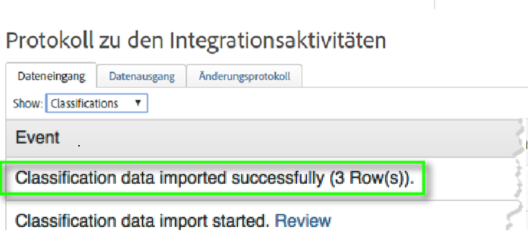
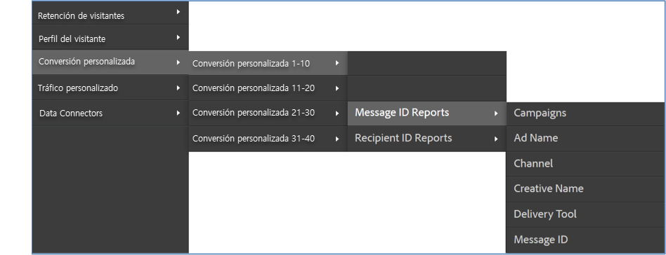

# Bereitstellen der Integration {#deploying-the-integration}

Die Bereitstellung dieser Integration ist ein einfacher Prozess, der aus der Fertigstellung des Adobe-Integrationsassistenten und der Verifizierung der Integration besteht.

## Abschließen des Adobe-Integrationsassistenten {#completing-the-adobe-integration-wizard}

Schritte zum Abschließen des Integrationsassistenten auf der Data Connectors-Oberfläche.

1. Navigieren Sie in der Adobe Experience Cloud zum Bereich „Data Connectors“ (früher Genesis).
1. Starten Sie den Dynamic Signal-Integrationsassistenten.
1. Wählen Sie die gewünschte Report Suite aus. Geben Sie dann einen Namen für die Integration ein.
1. Konfigurieren Sie die folgenden Elemente:

   | Element | Beschreibung |
   |---|---|
   | E-Mail  Adresse | Die E-Mail-Adresse des Hauptkontakts. |
   | Beschreibung | (Optional) Beschreibung für die Einrichtung dieser Integration. |
   | Community-ID | Diese ID können Sie von Ihrem Dynamic Signal-Kundenbetreuer erhalten. |

1. Konfigurieren Sie die folgenden **[!UICONTROL Variablenzuordnungselemente]**:

   | Element | Beschreibung |
   |---|---|
   | Trackingcode | Wählen Sie eine verfügbare eVar-Variable aus Ihrer Report Suite aus. |

1. Überprüfen Sie die Klassifizierungen, die für diese Integration erstellt werden.
1. Aktivieren Sie das Kontrollkästchen zum Erstellen des Dashboards für die Dynamic Signal-Integration (optional, jedoch dringend empfohlen).
1. Überprüfen Sie alle Konfigurationselemente. Klicken Sie dann auf **[!UICONTROL Jetzt aktivieren]**.
1. **Wichtig**: Nach Abschluss des Assistenten müssen Sie Ihren Dynamic Signal-Kundenbetreuer darüber informieren, damit er die Integration auf der VoiceStorm-Plattform aktivieren kann.

## Überprüfen der Integration {#verifying-the-integration}

Schritte zum Anzeigen der Einrichtung Ihrer Dynamic Signal VoiceStorm-Integration in der Adobe Experience Cloud

1. Zeigen Sie die Einrichtung Ihrer Dynamic Signal-Integration im Protokoll zu den Integrationsaktivitäten an.
   1. Navigieren Sie in Adobe Experience Cloud zu **[!UICONTROL Support]** > **[!UICONTROL Protokoll zu den Integrationsaktivitäten]**.

      

   1. Suchen Sie nach Einträgen wie **[!UICONTROL Classification-Daten wurden erfolgreich importiert]**. Diese Einträge sollten innerhalb von 24 Stunden nach erfolgreicher Bereitstellung angezeigt werden.
1. Überprüfen Sie Ihre Dynamic Signal-Berichte in Adobe Analytics mit dem Dashboard, das automatisch mit dem Adobe-Integrationsassistenten erstellt wurde (Schritt 7). Alternativ dazu können Sie in der Menüstruktur von Adobe Analytics zur Dynamic Signal-Berichterstellung navigieren (siehe die folgenden Screenshots).

   **Hinweis**: Diese Daten sollten innerhalb von 24–48 Stunden nach erfolgreicher Bereitstellung angezeigt werden.

   

   
