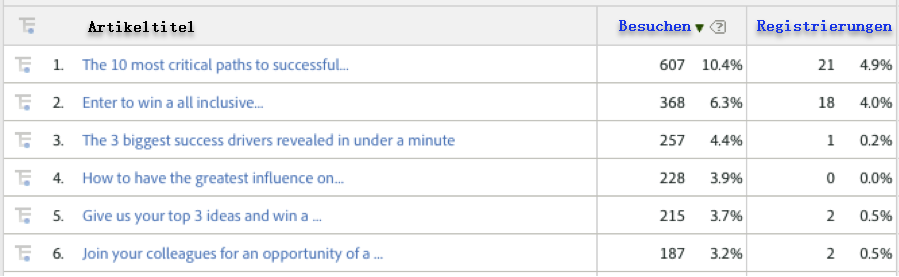
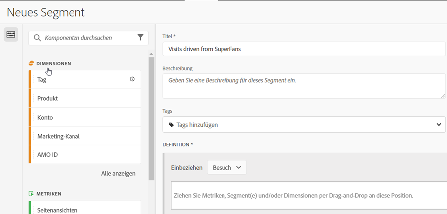
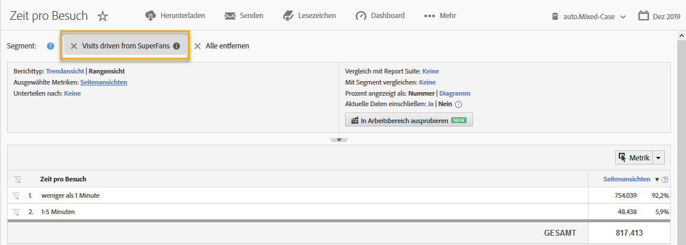

# Verwenden der Integration {#using-the-integration}

Nach der Bereitstellung können Sie die zusätzlichen Funktionen dieser Integration nutzen.

**Hinweis**: Es kann 24–48 Stunden dauern, bis einige der Dynamic Signal-Daten in Ihren Adobe Analytics-Berichten angezeigt werden.

Die folgenden Aktionen führen zu einem Mehrwert aus dieser Integration in Adobe Analytics.

## Anzeigen von Traffic- und Konversionsmetriken nach Dynamic Signal-Dimensionen {#viewing-traffic-and-conversion-metrics-by-dynamic-signal-dimensions}

Beispiel eines Berichts in Adobe Analytics.

Diese Integration bietet neue Dimensionen, die als Adobe Analytics-Berichte verfügbar werden. Der folgende Bericht ist ein Beispiel für die Analyse von Besuchen und einer Konversionsmetrik (Registrierungen), die nach „Artikeltitel“ aufgeschlüsselt wurden.

## Segmentieren nach Dynamic Signal-Dimensionen {#segmenting-by-dynamic-signal-dimensions}

Beispiele für Segmente, die auf Dynamic Signal-Dimensionen basieren.

Eine wichtige Funktion dieser Integration ist die Möglichkeit, Adobe Analytics-Segmente basierend auf den Dimensionen für integrierte Berichte zu erstellen. Sie können beispielsweise ein Segment erstellen, das nur Besuche aus einer bestimmten VoiceStorm-Community enthält. Sie könnten dies „Besuche von SuperFans“ nennen. Diese Segmentdefinition könnte wie folgt aussehen.

## Dimensionen für integrierte Berichte {#integrated-reporting-dimensions}

Listet die Dynamic Signal-Berichtsdimensionen auf, die in dieser Integration enthalten sind.

| Dimension | Beschreibung |
|---|---|
| Kanaltyp | Das soziale Netzwerk (oder die Blogging-Plattform), in dem der Benutzer einen Community-Post freigegeben hat. Benutzer können einen Post in mehreren Kanälen freigeben. Klicks und andere Aktivitäten werden pro Kanal segmentiert. In diesem Feld werden Facebook, Twitter usw. angezeigt. So können Sie sehen, welcher Kanaltyp die Aktivität vorantreibt. |
| Artikel-ID | Die Artikel-ID identifiziert Inhalte in der Dynamic Signal-Community auf eindeutige Weise. |
| Quellentyp | Dieses Feld gibt an, ob der Post von einem „Mitglied“ oder von der „Marke“ erstellt wurde. Beachten Sie, dass in beiden Fällen Inhalte manuell in der Anwendung erstellt oder aus einem externen Feed importiert werden können. |
| Benutzername | Der Benutzer, der einen Post in seinen sozialen Netzwerken freigegeben hat und Clickthroughs zu Ihrer Site generiert hat. |
| Quell-ID | Die Quell-ID identifiziert eindeutig den Ersteller (oder Autor) des freigegebenen Posts. Meistens handelt es sich dabei um ein bestimmtes Mitglied oder einen externen Feed. |
| Benutzer-ID | Die Benutzer-ID identifiziert eindeutig einen Benutzer (d. h. ein Mitglied) in der Dynamic Signal-Community. In diesem Fall ist der Benutzer der freigebende Benutzer, der den Post in seinen sozialen Netzwerken freigegeben hat. |
| Name der Quelle | Die Quelle ist der Ersteller (oder Autor) des freigegebenen Posts. In den meisten Fällen ist dies ein Mitglied der Community oder ein externer Feed. |
| Artikeltitel | Der Titel des freigegebenen Posts, der Klicks zu Ihrer Site generiert hat. |
| Community-Name | Der Name Ihrer Dynamic Signal-Community. |

