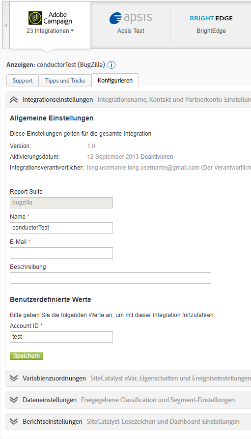

# Übersicht über Data Connectors

Adobe bietet Organisationen umsetzbare Echtzeit-Informationen zu ihren digitalen Strategien und Marketinginitiativen. Mit Data Connectors können Sie Verfolgungsdaten aus Drittanbieter-Anwendungen in Analysen importieren, um Daten über eine zentrale Stelle zu erfassen und zu nutzen. Wenn Sie eines der Partnerprodukte verwenden, können Sie eine Integration erstellen, die die Anwendungsdaten in Marketing-Berichte importiert. Nach der Integration können Sie Berichte erzeugen, die die Daten aus Ihrer Anwendung mit einbeziehen.

Für eine E-Mail-Integration möchten Sie z. B. vielleicht einen E-Mail-Partner nutzen, der für die Verteilung einer E-Mail-Kampagne sorgt. Wenn Besucher Ihre Website besuchen, möchten Sie wissen, wer aufgrund der E-Mail-Kampagne auf der Seite gelandet ist. Data Connectors integrieren Daten von Ihrem E-Mail-Partner in Marketing-Berichte, damit Sie diese Informationen zur Messung der Effektivität Ihrer E-Mail-Kampagne nutzen können.

>[!IMPORTANT]
>
>Die Adobe Data Connector Technologie wird Mitte bis Ende 2021 auslaufen. [Weitere Informationen ...](/help/import/data-connectors/data-connectors-eol.md)

**Systemanforderungen**

Die Integration von Data Connectors sollte mit den herkömmlichen Browsern problemlos möglich sein. Die Berichtdarstellung und -funktion arbeitet jedoch am besten auf Systemen, die die folgenden Empfehlungen erfüllen:

* Browser: Microsoft Internet Explorer Version 6 oder höher
* Cookies: Erforderlich
* JavaScript: Aktiviert
* Betriebssystem: Windows-basiert
* Macromedia Flash Player: Version 6 oder neuer
* Bildschirmauflösung: 1.024x768 (800x600 funktioniert auch)
* Farbtiefe: 16-Bit oder höher

Zusätzlich wird die Datenerfassung verbessert, wenn für die Webbrowser der Benutzer JavaScript aktiviert wurde.

**Voraussetzungen**

Bevor Sie eine Data Connectors-Integration für Ihr Produkt konfigurieren, führen Sie die folgenden Schritte aus:

* Besorgen Sie sich die notwendigen Zugangsdaten für das Partnerprodukt-Konto sowie die entsprechenden Zugriffsberechtigungen für alle Daten, die Sie in Marketing-Berichte integrieren möchten. Möglicherweise empfiehlt es sich, ein eigenes E-Mail-Konto für Berichtverteiler und für Benachrichtigungen zu den integrierten Operationen anzulegen.
* Identifizieren Sie die benutzerspezifischen Variablen, die Ihre Kampagneninformationen enthalten. Diese werden in der Regel als Kampagnen-Trackingcode bezeichnet, möglicherweise wird in Ihrer Organisation aber auch eine andere Terminologie verwendet.
* Bestimmen Sie die Ereignisse, für die Sie Impressionen und Klickdaten erhalten möchten. Möglicherweise empfiehlt es sich, die Ereignisse entsprechend umzubenennen.
* Platzieren Sie den entsprechenden Code auf Ihrer Landingpage, sodass Analytics eine entsprechende Modellierung mit den Daten durchführen kann, die vom Partnerprodukt übermittelt werden. Spezifische Anweisungen für die jeweiligen Partnerprodukte finden Sie im Data Connectors-Showcase unter der Registerkarte Ressourcen.

## Eine Integration hinzufügen

Sie benötigen ein aktuelles Konto, um auf die [!UICONTROL Data Connectors]-Landingpage (Konsole) zugreifen zu können. Darüber hinaus wird empfohlen, dass Sie mit Adobe Analytics vertraut sind.

1. Melden Sie sich bei Adobe Experience Cloud an.
1. Klicken Sie auf **[!UICONTROL Analytics]** > **[!UICONTROL Admin]** > **[!UICONTROL Data Connectors]**.
1. Klicken Sie auf **[!UICONTROL Neu hinzufügen]**.
1. Gehen Sie die Oberfläche **[!UICONTROL Integration hinzufügen]** schrittweise durch.

   Abhängig von der jeweiligen Produktintegration müssen Sie im Zuge des Integrationsprozesses eventuell spezifische Konfigurationsinformationen bereitstellen.

   Nach Abschluss der Integration wird das Partnerproduktsymbol auf der Seite „Data Connectors-Netzwerk“ angezeigt und steht in den Menüs zur Verfügung.

## Data Connectors-Konsole

Nachdem Sie eine Integration aktiviert haben, wird sie auf der Seite [!UICONTROL Data Connectors] angezeigt. Sie können Details anzeigen und Konfigurationsänderungen in der Konsole vornehmen. Sie können aktive Integrationen und Integrationen für alle Report Suites in Ihrer Firma anzeigen. Darüber hinaus können Sie sich ein Aktivitätsprotokoll ansehen, eine Integration als Dashboard einstellen, eine Integration konfigurieren oder die Hilfe-Funktion nutzen.



## Remarketing-Segmente in Data Connectors

Remarketing-Segmente sind Datendateien, die auf der Grundlage der in einer Data Connectors-Integration verwendeten Variablen erstellt werden.

Adobe Analytics sendet diese täglich in separaten Dateien über Data Warehouse an ein durch Adobe für den Drittanbieter erstelltes FTP-Konto. Der Drittanbieter verteilt diese Dateien dann an den Kunden. Firmen nutzen dies in der Regel für ein Remarketing für Besucher, die die Site besucht und sich ein Produkt angesehen, dieses aber nicht gekauft haben. (Sie kontaktieren z. B. einen Kunden, um ihm einen Rabatt für ein Produkt anzubieten, das er sich angesehen, dann aber nicht gekauft hat).

**Segmente**

* [!UICONTROL Warenkorbabbruch]: Der Prozentsatz der Besucher, die einen Artikel zu ihrem Warenkorb hinzugefügt, aber nicht gekauft haben. Diese Metrik wird berechnet, indem Bestellungen durch zum Warenkorb hinzugefügte Artikel dividiert werden.
* [!UICONTROL Käufe]: Die Empfänger-IDs (oder Besucher-IDs), die Käufe getätigt haben, die auf der Nachrichten-ID in einem bestimmten Produkt basieren.
* [!UICONTROL Produktansichten]: Analog zu [!UICONTROL Warenkorbabbrüche] ist auch dies eine berechnete Metrik. Diese gibt [!UICONTROL Produktansichten] dividiert durch Bestellungen an, weil die Betrachtung des Produkts durch die Kunden ein gewisses Interesse zeigt.

**Implementierungsbeispiele**

Für eine erfolgreiche Implementierung von Remarketing-Segmenten müssen folgende Bedingungen erfüllt sein:

* Ein Data Connectors-Vertrag liegt vor und Ihre Organisation hat die Implementierungsphase zusammen mit einem Adobe-Berater abgeschlossen.
* Das zugehörige Ereignis wird zusammen mit der Produktvariablen ausgelöst:
   * Warenkorbabbruch: `scAdd`-Ereignis
   * Einkäufe: `purchase`-Ereignis
   * Produktansichten: `prodView`-Ereignis

>[!NOTE]
>
>Wenn das Produkt ohne verknüpftes Ereignis definiert ist, wird das prodView-Ereignis automatisch ausgelöst.
Falls die obigen Voraussetzungen nicht erfüllt sind, werden die entsprechenden Remarketing-Segmente nicht korrekt berichtet.

[!UICONTROL Warenkorbabbruch]: Wird ausgelöst, nachdem der Benutzer ein Produkt zum Warenkorb hinzugefügt hat:

```
s.products=";cat";
s.events="scAdd";
```

[!UICONTROL Käufe]: Wird auf der Kaufbestätigungsseite ausgelöst:

```
s.products=";
cat;1;50";
s.events="purchase";
//Note: Though optional, adding the purchaseID variable increases accuracy by preventing duplicate purchases
```

**Häufige Probleme**

| Problem | Beschreibung |
| -----------| ---------- |  
| In der Remarketing-Segment-Datei wird keine Produkt-ID angezeigt. | Dies passiert, wenn das richtige Ereignis ausgelöst wird, für dieselbe Bildanforderung jedoch keine Produktvariable vorhanden ist. Um dies zu korrigieren, müssen Sie sicherstellen, dass die Produktvariable und das zugehörige Ereignis wie im obigen Beispiel auf derselben Seite ausgelöst werden. |
| Es werden keine Remarketing-Segment-Dateien empfangen. | Falls Sie Ihre Dateien nicht empfangen, bitten Sie einen unterstützten Benutzer Ihrer Organisation, sich an ClientCare zu wenden, damit untersucht wird, aus welchen Gründen die Berichte nicht erfolgreich empfangen werden. |


>[!IMPORTANT]
>
>In der Regel richten Berater zusätzlich zu Ihrer standardmäßigen Remarketing-Segment-Datei aus der Data Connectors-Integration auch eine Data Warehouse-Anforderung als terminierten täglichen Bericht ein. Diese Data Warehouse-Anforderung enthält sowohl Data Connectors-Variablen als auch Nicht-Data Connectors-Variablen und die Anforderung kann nur auf Grundlage der spezifischen Anforderung Ihrer Organisation terminiert werden. Damit bei der Fehlerbeseitigung keine Missverständnisse auftreten, geben Sie an, ob es sich bei der fraglichen Datei um die tatsächliche Remarketing-Segment-Datei oder um eine Data Warehouse-Anforderung handelt, die Nicht-Genesis-Variablen enthält.
