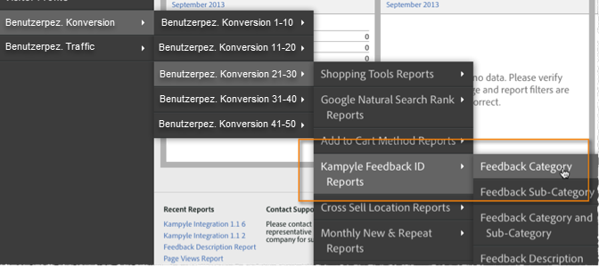

# Bereitstellen der Integration {#deploying-the-integration}

Bei der Bereitstellung dieser Integration müssen Sie den Integrationsassistenten für Adoben, den Plug-in-Code (JavaScript) und die Integrationsüberprüfung durchführen.

## Abschließen des Adobe-Integrationsassistenten {#complete-the-adobe-integration-wizard}

Um die Integration zu aktivieren, führen Sie den Konfigurationsassistenten in der Data Connectors-Oberfläche aus.

1. Melden Sie sich bei Adobe Experience Cloud an.
1. Navigieren Sie zu **[!UICONTROL Data Connectors]**.
1. Starten Sie den Kampyle-Integrationsassistenten.
1. Wählen Sie die gewünschte Report Suite aus. Geben Sie dann einen Namen für die Integration ein.
1. Konfigurieren Sie die folgenden Elemente:
   1. **[!UICONTROL E-Mail-Adresse]**: Die E-Mail-Adresse des Hauptkontakts.
   1. **[!UICONTROL Beschreibung]**  (optional): Beschreibung für diese Integrationseinrichtung.
   1. **[!UICONTROL Kampyle-Schlüssel]**: Suchen Sie diesen Schlüssel in der Anwendung Kampyle unter  **[!UICONTROL Feedback-Formular]** >  **[!UICONTROL Feedback-Formularanpassung]**.
   1. **[!UICONTROL Tracking-Server]**: Der Wert des Tracking-Servers, den Sie zur Verfolgung von Adobe Analytics-Daten verwenden.
   1. **[!UICONTROL Sicherer]** Tracking-Server: Wenn sich Ihr Tracking-Server für sicheren/https-Traffic unterscheidet, geben Sie diese Einstellung hier an.
1. Konfigurieren Sie die folgenden **[!UICONTROL Variablenzuordnungselemente]**:
   1. **[!UICONTROL Kampyle Feedback-ID]**: Wählen Sie eine verfügbare eVar aus Ihrer Report Suite
   1. **[!UICONTROL Feedback-Bewertung]**: Wählen Sie ein verfügbares Erfolgserlebnis (Typ &quot;Zähler&quot;) aus Ihrer Report Suite aus.
   1. **[!UICONTROL Feedback-Elemente]**: Wählen Sie ein verfügbares Erfolgserlebnis (Typ &quot;Zähler&quot;) aus Ihrer Report Suite aus.
   1. **[!UICONTROL Feedback mit Bewertung]**: Wählen Sie ein verfügbares Erfolgserlebnis (Typ &quot;Zähler&quot;) aus Ihrer Report Suite aus.
1. Aktivieren Sie das Kästchen, damit das Dashboard für die Kampyle-Integration automatisch für Sie erstellt wird (empfohlen).
1. Überprüfen Sie alle Konfigurationselemente. Klicken Sie dann auf **[!UICONTROL Jetzt aktivieren]**.

## Bereitstellen des Integrationskonfigurationsobjekts {#deploy-the-integration-configuration-object}

Stellen Sie nach Abschluss des Integrationsassistenten das Integrationskonfigurationsobjekt für Ihre Webeigenschaft bereit. In vielen Fällen ist es am einfachsten, das Integrationskonfigurationsobjekt in Ihren Adobe Analytics-Bereitstellungscode aufzunehmen.

>[!NOTE]
>
>Wenn Sie Adobe Experience Platform Launch verwenden, können Sie das Integrationskonfigurationsobjekt einfach über dieses Tool hinzufügen.

1. Navigieren Sie zur Registerkarte **[!UICONTROL Ressourcen]** > **[!UICONTROL Support]** der Integration.
1. Laden Sie die Ressource **[!UICONTROL Kampyle Integration Code (JS)]** herunter. Speichern Sie diese anschließend. Der Code sieht in etwa so aus:

   ```
   /* Kampyle:  Integration configuration settings */
     window.k_sc_param = { "version":1.1 }
   ```

1. Stellen Sie den Code mit einer der folgenden Methoden bereit:

   * Verwenden Sie Adobe Experience Platform Launch.
   * Stellen Sie den Code für die Organisationsressource bereit, die Ihre Adobe Analytics-Bereitstellung verwaltet.

## Überprüfen der Integration {#verify-the-integration}

Überprüfen Sie, ob die Integration Daten erfolgreich übertragen hat, indem Sie einige Prüfungen durchführen.

### Protokoll zu den Integrationsaktivitäten {#section-0472df9180db4f218db5f6040cab07af}

Zeigen Sie Ihre Einrichtung für die Kampyle-Integration in der Adobe Experience Cloud an. Navigieren Sie dazu zu **[!UICONTROL Support]** > **[!UICONTROL Protokoll zu den Integrationsaktivitäten]**. Auf der Registerkarte **[!UICONTROL Dateneingang]** werden Einträge angezeigt, aus denen hervorgeht, dass Klassifizierungsdaten erfolgreich importiert wurden.

>[!NOTE]
>
>Protokolleinträge werden in der Regel innerhalb von 24 Stunden nach erfolgreicher Bereitstellung angezeigt.


### Adobe-Berichtsdaten {#section-1ae9f0a5e6bc40988478ff55aefd56ac}

Zeigen Sie Ihre Kampyle-Feedback-Berichte mit Adobe Analytics an, indem Sie innerhalb der entsprechenden Menüstruktur zur Kampyle-Berichterstellung navigieren.

>[!NOTE]
>
>Berichtsdaten sollten innerhalb von 24–48 Stunden nach erfolgreicher Bereitstellung angezeigt werden, sofern die integrierten Feedback-Formulare Übermittlungen aktiv empfangen.


